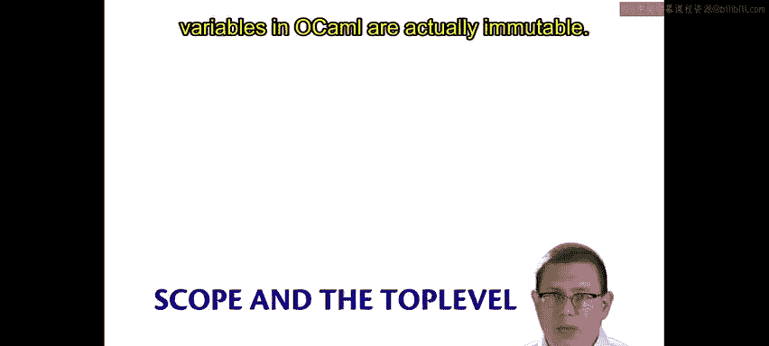
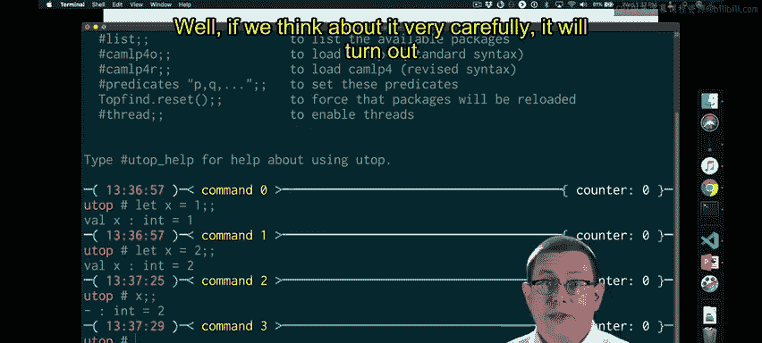
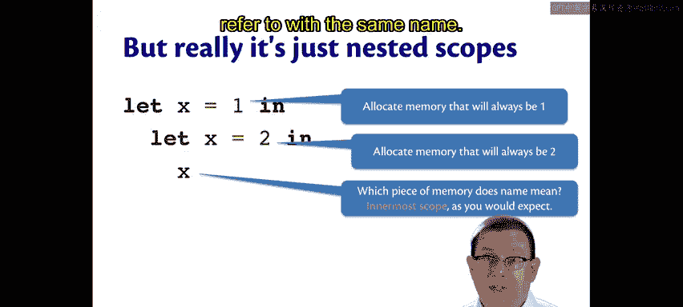
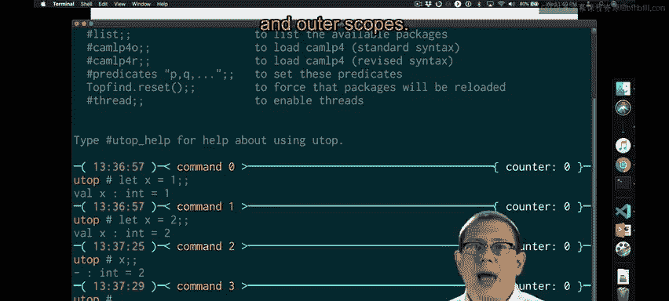

# 康奈尔大学《OCaml编程｜CS3110：OCaml Programming： Correct + Efficient + Beautiful》中英字幕 - P12：-012-Scope and the Toplevel Chap2 Video 7.zh_en - GPT中英字幕课程资源 - BV1Tx4y1s7sP

One last example with scope。And it comes up every year because it seems to contradict what I've said all along。

 which is that variables in OcaMl are actually immutable。

In the top level， I could write let X equal 1。And then I could write， let x equal2。

An X now evaluates to 2。Gosh， that seems a lot like mutability。

 It seems like I've just changed the value in X。Well， if we think about it very carefully。

 it will turn out that's not what has occurred。

It seems like that sequence of lead definitions is mutating the variable X。

 but we now know that we can understand a series of definitions like that in the top level as just nested left expressions。

 nested scopes， in other words。So really that's let x equal1 in let x equal 2 in x。

 and we know how to evaluate that。 in fact， we've seen an example of it already。

 we know the whole thing is going to evaluate to2。One way to think about that under the hood is that the first let expression is allocating memory that will always store the value one。

The second lead expression is allocating memory that will always store the value too。

And then when the let。Expression that is innermost has its body evaluated。

Which piece of memory do we look at for the value？We know what that is。

 it's going to be the innermost scope。As the result of the rules that we have defined for evaluating lead expressions。

 it's also， I suspect naturally what you would think of anyway from your experience with other programming languages。

 names usually mean whatever the innermost scope says they should mean， and that's true here。

So now you can see。Variables really aren't mutating here。😡。

We're just allocating a new piece of memory that we're going to refer to with the same name。

Back in the top level， you might ask， well， is there a way to go back and refer to that X that was bound to1 as opposed to the X that was bound to2。

 No， there really isn't In the top level， we're not going to be able to get back to that outer level of scope。

 Of course， in reality， programs we write are mostly going to be in files not in the top level。

 and there we know how we can nest scope and have inner and outer scopes。

