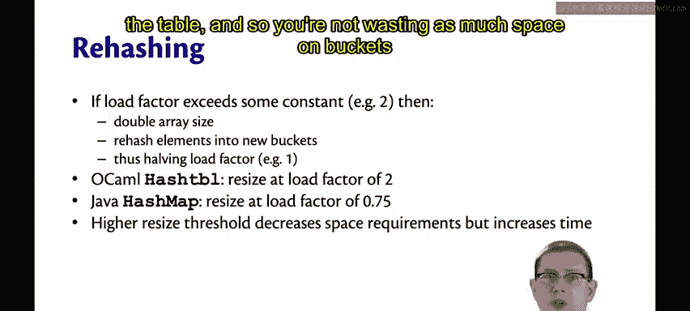
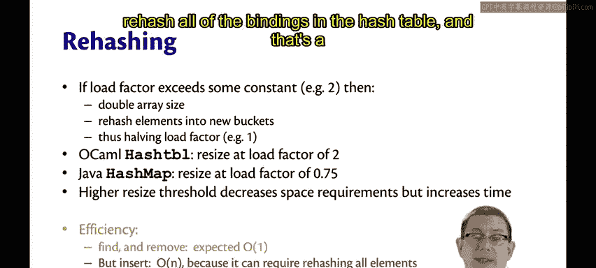
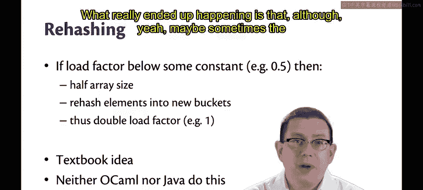
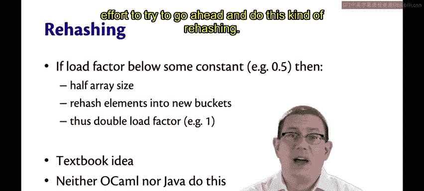
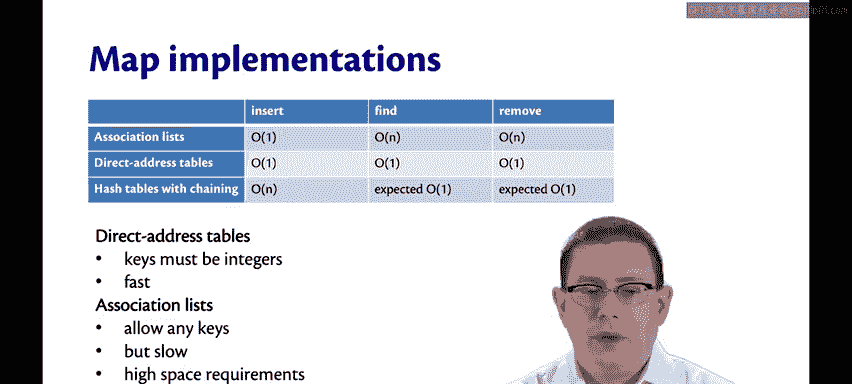
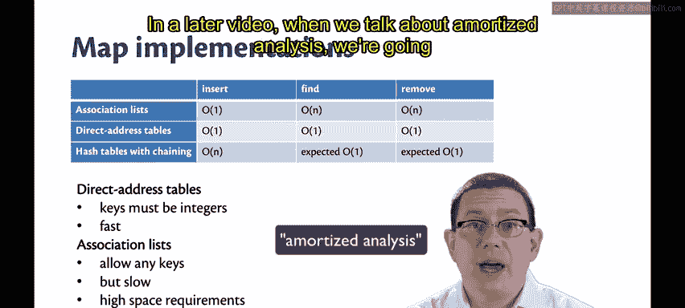
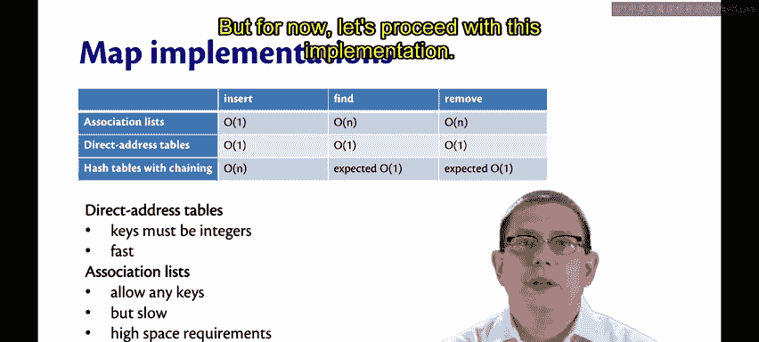

# OCaml编程：8.14：哈希表扩容与性能分析 🔄

在本节课中，我们将学习哈希表实现中的一个关键优化技术——**扩容（Rehashing）**。我们将探讨扩容的触发条件、执行过程，以及它如何影响哈希表的空间和时间效率。最后，我们会将哈希表与之前学过的其他映射（Map）实现进行对比。

---

## 扩容机制

上一节我们介绍了链式哈希表的基本结构。本节中我们来看看当哈希表变得过于拥挤时，如何通过扩容来维持其性能。

如果**负载因子（Load Factor）**超过一个特定阈值（例如2），哈希表的实现会暂停当前操作，将底层数组的大小**加倍**，并将所有现有元素**复制**到新数组中。在此过程中，每个元素会根据新的数组大小被**重新哈希**，并可能被放入新的桶中。

这个过程会将负载因子**减半**。因为绑定（键值对）的数量保持不变，但桶的数量翻倍了。例如，负载因子可能从2降至1。

以下是扩容过程的伪代码描述：
```ocaml
if load_factor > threshold then
    let new_size = old_size * 2 in
    let new_buckets = create_empty_array new_size in
    for each binding in old_buckets do
        let new_index = hash(binding.key) mod new_size in
        insert binding into new_buckets.(new_index)
    done
    replace old_buckets with new_buckets
```

## 不同实现的扩容策略

以下是不同编程语言标准库中哈希表扩容策略的对比：



*   **OCaml** 的哈希表在负载因子达到 **2** 时进行扩容，将其降低回 **1**。
*   **Java** 的 `HashMap` 在负载因子达到 **0.75** 时进行扩容。

更高的扩容阈值（如Java的0.75）会**降低空间需求**，但**增加时间需求**。因为当每个桶中预期有2个元素需要查找时，所花费的时间会比每个桶只有0.75个预期元素时要略多一些。然而，当负载因子为2时，元素在表中排列得更紧密，因此不会在空桶上浪费太多空间。

## 操作复杂度分析


经过扩容优化后，`find`（查找）和 `remove`（删除）操作的效率现在是**期望常数时间** `O(1)`。因为从期望值来看，在每个数组索引位置只需要搜索常数数量的元素。



但是，`insert`（插入）操作仍然是个问题。它仍然是**最坏情况线性时间** `O(n)` 的操作。因为如果你刚插入一个元素就导致负载因子超过了阈值（无论阈值是多少），现在你就必须对哈希表中的所有绑定进行重新哈希，这是一个线性时间的操作。


## 缩容的考量

顺便提一下，如果负载因子低于某个常数（例如 **0.5**），也可以进行对称的**缩容**操作。当负载因子过低，意味着存在大量浪费的空间时，可以分配一个容量减半的新数组，并将所有元素重新哈希到新数组的桶中。这会使负载因子翻倍，例如回升到1。

这是一个在许多教科书中都能找到的想法。但现实世界的库似乎不这么做。OCaml不这么做，Java也不这么做。我曾与一位Java `HashMap` 的实现者交谈，他说这是因为他们对哈希表的真实工作负载进行了研究，发现缩容并不是一件有用的事情。实际情况是，虽然有时哈希表可能会变得有点小，但最终用户通常会向其中添加更多元素，因此尝试进行这种缩容重新哈希只是浪费精力。




## 映射ADT实现对比

以下是目前我们学过的三种映射抽象数据类型（ADT）的实现对比：

1.  **关联列表（Association Lists）**
2.  **直接地址表（Direct Address Tables）**
3.  **链式哈希表（Hash Tables with Chaining）**

链式哈希表几乎集所有优点于一身。现在我们可以允许任何类型的键。只要我们有一个好的哈希函数，就能获得快速的 `find` 和 `remove` 操作。




我们还有一个看似较慢的 `insert` 操作。在后续关于**摊还分析（Amortized Analysis）** 的视频中，我们将探讨如何解决这个问题。



目前，让我们先继续使用这个实现。





---


## 总结


本节课中我们一起学习了哈希表的**扩容（Rehashing）** 机制。我们了解到，当负载因子超过阈值时，通过将数组容量加倍并重新哈希所有元素，可以将负载因子减半，从而维持 `find` 和 `remove` 操作的期望常数时间复杂度。我们还比较了OCaml和Java不同的扩容阈值策略及其在空间和时间上的权衡，并简要讨论了缩容在实践中的必要性。最后，我们将链式哈希表与关联列表、直接地址表进行了对比，认识到链式哈希表在支持任意键类型的同时，提供了优异的查找和删除性能，尽管插入操作在最坏情况下仍是线性的。