# 康奈尔大学《OCaml编程｜CS3110：OCaml Programming： Correct + Efficient + Beautiful》中英字幕 - P131：-131-Hash Table Interface Chap8 Video 15.zh_en - GPT中英字幕课程资源 - BV1Tx4y1s7sP

Let's write an interface for hash tables。 This will be a kind of amalgam of our previous two interfaces for maps based on association lists and maps based on arrays。

 So for a table map， we'll start off with a representation type parameterized on key and value types。

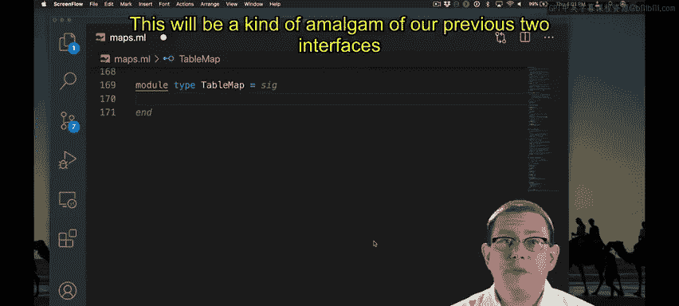

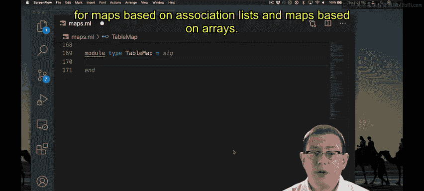

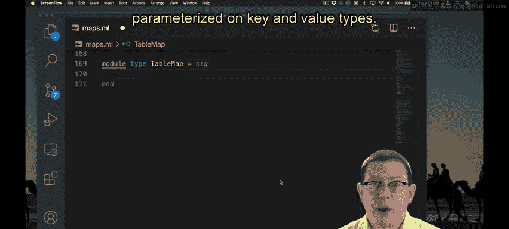

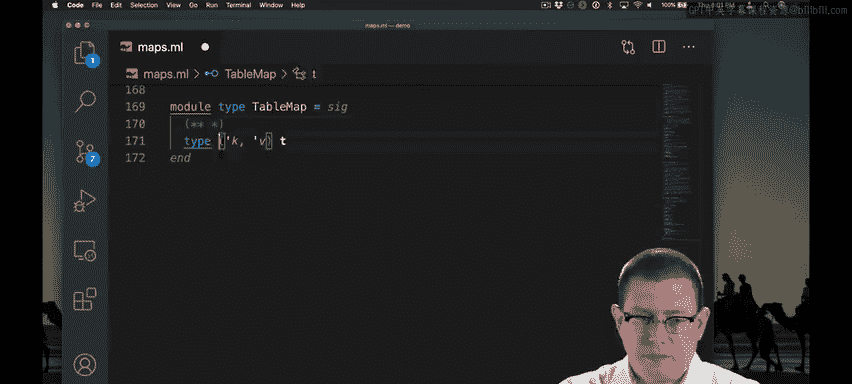

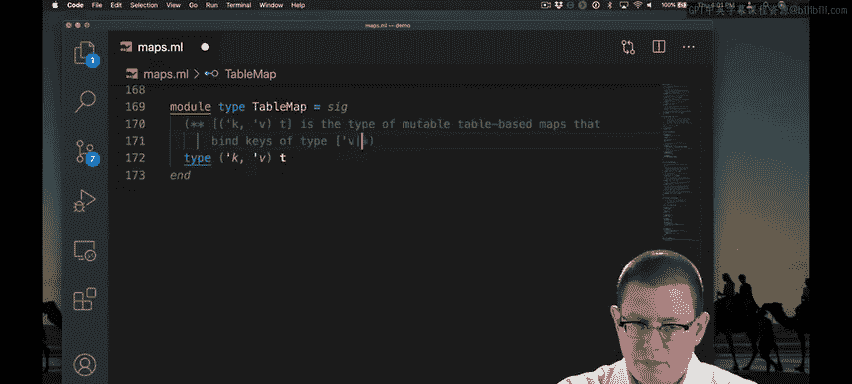

Type。😡，KVT， so KVT for short， is the type of mutable table based maps that bind keys of type K to values of type V。

 This is the same representation type constructor that we had for association lists where we parameterized on both keys and values We're back to parameterizing on keys because we're not making the limitation that keys have to be integers anymore like we do for a direct or address table。

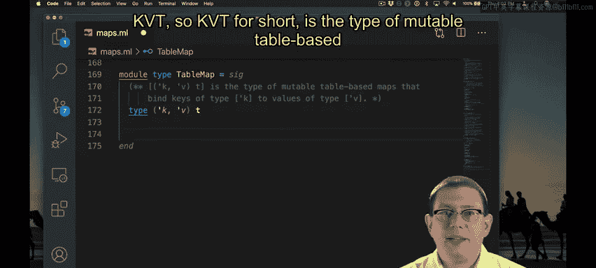

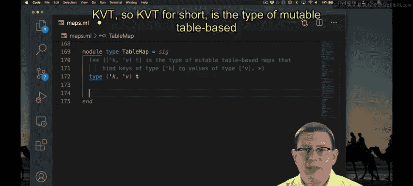

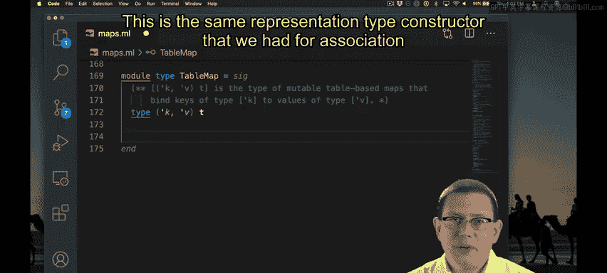

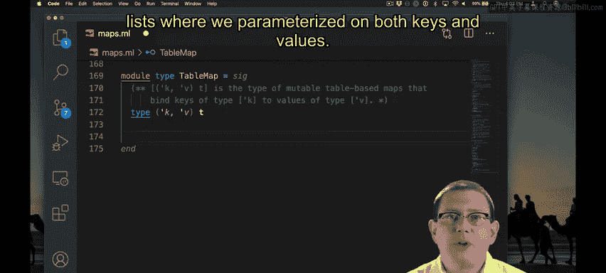

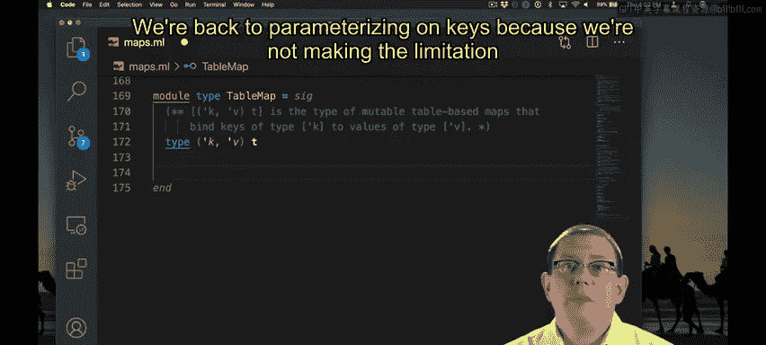

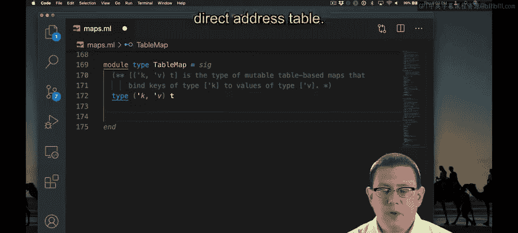

You can see from the type of the insert operation and from its specification that it mutates the data structure。

 so insert KVM mutates a map M to bind K to V， and as always in our implementation so far。

 if K was already bound to M that that binding is replaced by the binding。

The specification for the Find operation is the same as for association lists。

The roof operation looks like a kind of combination of the association list and direct address table operations。

 it returns unit because it's mutating， but it's parameterized on a key type。

The create operation is based on the same operation from direct address tables。

 We discovered there that we needed create to take in a capacity。

 and we also needed to create function， not just an empty value because of mutability。

Here we add the new idea that Cre also needs to take in a hash function as an argument。

That's because our hash table implementation itself is not going to have any idea how to hash values of this arbitrary type K to integers。

 so we're asking the clients of the hashable to pass in that hash function to us。Of course。

 we need it to be a good hash function that's going to distribute keys uniformly over imagestegers。

