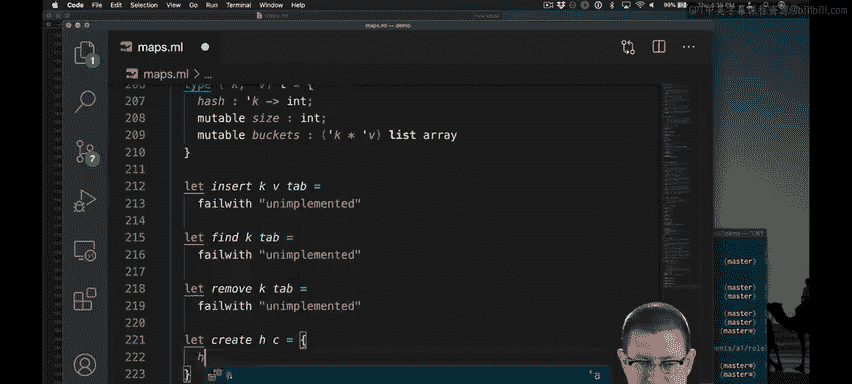
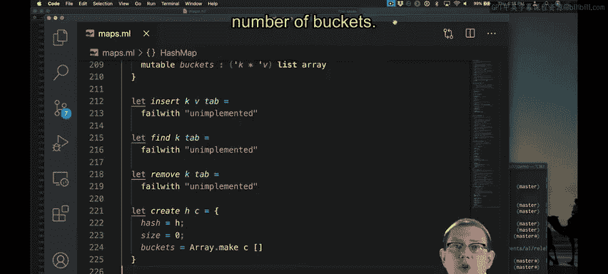
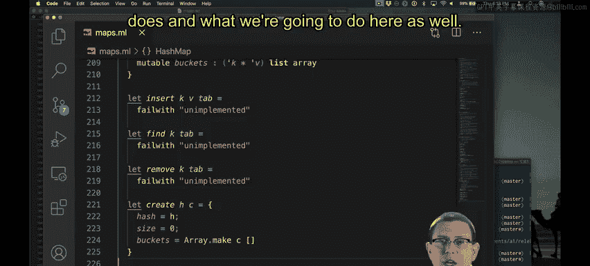
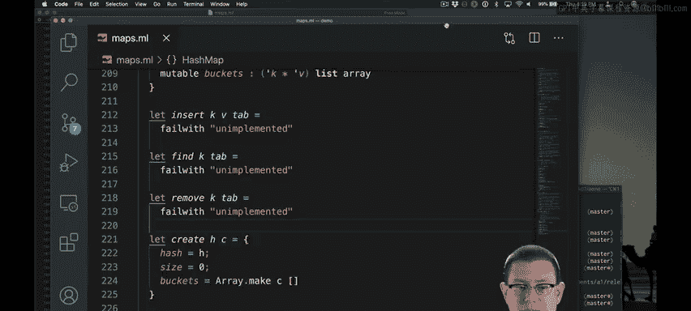
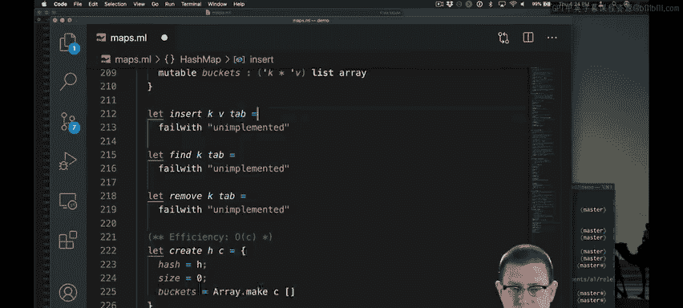

# 康奈尔大学《OCaml编程｜CS3110：OCaml Programming： Correct + Efficient + Beautiful》中英字幕 - P132：-132-Hash Table Insert Implementation Chap8 Video 16.zh_en - GPT中英字幕课程资源 - BV1Tx4y1s7sP

Now we will implement the table map interface with a hashmap module。

I've already started off here with the representation type， abstraction function。

 and representation invariant that we went over before。

I'm going to add two more things into the representation type that we haven't seen so far First off。

 I'm going to store the hash function in there because we're going to need that throughout the implementation of this module to know how to hash keys。

Second， I'm going to store the size of the hash table in this rec。

Now that's something that could always be recomputed by scanning through the buckets。

 but it will help us if we keep a field in the record devoted to this purpose。😡。

So the size of the hash table is going to be the number of bindings in it。

 and I've made that field mutable so that we can change it as bindings are inserted and removed。

I have implementations as stubs down here for insert， find remove and create。

 so let's work on those next creating the hash table is probably the easiest of these operations。

All we have to do is store the hash function。Say that the size is0 because there are no binding so far and create a bunch of empty buckets in an array of the right length。

This of the way we're using capacity here is as the initial number of buckets。

 it's sort of the target number of bindings in the hash table if we're targeting a load factor of one。

 which is what the OCMl hash table implementation does and what we're going to do here as well。😡。

The efficiency of create is going to be linear in the capacity because we have to allocate that many array elements and initialize。

Next， let's implement the insert operation。We know from studying that algorithm that there are two pieces to it。

Actually doing the insert followed by resizing if needed。

So let's factor our implementation of this function into two helper functions。

Now we have both helper functions and we need to implement them。

That warning on the first one there is because O Camel has detected that nothing reasonable is being returned from that function at this point。

Let's go ahead and implement the insertt no resize first。

So the first thing we need to do is figure out where to put this new key。

 We need to know what bucket it goes into。😡，Let's do that。So first off， I'm going to hash the key。😡。

That gives me what I'd like to use as a bucket， it's just， that's not quite suitable yet。Here's why。

I've assumed that my hash function distributes keys uniformly over integers。But not every integer。

 all2 to the 63 of the minowcal is going to be suitable as an index into my array。

 That array has a certain capacity that's probably not2 to the 63， maybe it's 100。

 maybe it's even 1000， but it's not that big。So we need to modify the output of the hash function in order to reduce it down to the range of the actual number of buckets that are currently available。

Let's write a helper function to do that to figure out what the index of a key is into our buckets array。

The hash value could be taken modlo the number of buckets in the hash table。

That would get us down into the right range。So what is the capacity of the table。

 let's write another helper function to get us。All right。

 so that caused us to go off and write a whole bunch of helper functions， but this is good。

 this is a good way to structure our development every time we discover we need something new to create a helper function for it。

Now， let's stop and think about whether we really have managed to squeeze down that range of hash values to a small enough range。

 You might remember that the modular function， if you pass it in a negative number。

 will give you back a negative number。So what's negative 42 mod 10， it's negative 2。

That's not going to be a valid array index either。I'm going to add the additional restriction on hash functions that they must return positive values so I don't have to deal with this negative problem。

There I've added documentation of that to my representation type。

 I've also added it to the specification for create。

 Now we're in good shape to continue forward with implementing insert。

We know the bucket where the key needs to go。 now we just need to put the binding into that bucket。😡。

So what I've done at this point is to save the old bucket here that gives me that key value list。

And now I'm putting the new key value binding into the front of that bucket。

And mutating the bucket in the array so that it has the binding now。

One thing to think about is I could have just inadvertently violated a representation and variance。

The Reend variant says no key appears more than once an array。

 and so in particular there can't be any duplicate keys in association lists。Well。

 I could have just put a duplicate key into that association list if I wasn't careful。

 because maybe the old bucket already bound K。I need to get rid of it， first。

The library function remove AsOS will remove the first binding of keyK that it finds。

 since we were already guaranteed by the representation and variant that there could be at most one binding already。

 we're good， we don't have to continue removing more and more of them as we did in our association list implementation of maps。

All right， so we've stored that in the bucket。What。😡。

We are trying to maintain the size of the hash table as well in a field of the representation type。

The size might have just gone up by one if we added a new binding， so we need to account for that。

So the table size goes up by one。If the key K was not already bound in the old bucket。All right。

 I finally got around to documenting that specification comment， which I should have done earlier。

Now let's think about the efficiency of this part of the operation。There's a lot going on here。

So what's the efficiency of index？Well， it's just taking a hash function and applying it to a key and a module of the capacity。

 the capacity is just looking at the length of the array。

 which is stored as something that can be accessed in constant time in the OchMl implementation of arrays。

So capacity is actually constant time。And we said earlier that hash functions also ought to run in constant time。

Under that assumption。Index runs in constant time as well。But you know what。

 we should probably document that assumption。Okay， so now we've added that to the representation type and the specification for P8 so back here within insert no resize。

 we've got a constant time operation on this line。We're just indexing into an array here and accessing a field of a record。

 Those are constant time operations。On the next line。

 we're conzing of value on and updating an array element。 that's constant time， but。

We call list dot remove move As here。What's that going to run in？Well。

 it's linear in the length of the bucket。Now， all this work we've done has been to make sure that the expected length of a bucket is constant。

So the expected efficiency of this line is actually going to be based on that bucket length L。

Whatever that might be， So that's supposed to be our max load factor。

 We're going to target two for our max load factor。 So that's a constant。 It's expected big O of L。

 which is expected constant time。Okay， I introduced a little helper variable there to get rid of the problem that I was going over the8 column。

Finally。In the if expression， I'm once again potentially doing a linear time operation。

 except for it also is going to be bounded by the expected bucket length。

And therefore is an expect constant。So the efficiency of the entire insert。

 no resize operation is as we planned before， going to be expected constant time。

