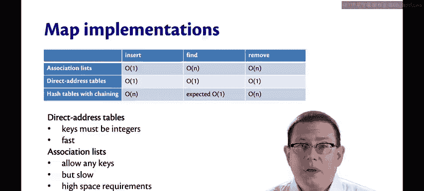
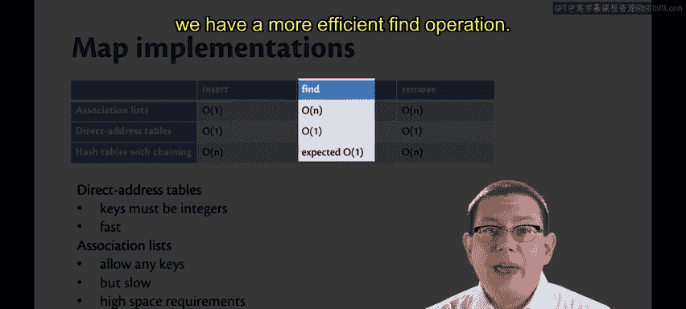
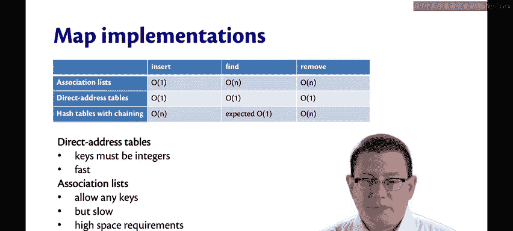
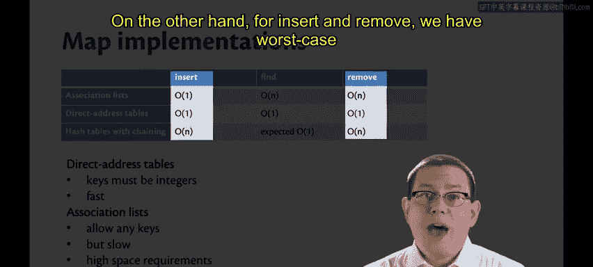
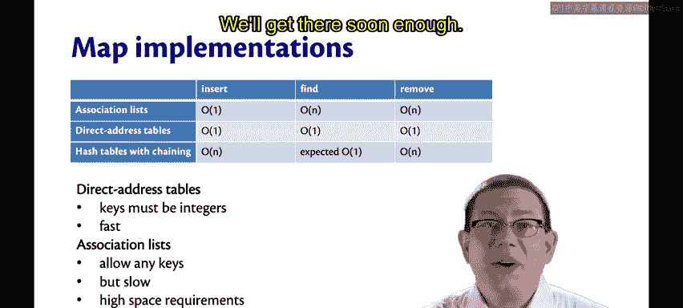

# OCaml编程：8.19：哈希表与其他映射数据结构的对比 🆚

在本节课中，我们将回顾并比较哈希表与其他实现映射抽象数据类型（Map ADT）的数据结构在性能上的差异。

上一节我们完成了哈希表的实现，本节中我们来看看它与其他数据结构相比表现如何。

## 性能概览 📊

哈希表（采用链地址法）相较于关联列表的主要优势在于其查找操作效率更高。

关联列表的查找操作时间复杂度为线性时间 `O(n)`，而哈希表的查找操作在期望情况下是常数时间 `O(1)`。

这里必须强调“期望”一词，因为其性能取决于所使用的哈希函数。一个好的哈希函数会将键均匀地分布到各个桶中，从而将每个桶的期望长度保持在常数级别。

## 插入与删除操作的考量 ⚖️

然而，对于插入和删除操作，哈希表在最坏情况下的时间复杂度是线性的 `O(n)`。

在之前的一些视频中，我曾错误地将其描述为“期望”常数时间，这是一个失误。对于采用链地址法的哈希表，其插入和删除操作在最坏情况下确实是线性时间。这使得它们在某些方面比关联列表和直接寻址表更差。

以下是几种数据结构操作的时间复杂度对比：

*   **关联列表**：所有操作在最坏情况下均为 `O(n)`。
*   **直接寻址表**：所有操作在最坏情况下均为 `O(1)`，但要求键是整数且范围较小。
*   **哈希表（链地址法）**：
    *   查找：期望 `O(1)`。
    *   插入：最坏情况 `O(n)`。
    *   删除：最坏情况 `O(n)`。

## 展望：摊还分析 🔮

我们将在下周学习一种名为“摊还分析”的技术。通过这种分析，我们可以得出结论：哈希表的插入和删除操作实际上是常数时间的，而非线性时间。这值得我们期待，我们很快就能学到。

---

本节课中我们一起学习了哈希表与其他映射数据结构（主要是关联列表和直接寻址表）的性能对比。我们了解到哈希表在查找操作上具有期望常数时间的优势，但其插入和删除操作在最坏情况下是线性的。最后，我们预告了通过摊还分析可以更全面地评估哈希表的平均性能。