# 康奈尔大学《OCaml编程｜CS3110：OCaml Programming： Correct + Efficient + Beautiful》中英字幕 - P136：-136-Hash Functions Chap8 Video 20.zh_en - GPT中英字幕课程资源 - BV1Tx4y1s7sP

I've talked much now about how the performance of a hash table depends upon the hash function。

We need a good hash function in order to achieve an efficient hash table implementation。

We know that a hash function that's just a constant would be terrible because all keys would collide in the same bucket。

We need the hash function to distribute the keys uniformly at random over all the buckets。

So how do you do that？

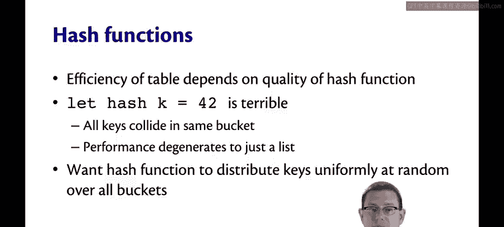

While there are really three steps to transforming a key into a bucket index。

 let's break down those three steps。The first is to transform the key into some kind of stream of bytes。

😡，So this is called serialization。Seerialalization is a problem that occurs not just in hash functions。

 but when you say want to convert some representation of a value in memory and store it onto a disk。

 you have to serialize it into a stream of bytes at that point。

So serialization is something that really should be injective。

If you're going to load something from disk， you want to recover the same thing that you wrote to it originally。

 so you don't want to be unable to invert this piece of the hash function。😡。

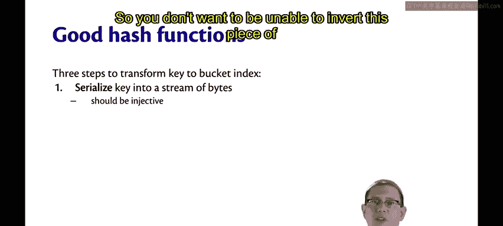

The second step is to diffuse those bytes into a single large integer。

So it's like you're taking all of them and throwing them out there into some sort of large integer。

Here is where we want to have a kind of randomness。😡。

A small change to the key should result in a large。

 hopefully unpredictable change to what integer it gets diffused into。Now。

 we might necessarily lose injectivity here。 It depends on the size of the integer we're diffusing into。

If it's into an int 64 or even an int63， that's still likely to be injective unless the inputs we're using are massively。

 massively big。

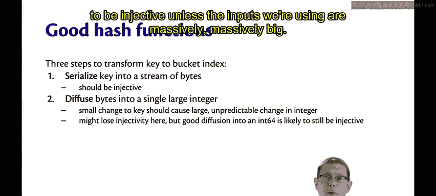

The third and final step is to compress that imageteger to be within the range of bucket indices for the particular table that we're using。

😡，So you know， if there are M different buckets in the table。

 then we need to map the key into0 through M minus1。At this point。

 we definitely lose injectivity because we're going from a very large space down to a small space。

The responsibility for these three steps is typically divided between the client of the hash table and the implementer of the hash table。

😡，In the implementation we looked at， where I asked the client to pass in the hash function to my hash table implementation。

 I was largely pushing the responsibility for this on the client。

 The only thing I did was the compression， as the。But other libraries make other choices。

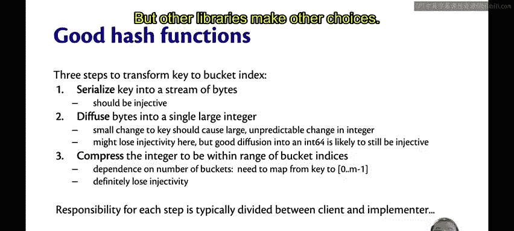

Ocal's hashtable module。

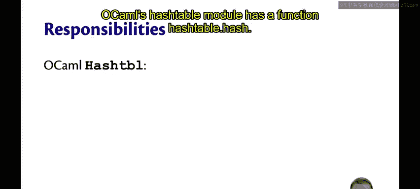

Has a function， hashable do hash。You can use this to convert a value of any type into an int。

Doesn't matter what that input type is。It does the serialization and the diffusion。

 which is to say the converting to bytes and then converting the bytes to an integer in some native C code based on a well known。

 well studied hash。Another function within the implementation of Hahable called key underscore indexex does compression to convert it down to the small number of buckets。

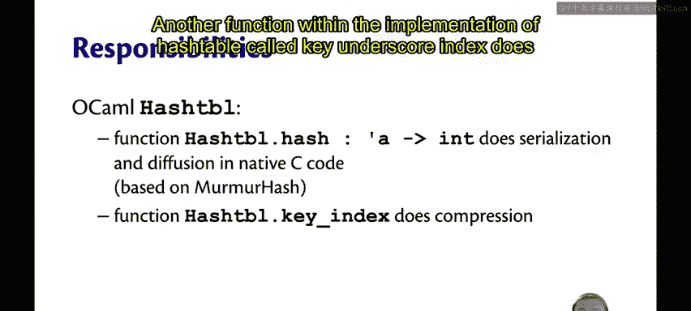

So in that implementation of hash tables， the implementer is responsible for everything。😡。

A client doesn't even have to pass the end in a hash function。And that's great when you're a client。

Until you want a relaxed notion of equality on keys。Like， for example。

 maybe your keys aren't just strings， but you want them to be case insensitive strings。At that point。

 the consistency between hash and equals is getting lost。😡。

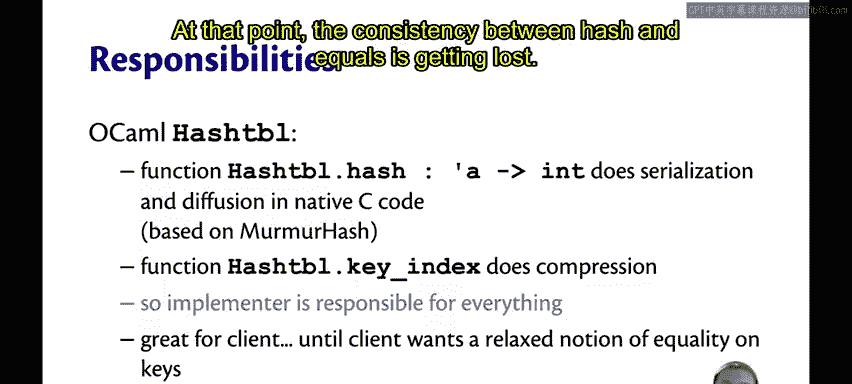

So OAML actually provides a second implementation。Now， this is still in the hashable module。

 but it's a functer nested inside of it called make。

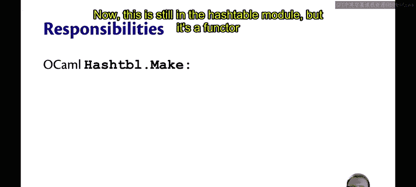

So this has an input whose signature is hash type。😡。

And hash type requires you to provide a hash function， which is exactly like what we've seen so far。

 as well as an equal function， which tells when two values are equal to keys or equal actually。

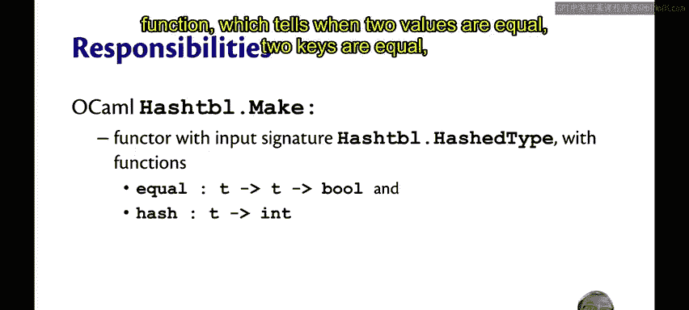

So the client here has to provide equal in hash to do the serialization and diffusion。

Because they're getting from the point of that input type T through a stream of vites into an int。

And the client is responsible for guaranteeing that if two keys are equal。

 they must have the same hash。Here the implementer is responsible only for compression。

This is similar to what I implemented before。 I just ignored issues about equality。

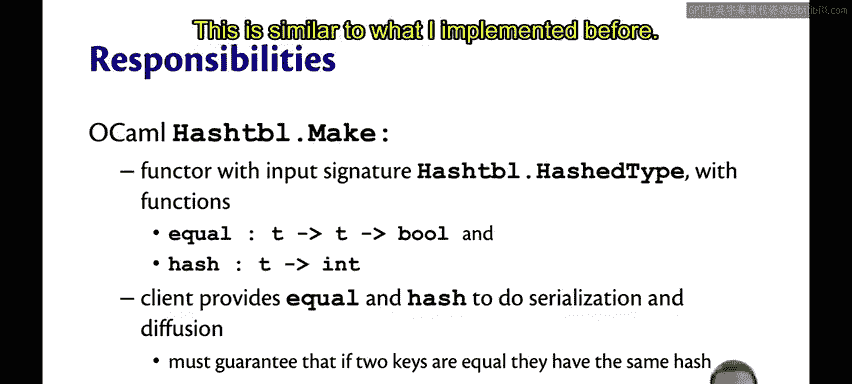

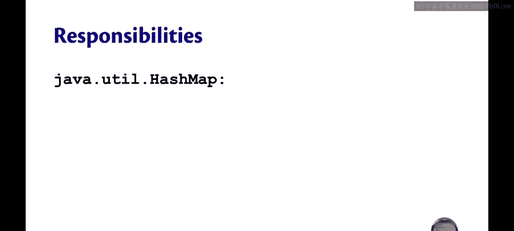

Java。util dot hashmap。Has a method that it relies on。

 which is in the object class called hash code hash code is responsible for doing the serialization and diffusion。

The typical default implementation here is for hash code to return the address of an object as an integer。

There's not much diffusion there because the addresses of objects within any given running VM are not that different from one another。

 they all tend to be within a fairly similar heap space。Now。

 you know that you can override hash code as a client。😡。

But then you have to guarantee that if two keys are equal， they have the same hash。

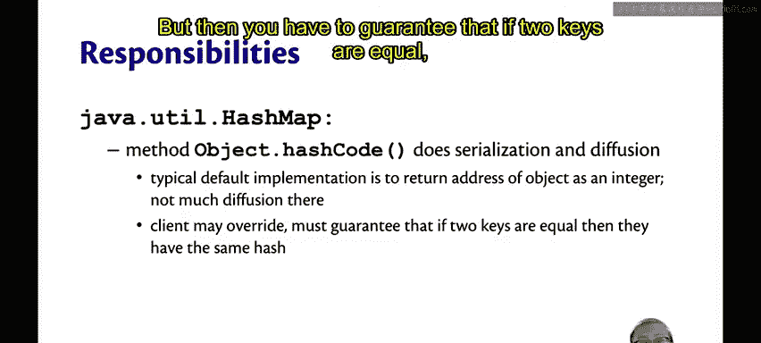

There is another method buried inside the implementation of Java Utiilda hashmap。😡，Called hash。

And it actually does further diffusion on top of whatever hash code does。😡。

So this is an effort to try to protect you from yourself if you accidentally provide a bad hash code function。

 this is trying to do some extra diffusion in order to make sure that code that hash table performance doesn't degrade。

😡，Basically， the implementer doesn't trust the client here。

 and that's probably good because I know we've all written bad hash code implementations in Java。😡。

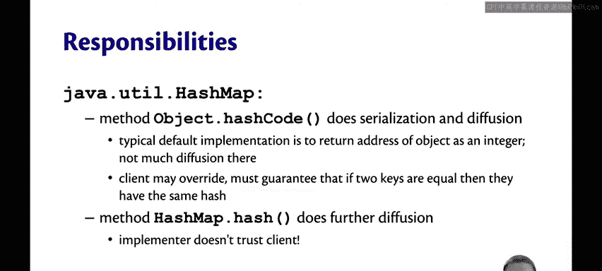

There's a final method called index4 that does the compression to figure out what index of the bucket should be for a given。

So here we have the implementer splitting the responsibilities for the hash function with the client in a very interesting way。

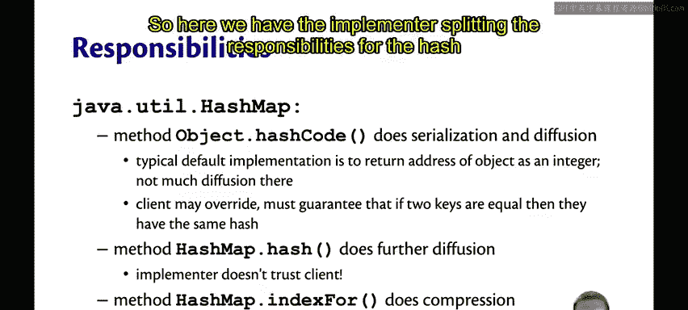

If you're going to design your own hash function， it's tricky business。😡，For compression。

 both Java and Ocael end up making the number of buckets be a power of two。

 and the compressing by mod of that number of buckets。

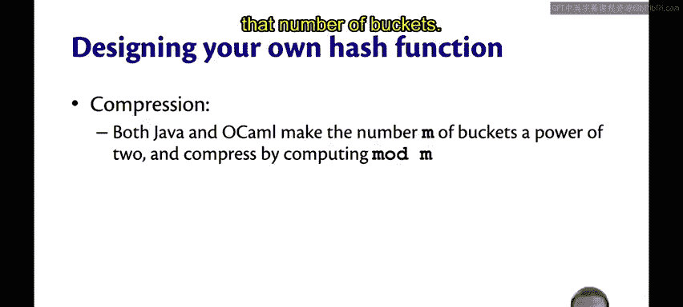

For serialization， both Java and OcaMml support it。

 so you can get a pre implemented version of converting an arbitrary type to a string of bytes。😡。

In Ocamel， it's in a module called Marshall in the Standard Library。

And for diffusion， well that's really the hard part and there are various techniques that I'm not going to cover here。

 they are at some times covered in CS 2800 depending on who is teaching it that semester。

 so if you can't find it in the current semester's notes。

 you might be able to look back in the past at 2800 and find some notes on techniques like modular hashing。

 multiplicative hashing， universal hashing， cryptographic hashing and so forth。

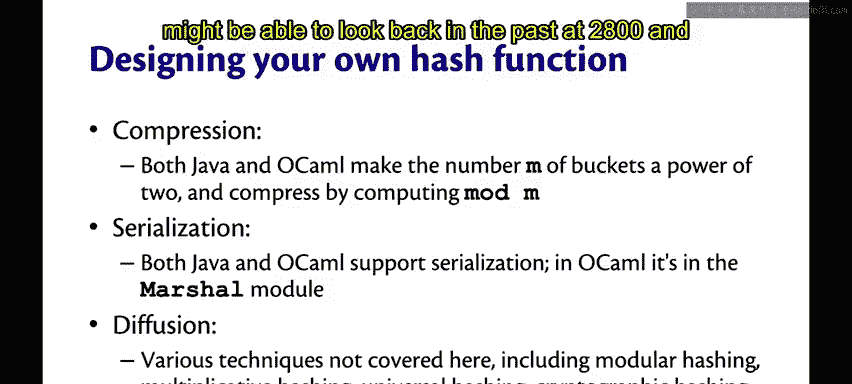

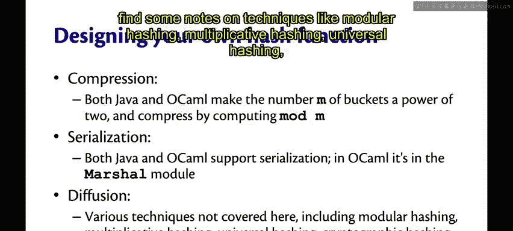

Hashing is hard。If you don't achieve good diffusion。

 then you lose constant time performance because the keys don't distribute uniformly over the buckets。

If your hash function itself is not constant time， you lose constant time performance because that which is an assumption we needed to make in the analysis。

And as you know from past classes， if you don't obey the equals invari that equals in hash code have to agree。

 whether it's Java or OcaMl， you lose correctness。

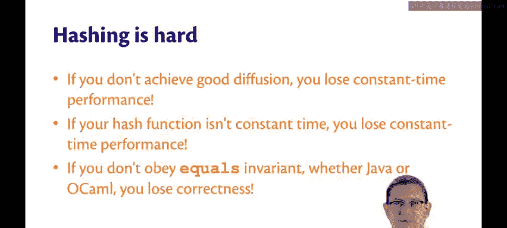