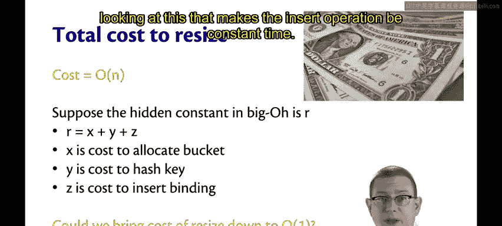
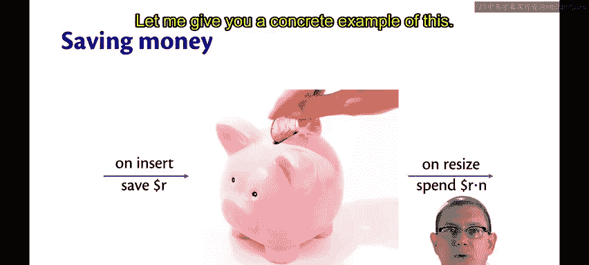
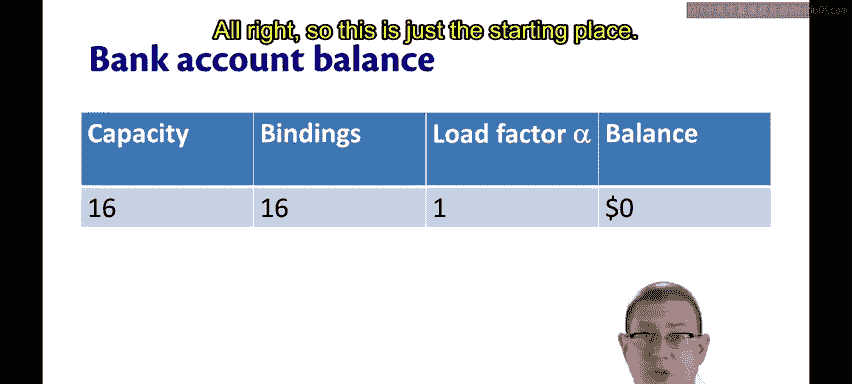
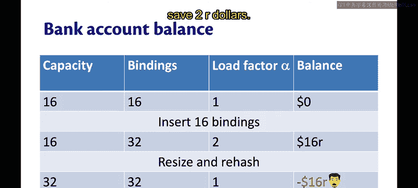
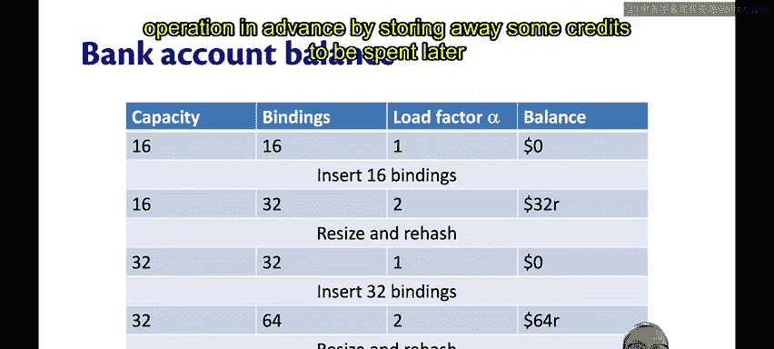
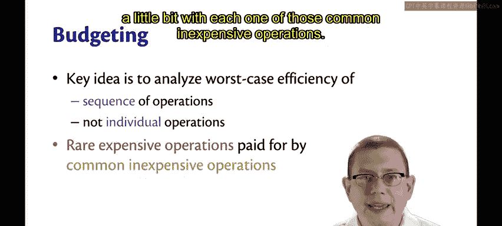
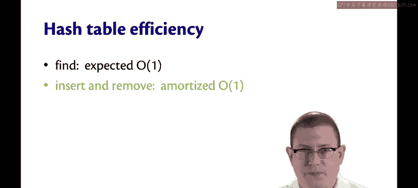

# 康奈尔大学《OCaml编程》：8.22：哈希表的摊还分析 🏦

在本节课中，我们将要学习一种名为“摊还分析”的技术，它可以帮助我们理解哈希表插入操作的平均成本。我们将通过一个存钱罐的比喻，来解释为什么即使最坏情况下的扩容操作是线性的，插入操作的平均时间仍然可以被视为常数时间。

上一节我们介绍了哈希表扩容操作在最坏情况下是线性的。本节中我们来看看，如何通过摊还分析来论证插入操作的平均时间复杂度是常数。

## 摊还分析的核心思想 💡

摊还分析的核心思想是：我们分析的不是单个操作的效率，而是一系列操作的效率。通过为每个廉价操作（如普通插入）预留少量“信用”，我们可以为那些罕见但昂贵的操作（如扩容）提前“存钱”。

## 存钱罐比喻 🐷

让我们想象一个存钱罐。每次执行插入操作时，我们向存钱罐里存入一些钱。当哈希表的负载因子变得过高，需要进行扩容操作时，我们就“砸开”存钱罐，用里面存的钱来支付扩容的成本。

具体来说，如果此时表中有 `n` 个绑定，我们就花费 `n` 美元来支付这次扩容操作。

## 一个具体例子 📊

假设我们有一个哈希表，其容量为 `16`（即有16个桶），并且已经存有 `16` 个绑定。此时负载因子 `α = 1`，我们的“银行账户”余额为 `0`。

现在，我们插入 `16` 个新的绑定。绑定总数变为 `32`，负载因子达到 `2`，此时需要触发扩容。

以下是关键的计算步骤：
1.  如果我们每次插入只存入 `R` 美元，那么账户里总共有 `16 * R` 美元。
2.  扩容和重哈希操作需要为哈希表中的每个绑定支付 `R` 美元，总成本为 `32 * R` 美元。
3.  从 `16R` 中扣除 `32R`，我们得到了 `-16R` 美元的负余额，破产了。

显然，我们存的钱不够。

## 调整策略：加倍存款 💰

如果我们调整策略，每次插入时存入 `2R` 美元，情况会如何？

再次从相同起点开始（16个绑定，余额为0）：
1.  插入 `16` 个新绑定后，绑定总数变为 `32`。
2.  此时我们的账户余额为 `16 * 2R = 32R` 美元。
3.  扩容操作的成本依然是 `32 * R` 美元。
4.  我们恰好有足够的钱支付这次扩容，账户余额归零。

这个过程可以持续下去。例如，再插入 `32` 个绑定（总数达64）时，我们需要支付 `64R` 美元进行扩容。而我们在此期间通过每次插入存入 `2R` 美元，总共存入了 `32 * 2R = 64R` 美元，再次刚好够用。

我们找到了一种方法，通过提前存储信用（存钱），来为将来需要的昂贵操作（扩容）支付费用。

## 生活中的类比：预算与享受 🍣

这就像一个预算问题。当我还是研究生时，我喜欢寿司，但寿司很贵。所以，周一到周四，我可能吃很多便宜的拉面，这样到周五时，我就存够了钱，可以和朋友们一起去享受一顿美味的寿司大餐。

这与哈希表的操作是同样的道理：在频繁的廉价操作（插入/吃拉面）中，我们存下一点额外的钱，以便在最后（需要扩容/想吃寿司时），我们有足够的资金来支付那顿昂贵的大餐。

## 摊还分析的结论 ✅

通过这种分析，哈希表的查找操作仍然是期望常数时间。而插入操作，则可以被称为**摊还常数时间**。

“摊还”是一个金融术语，它基本上指的就是我们在这里所做的预算模型：通过为每个廉价操作预留一点资金，来支付那些昂贵的操作。

本节课中我们一起学习了摊还分析的概念。我们通过存钱罐的比喻，理解了如何通过分析一系列操作的平均成本，来论证哈希表插入操作具有摊还常数时间复杂度。关键在于，为每个普通插入操作支付一点“额外费用”，从而为将来不可避免的昂贵扩容操作提前做好准备。