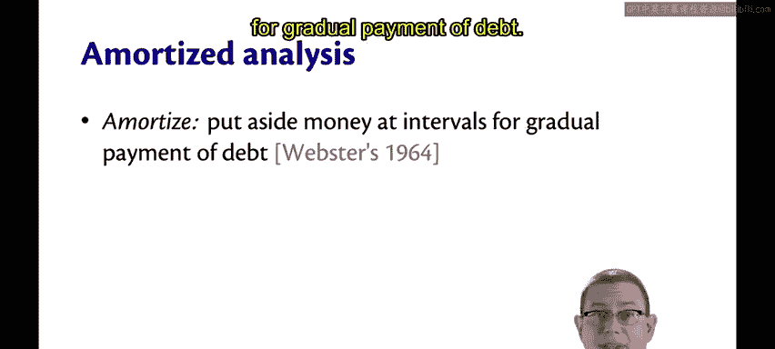
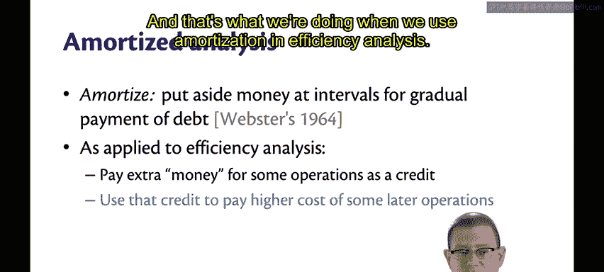
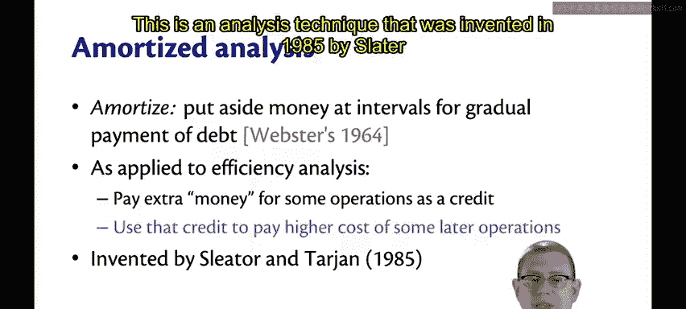
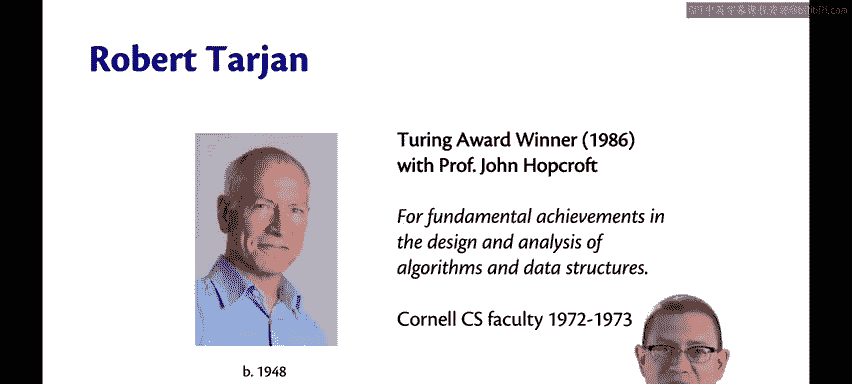
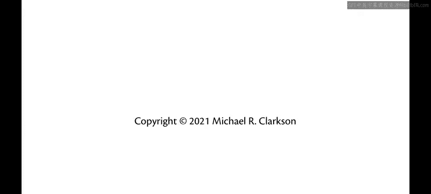

# OCaml编程：8.23：平摊分析的基本思想 🧮

在本节课中，我们将学习一种名为“平摊分析”的算法效率分析技术。我们将了解其核心思想、发明背景以及它如何帮助我们更准确地评估数据结构的性能。

## 平摊分析的定义 📖

字典中，“平摊”的定义是：**定期留出资金，用于逐步偿还债务**。

## 在效率分析中的应用 ⚙️

在效率分析中使用平摊分析时，我们所做的正是上述定义描述的事情。

我们为某些操作支付一些额外的“成本”（这里我将其比喻为“钱”）。这实际上是一种对时间成本的“会计”方法，用于平衡我们将在后续操作与先前操作上花费的时间。

我们利用预留的这种“信用”（类似于时间信用），来支付那些后续操作中可能出现的更高成本。

## 技术的起源与背景 🧑‍🔬

这种分析技术由**Slater**和**Tarjan**于1985年发明。

**Bob Tarjan**与康奈尔大学有一段渊源。他于1986年与我们自己的教授**John Hopcroft**（最近刚刚退休）共同获得了图灵奖。他们因在算法和数据结构设计与分析方面的基础性成就而获奖。

Bob Tarjan仅在1972年至1973年间担任了一年的康奈尔大学计算机科学系教员。

我曾问过Hopcroft教授，为何Tarjan只在这里待了一年。他告诉我的故事是：Bob本质上是个“加州男孩”，无法忍受伊萨卡冬天的天气，因此在一年后就离开了。

---

本节课中，我们一起学习了平摊分析的基本思想。我们了解到，平摊分析是一种通过将高成本操作的开销“分摊”到一系列操作中，从而更公平地评估算法平均性能的技术。它由Tarjan等人发明，其核心在于一种时间成本的“信用”会计系统，帮助我们理解数据结构的整体效率，而非孤立地看待单次操作。