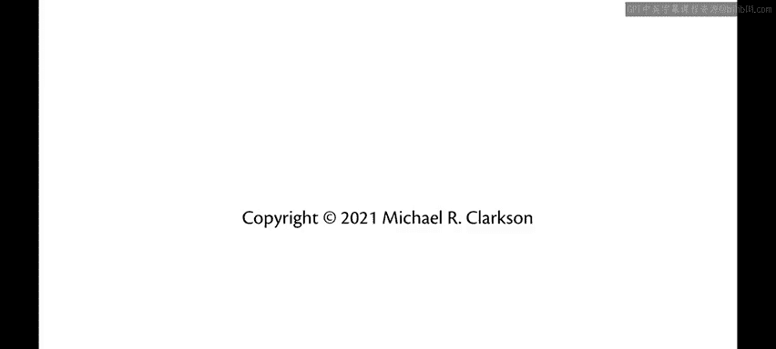

# 康奈尔大学《OCaml编程｜CS3110：OCaml Programming： Correct + Efficient + Beautiful》中英字幕 - P13：-013-Anonymous Functions Chap2 Video 8.zh_en - GPT中英字幕课程资源 - BV1Tx4y1s7sP

Functions are the most basic building block of any functional program we saw a little bit about functions last week。

 especially in the readings， now we're going to take a deep dive into them。

The most basic kind of function in Ocal is the anonymous function。

Here is an anonymous function that takes in an argument X and returns x plus1。

 that is it increments its input。Now you can see from the response that OKMll gave us here。

 it's telling us something about this function， but it's a little different than some of the output we've seen from U before。

The right hand side of that output says fun in angle brackets。

 The angle brackets there indicate that U has an unprintable value。

 It's a value that UP simply can't tell us everything about In this case。

 all it can do is tell us this is a function， but nothing more about what that function is not its source code。

 not how the programmer wrote it， anything like that。

The reason for that is that by the time Ocaml gets around to printing out this output。

 that function has been compiled and now exists as bits in memory and is no longer in its original form。

 that's why it's become unprincipled at that point。Now， moving to the left。

 you see the int arrow int。That's the type of the function。Int arrow int， of course。

 means that the function takes in an integer as input and gives back an integer as output。

 And you can see the dash moving even further to the left， meaning that it's anonymous。

 We saw all of these kinds of things happening last week。For example， when we entered 3110。

 that is an anonymous integer， we have not bound it to a name yet。

 its type is int and its value is 3110。So the difference here with the anonymous function is it's still anonymous。

 it still has a type。But we don't actually get to see what the value is。

There will be other kinds of values in the future that willll see U print with those angle brackets。

 but functions are it for now。Now I didn't have to write that function with those parentheses。

 I actually could have written it without those those were not mandatory there。

 but putting parentheses around anonymous functions is important when you want to be able to apply them so that Ocheml parses the syntax correctly so suppose we actually wanted to increase an integer maybe we wanted to increase 3110。

 for example， Now the syntax you're used to from other languages is probably that when you want to call a function。

 you put the parameters to that function in parentheses。It's really a bit different in Ocael。

In OMl function application。Is just writing the function next to its argument with no extra syntax necessary。

Unless you need to force okaymo to parse some of the syntax in the right way。Okay， so in this case。

 what I need to do is put parentheses around the anonymous function itself to say。

Pase this as a single unit。And apply that to the argument 3110。That gets us back 3111。All right。

 so what's going on here is that that left hand side in parentheses was parsed as the function to be applied。

 the right hand side there was parsed as the argument that the function is being applied to and the function application occurred。

You could put in extra parentheses around here and that might feel a little more normal if you're used to putting parentheses around arguments。

 but it's not required and they really ought to be left out on the grounds that adding in extra parentheses only complicates the code Now you may need to play around with adding extra parentheses as you get used to Ocal in its syntax just to figure out how things parse and that's fine。

 but try to use as few as possible to keep your code cleaner。Okay。

 so that was one simple example of a function and how to apply it。

 That function took a single argument。 You can have multiple argument functions as well。

 Here's an anonymous function that takes into two arguments， X and Y。And what does it do， Well。

 let's let's how about we add those two arguments together。 And you know what。

 let's make this a floating point edition as well， just for variety。

 So we'll add X and Y together with the floating point edition operator。

And you know even more interesting， let's let's maybe make this an average。

 so let's take the average of the two of those to divide that by two， of course。

 based on the normal rules of how arithmetic work， I need to put parentheses around the x plus y there。

Okay， so now I have an anonymous function that could take the average of two arguments。

 of course I need to put in the dot there for two dot to make that a floating point number you can put in2 dot0 as well by the way。

 but you don't have to put in the dot zero there。Okay， so now I have an average function。

 and I can apply that to two different arguments。 Suppose I take the average of 21，10。

As a floating point number and 3110 as a floating point number， that gets me back。2610。5。

