# OCaml编程：8.25：摊还分析理论 🧮

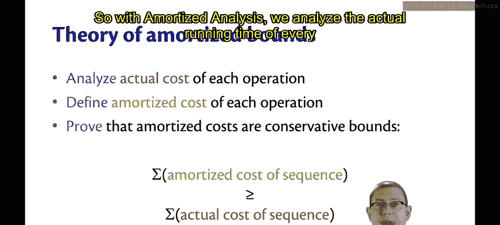

在本节课中，我们将学习摊还分析背后的理论。我们已经非正式地看到了两个使用摊还分析的例子，分别是哈希表和双列表队列。现在，让我们更深入地探讨其理论基础。

## 摊还分析的核心概念

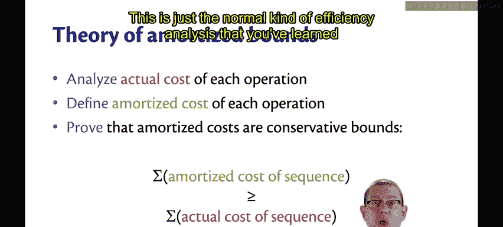

摊还分析的核心在于，我们仍然分析每个操作的实际运行时间。这与你在其他课程中学到的效率分析没有区别。我们仍然关心每个操作的实际运行时间。

但在此基础上，我们引入了一个记账技巧的概念。我们为每个操作定义一个**摊还成本**。这个成本源于我们自己的设想，但我们必须确保它是正确的。具体来说，我们需要证明，对于任何操作序列，其总摊还成本是总实际成本的一个保守上界。

这意味着，对于一系列操作，我们希望证明：
**总实际成本 ≤ 总摊还成本**

摊还成本总是比实际成本“更差”（即更高），这正是我们要为整个序列证明的。重要的是，我们是在高估操作的成本，而不是低估，这样才能保证最坏情况下的分析是可靠的。

## 回到双列表队列的例子

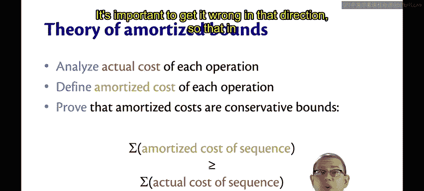

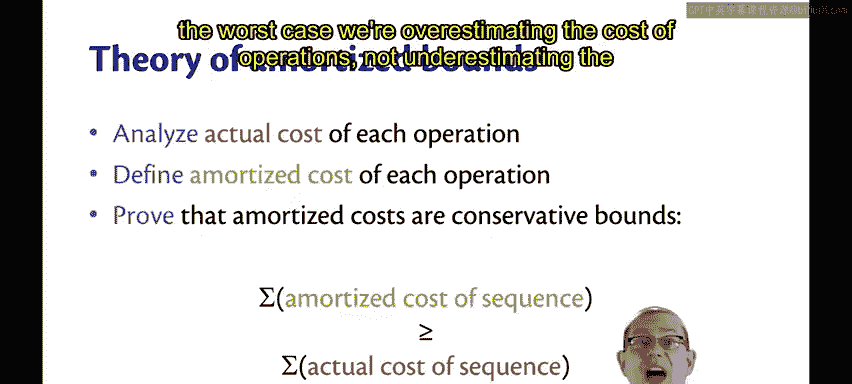

让我们回到双列表队列的例子。通过分析代码，我们可以得到：
*   `enqueue` 操作的实际成本是 **1**（因为需要将一个元素 `cons` 到列表上）。
*   `dequeue` 操作的实际成本可能是 **1**（当只需取列表的 `tail` 时），也可能是 **1 + `length(back)`**（当 `front` 为空，需要反转 `back` 列表时）。

现在，基于我们的记账设想，我们定义：
*   `enqueue` 的摊还成本为 **2**。
*   `dequeue` 的摊还成本为 **1**。

我们在这里规定，`dequeue` 操作永远只支付1个单位的成本，而任何 `enqueue` 操作则需要支付双倍的价格。

接下来，我们需要为任何操作序列证明：总摊还成本大于或等于总实际成本。

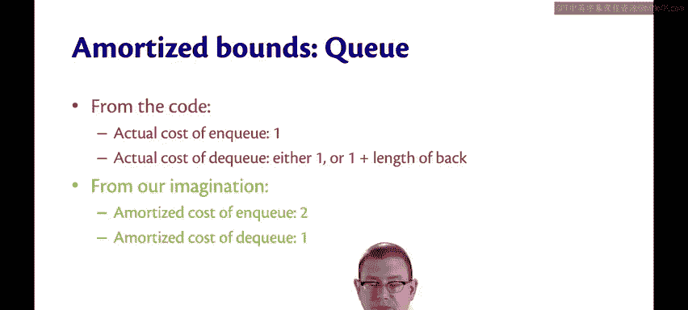

## 证明的挑战与方法

为所有可能的操作序列证明这一点是困难的。我们可以为一个具体的序列（例如，四个 `enqueue` 后跟四个 `dequeue`）进行计算验证，但这远远不够。我们需要对所有可能的序列都成立。

逐个分析所有可能的序列在数学上并不方便。更简单的方法是能够独立地分析每个操作，而不必考虑整个序列。

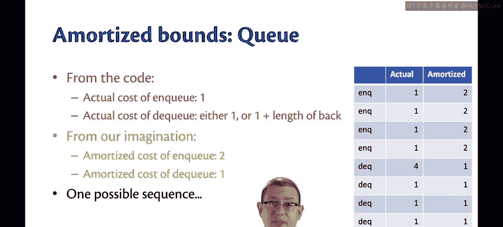

摊还分析提供了两种技术来实现这一点，它们被称为：
1.  **银行家方法**
2.  **物理学家方法**

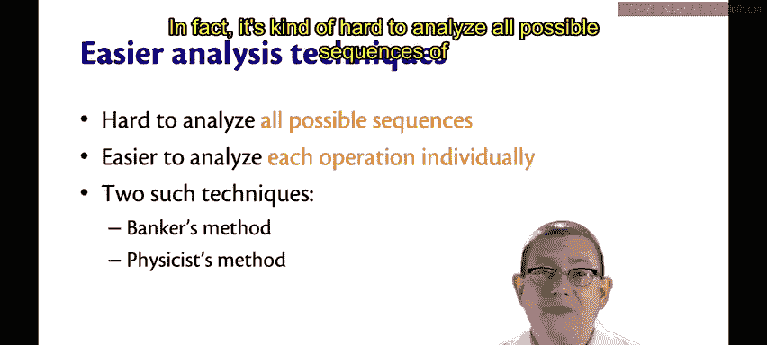

（注：本视频主要介绍了理论框架和证明目标，后续内容会详细讲解这两种具体方法。）

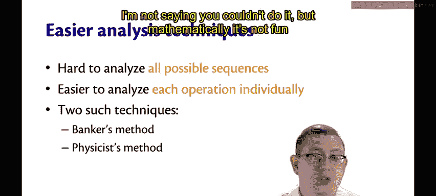

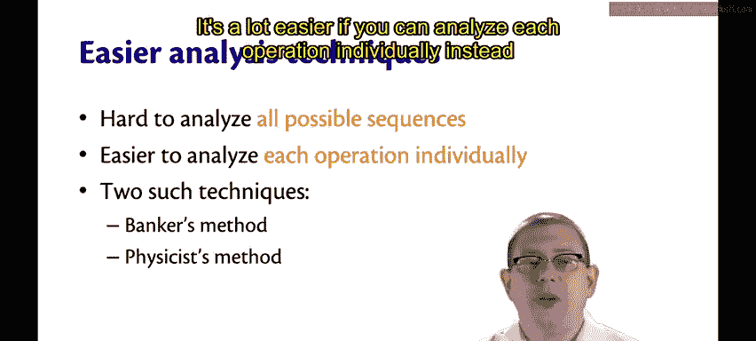

## 总结

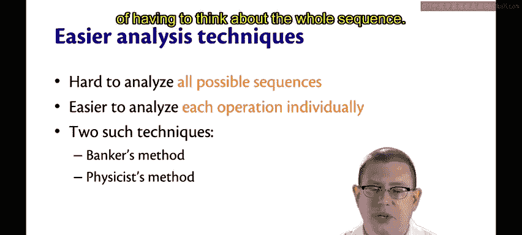

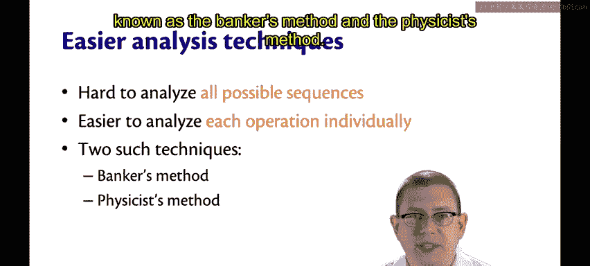

本节课我们一起学习了摊还分析的理论基础。我们了解到，摊还分析是在实际成本分析之上，通过定义“摊还成本”来进行的一种记账式分析。其核心目标是证明对于任何操作序列，总摊还成本都是总实际成本的一个保守上界。我们还看到了将这一理论应用于双列表队列的具体例子，并引出了两种简化分析的技术：银行家方法和物理学家方法。