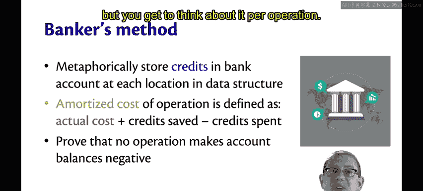
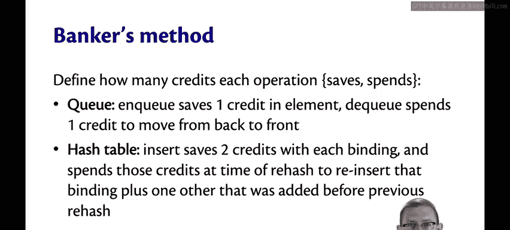
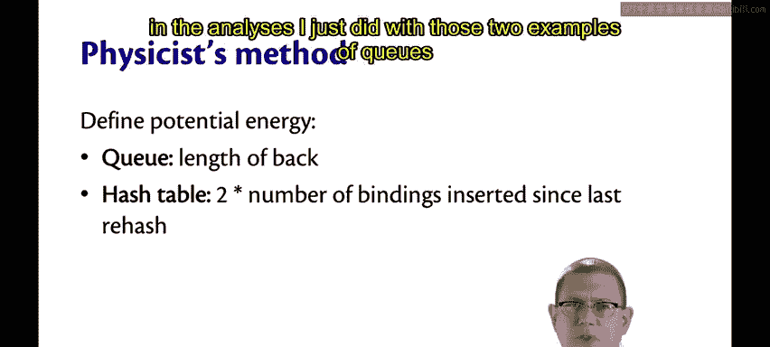
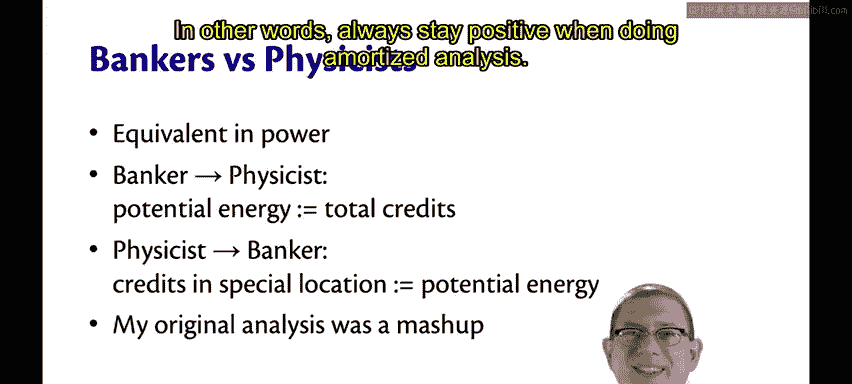

# OCaml编程：8.26：银行家与物理学家方法 🏦⚛️

在本节课中，我们将学习两种进行**摊还分析**的重要方法：银行家方法和物理学家方法。这两种方法为分析数据结构的平均性能提供了强大的工具，它们本质上是等价的，只是使用了不同的比喻。

## 银行家方法 🏦

银行家方法的核心思想是，在数据结构的每个位置“存储”信用（credits）。

例如，对于一个链表，银行家方法会说链表中的每个节点都有自己的“银行账户”。对于一个队列，可以是队列中的每个元素都有自己的信用。对于一个使用链式法的哈希表，可以是哈希表中表示为键值对的每个绑定都有自己的银行账户。

然后，我们定义一个操作的**摊还成本**为：
**摊还成本 = 实际成本 + 存储的信用 - 花费的信用**

通常，一个操作要么存储信用，要么花费信用，但也可以混合进行。实际成本会因存储额外信用而增加，或因花费信用而减少。接下来，只需证明没有任何操作会使账户余额变为负数。因为通过这样做，就能保证在整个操作序列中，摊还成本总是至少与实际成本一样大，但我们可以按操作来思考。

以下是队列和哈希表的分析示例：

对于队列，我们可以定义每个操作存储或花费的信用数量。假设 `enqueue` 操作在入队的元素上存储1个信用。而 `dequeue` 操作在需要将元素从后端移动到前端时，会花费该信用。这些账户余额永远不会变为负数，它们总是0或1。当一个元素从后端移动到前端时，其信用恰好降为0，并且这种情况最多发生一次。每个元素最多被移动到前端一次，这是一个不变式。

对于哈希表，假设 `insert` 操作在每个绑定上存储2个信用。在插入时，2个信用存入该绑定。将来某一天，该绑定可能需要被重新哈希和重新插入。那时，我们会花费这两个信用，并且以一种巧妙的方式进行：花费其中一个信用来重新哈希和重新插入该绑定本身，而另一个信用则充当“捐助者”，帮助那些缺少信用的其他绑定。为什么会有缺少信用的绑定呢？因为如果已经发生过重新哈希，那么来自旧周期的任何绑定其账户余额都将为0，此时它需要朋友的帮助。这个朋友就来自自上次重新哈希以来新插入的绑定。此时，新插入的绑定数量将与重新哈希前的旧绑定数量一样多，因此总绑定数是原来的两倍。存储2个信用正好是我们需要的数量，以便成为一个“好朋友”，帮助那些当时账户里没有“钱”的朋友。

## 物理学家方法 ⚛️

物理学家方法与银行家方法略有不同，但并非完全不同。它的比喻是，将整个数据结构（而不仅仅是特定元素）视为具有**势能**。可以想象为分析弹簧、弓弦的张力，或一个孩子在秋千顶端即将荡回时的势能等物理比喻。

在物理学家方法中，我们定义操作的**摊还成本**为：
**摊还成本 = 实际成本 + 势能的变化**

势能的变化可能为正（增加）也可能为负（减少）。这里我们需要证明势能永远不会为负。同样，这确保了摊还成本始终是实际成本的一个保守上界。

以下是两个示例：

对于双列表队列，我们可以将整个数据结构的势能定义为后端列表的长度。根据定义，这永远不会为负。任何时候，当我们执行导致后端列表反转的实际操作时，我们都可以用存储的势能来支付其成本，因为势能就是后端的长度，而这正是我们反转后端所需存储的量。

对于哈希表，我们可以将势能定义为自上次重新哈希以来插入的绑定数量的两倍。同样，基于与银行家方法相同的原因，这将是足够的。

## 两种方法的等价性与灵活性 🔄

你可能已经注意到，在上述队列和哈希表的例子中，银行家方法和物理学家方法的分析非常相似。这并非偶然，它们在能力上实际上是**等价**的，只是理解同一事物的不同比喻。

如果你想将银行家方法的分析转化为物理学家方法，只需将势能定义为数据结构中所有元素存储的信用总数。反之，如果你想将物理学家的分析转化为银行家的分析，只需在数据结构中指定一个位置（例如，选择某个特定元素），将所有信用只存储在那一个位置，并确保那里存储的就是势能。

在我最初分析哈希表和双列表队列时，实际上混合使用了这两种方法：我使用了银行家方法的术语（用“美元”而非“势能”），但又像物理学家方法那样，没有具体说明这些“美元”存储在哪里，只是想象有一个中央“储蓄罐”。

因此，请注意，你并不需要严格遵循任何一种比喻，你只需要能够定义一个操作的摊还成本，并证明你总是能够支付该操作的成本而不会变为负数。换句话说，在进行摊还分析时，始终保持“正数”。

## 总结 📝

本节课中，我们一起学习了两种进行摊还分析的核心方法：
1.  **银行家方法**：为数据结构中的元素分配“信用”，通过管理信用的存储与花费来分析摊还成本。
2.  **物理学家方法**：将整个数据结构视为具有“势能”，通过势能的变化来分析摊还成本。

这两种方法在数学上是等价的，选择哪一种取决于哪种比喻更便于理解和分析特定问题。关键在于能够定义出合理的信用或势能函数，并证明其在整个操作序列中始终保持非负，从而保证摊还成本是实际成本的有效上界。