# OCaml编程：8.27：函数式映射与集合 🗺️

在本节课中，我们将学习函数式映射（Map）和集合（Set）的实现方式，并比较不同数据结构的性能差异。我们将从已学的三种数据结构（关联列表、直接地址表、哈希表）出发，探讨它们各自的优缺点，并最终引入函数式集合的概念。

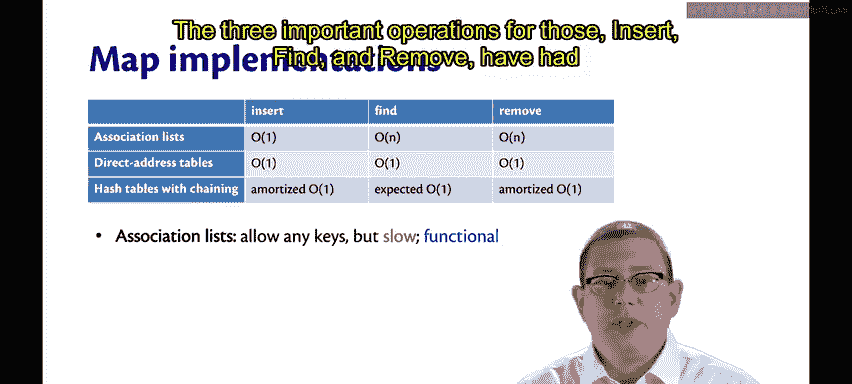

## 已实现的映射抽象数据类型

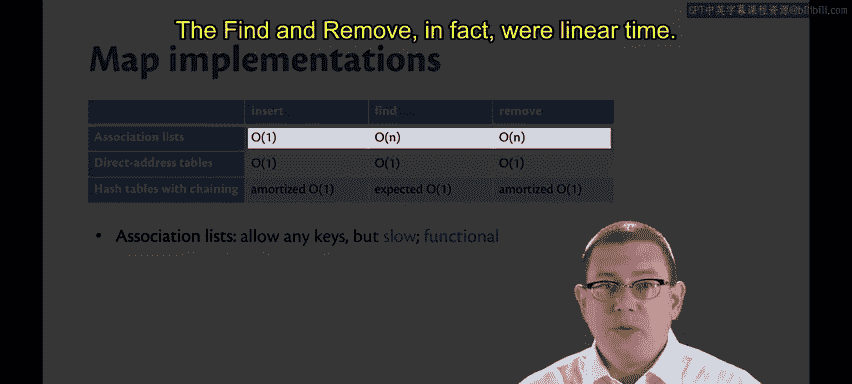

上一节我们介绍了映射（Map）的抽象数据类型（ADT）。本节中，我们来看看我们已使用三种不同的数据结构实现了它。

以下是三种实现方式及其特点：

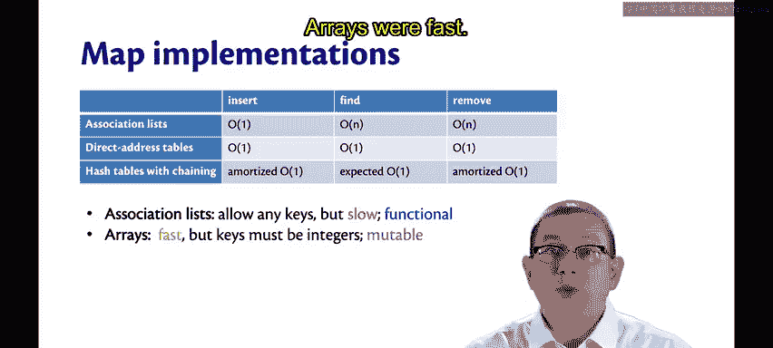

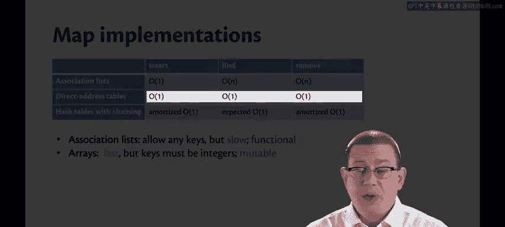

*   **关联列表**：这是一种函数式数据结构，易于编码实现。但其插入、查找和删除操作的时间复杂度均为线性时间（O(n)），性能较慢。
*   **直接地址表（数组）**：其插入、查找和删除操作均为常数时间（O(1)），速度很快。但它有两个主要限制：键必须是整数，并且它是可变的数据结构。
*   **链式哈希表**：它结合了前两者的思想。查找操作在拥有良好哈希函数的情况下，期望性能是常数时间。插入和删除操作在最坏情况下是线性时间，但通过摊还分析，我们可以认为其具有**摊还常数时间**的性能。哈希表同样是可变的数据结构。

## 迈向函数式数据结构

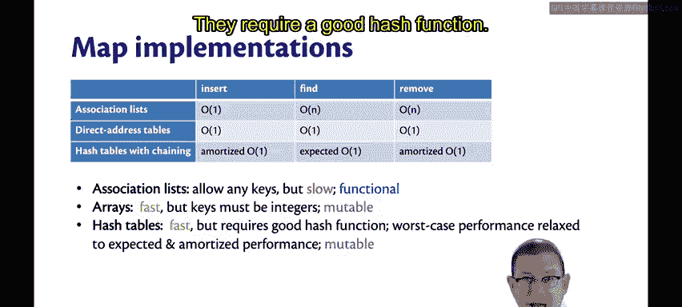

既然哈希表性能已经很好，我们能否用函数式数据结构达到同等或更好的性能呢？我们可能无法超越常数时间的性能，但函数式映射的效率能达到多高？这是我们接下来要探索的问题。😡

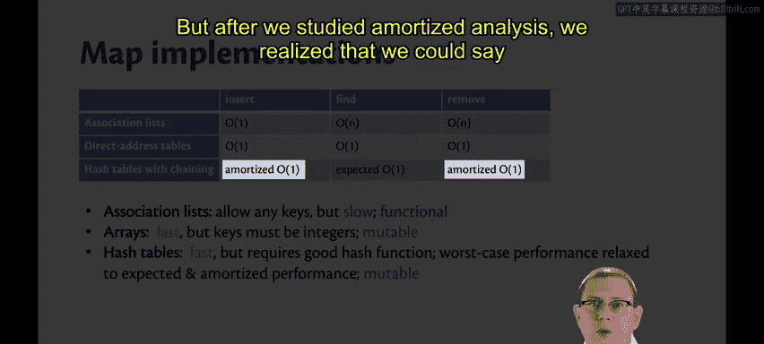

不过，我们将在集合（Set）的背景下进行探讨。让我们先简要思考一下映射与集合的关系。

从抽象角度看，一个映射本质上就是一组绑定的集合。事实上，我们一直使用的抽象表示法就是集合表示法。一个映射可能将键K1绑定到值V1，将键K2绑定到值V2，等等。如果你忽略值，就得到了一个集合——一个仅包含键的集合。因此，映射和集合是紧密相关的。实际上，用于实现它们的数据结构在很大程度上是可以互换的。

为了简化接下来的讨论，我将首先开发函数式集合。😡 在最后，只需做一个非常快速的调整，就能将其转变为函数式映射。😡

## 函数式集合接口

我们将从一个非常简单的集合接口开始。

```ocaml
module type Set = sig
  type 'a t
  val empty : 'a t
  val insert : 'a -> 'a t -> 'a t
  val mem : 'a -> 'a t -> bool
end
```

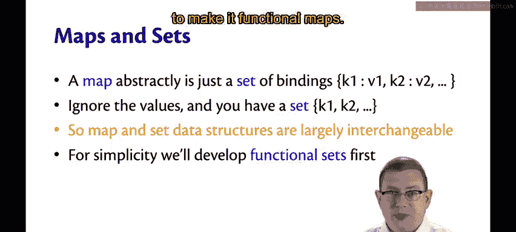

其中，`'a t` 是元素类型为 `'a` 的集合类型。`empty` 是空集合。`insert x s` 将一个元素 `x` 添加到集合 `s` 中，返回包含 `x` 以及 `s` 中所有元素的新集合。从类型签名可以看出，这是一个函数式数据结构——它接收一个旧集合并返回一个新集合，而不是返回 `unit`。最后，`mem x s` 是成员查询操作，用于判断 `x` 是否是集合 `s` 的成员。

## 列表实现示例

以下是一个将集合表示为不包含重复元素的列表的简单模块实现：

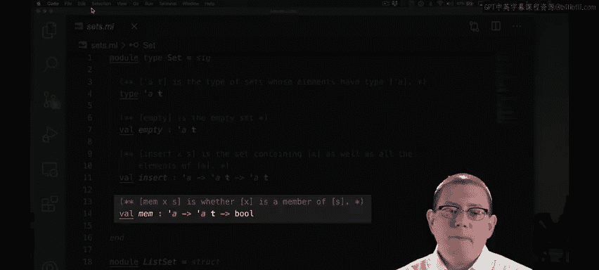

```ocaml
module ListSet : Set = struct
  type 'a t = 'a list
  let empty = []
  let mem = List.mem
  let insert x s = if mem x s then s else x :: s
end
```

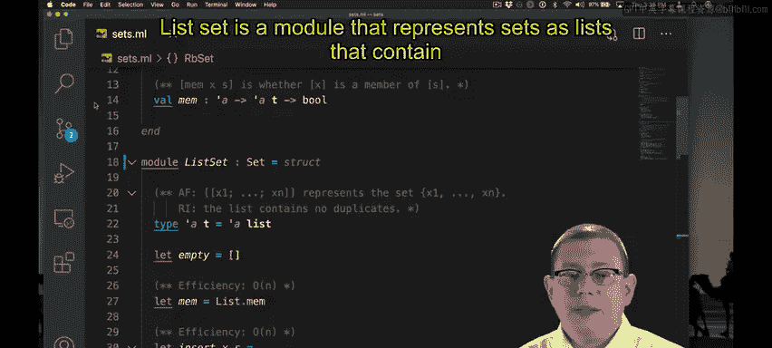

列表 `[x1; ...; xn]` 精确地表示集合 `{x1, ..., xn}`。空列表表示空集。成员查询可以直接用列表模块的 `mem` 函数实现。插入操作唯一需要注意的地方是，我们必须检查元素是否已经是集合的成员；如果是，则不改变集合，否则将其添加到列表前端。

由于在插入和查找时都需要遍历当前集合中的所有元素以检查是否存在，因此这两个操作的时间效率都与集合的大小成线性关系（O(n)）。

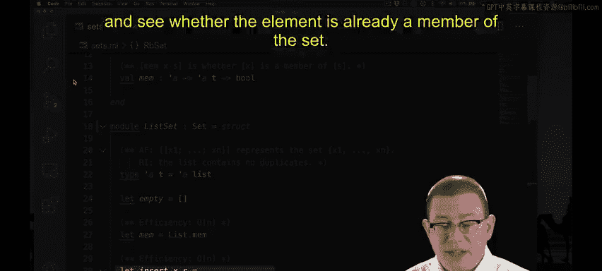

## 总结

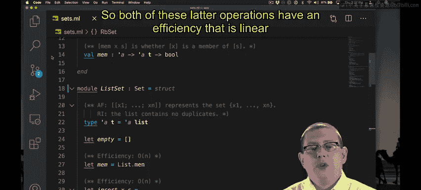

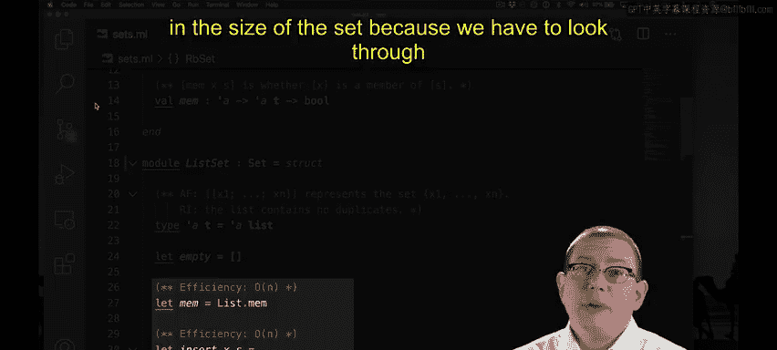


本节课中，我们一起回顾了用关联列表、直接地址表和哈希表实现映射ADT的性能特点。我们认识到，虽然哈希表性能优异，但它是可变的。接着，我们探讨了映射与集合的紧密联系，并为了引入函数式数据结构，定义了一个简单的函数式集合接口。最后，我们看到了一个基于列表的简单实现，但其核心操作（`insert` 和 `mem`）仍然是线性时间复杂度。这引出了一个问题：是否存在更高效的函数式集合/映射实现？我们将在后续课程中探索答案。