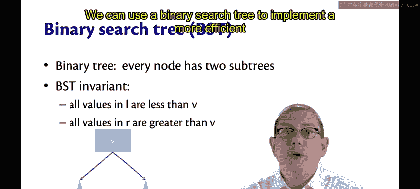
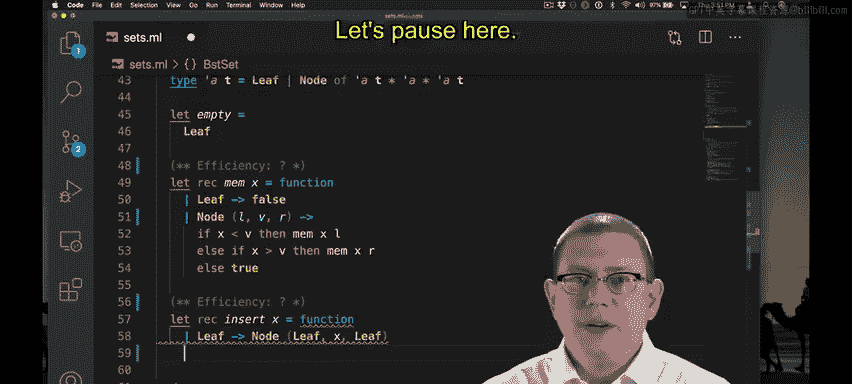
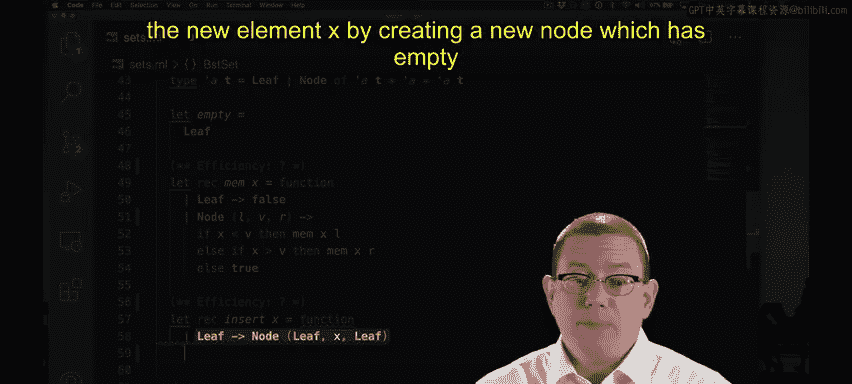
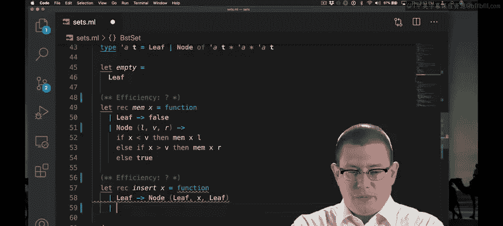
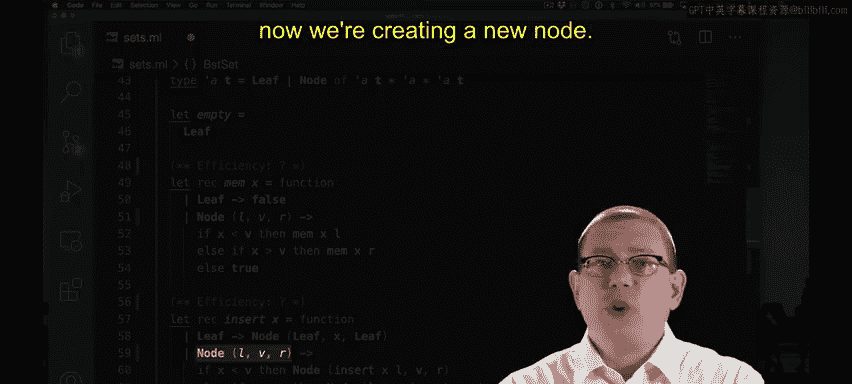
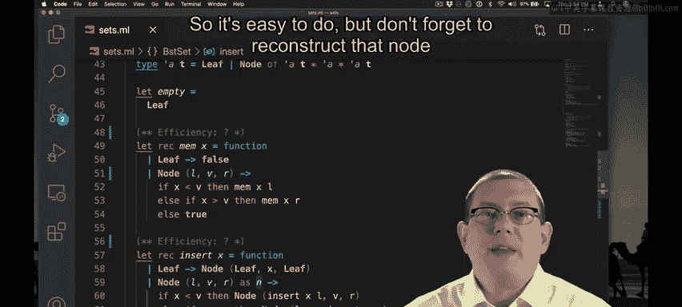

# OCaml编程：8.28：二叉搜索树实现集合

在本节课中，我们将学习如何使用二叉搜索树来实现一个比线性时间更高效的集合数据结构。我们将探讨BST的核心概念，并实现其成员检查和插入操作。

## 概述

上一节我们讨论了基于列表的集合实现，其时间复杂度为线性。本节中我们来看看如何利用二叉搜索树将时间复杂度降低到对数级别。

## 二叉搜索树简介

回想一下数组的线性搜索与二分搜索，你可能会猜到答案是肯定的，我们可以做得更好。线性搜索需要扫描整个数组，其运行时间为线性，即 **O(n)**，其中 n 是数组长度。但二分搜索不需要扫描整个数组，而是反复缩小搜索空间。当然，这要求数组满足一个不变式：它必须是有序的。但这将搜索算法的运行时间降低到了 **O(log n)**。我们不断将待搜索的数组大小减半，这对应于对数操作。

从早期的编程课程中，你会记得一个相关的概念：二叉搜索树，它使得搜索元素更加高效。在二叉树中，每个节点都有两个子树。但二叉搜索树不变式，或称BST不变式，规定：如果一个节点包含值 **v**，那么其左子树中的所有值都必须小于 **v**，其右子树中的所有值都必须大于 **v**。



我们可以使用二叉搜索树来实现一个更高效的集合。

## 实现BST集合

以下是使用模块 `BSTSet` 实现集合接口的起始代码。表示类型使用了我们熟悉的树类型。

```ocaml
type 'a tree =
  | Leaf
  | Node of 'a tree * 'a * 'a tree
```

这里的抽象函数是：`Leaf` 表示空集。如果一个节点包含值 **v** 以及子树 **l** 和 **r**，那么它表示包含 **v** 的集合，并与 **l** 和 **r** 所表示的集合取并集。

我的表示不变式就是BST不变式：对于树中的每个节点，其左子树中的所有值都必须小于节点值 **v**，其右子树中的所有值都必须大于 **v**。

空集就是空树，即一个叶子节点。我需要实现两个操作：`mem` 和 `insert`。

### 实现成员检查（Mem）

让我在实现 `mem` 时以BST不变式为指导。简单的情况是，如果我查看的是一棵空树，那么任何元素都不可能是该集合的成员，因此在这种情况下我返回 `false`。

如果我查看的树中有一个节点，那么我想将我要查找的值 **x** 与该节点中的值 **v** 进行比较。如果 **x** 小于 **v**，那么我想递归地在左子树中查找。如果 **x** 大于 **v**，那么我想递归地在右子树中查找。否则，**x** 必须等于 **v**，那么我就找到了集合中的这个元素，可以返回 `true`。

### 实现插入（Insert）





`insert` 的算法与 `mem` 的算法几乎相同。在这两种情况下，我们都需要使用BST不变式来确定节点在树中的位置。区别在于，对于 `mem`，我们在那里查找它，然后根据是否找到返回 `true` 或 `false`；而对于 `insert`，一旦我们到达正确的位置，我们就把元素放在它应该在的地方。



因此，`insert` 的代码看起来几乎和 `mem` 的代码一样。让我们在这里暂停一下，我有一个未详尽处理的模式匹配需要解释。

如果我们有一棵空树，那么我们通过创建一个具有空子树的新节点来插入新元素 **x**。

如果我们有一棵包含节点的非空树，那么我们使用BST不变式来比较要插入的元素 **x** 与节点中已有的值 **v**。如果 **x** 小于 **v**，我们递归地在左子树中插入。如果 **x** 大于 **v**，我们递归地在右子树中插入。否则，我们正好处于该元素应该在的位置，因此我们可以直接返回已经存在的节点，因为 **x** 必须等于 **v**。



关于这个实现有几点说明。我们已经将 `Node(l, v, r)` 作为模式匹配的一部分。现在我们正在创建一个新节点。我们可以通过使用 `as` 模式给上面匹配到的节点起一个名字，然后在这里直接返回 `n` 来进行微小的优化。这样稍微好一点。

此外，这里一个常见的错误是只递归处理子树，但忘记在其周围实际重建树的其余部分。你可能会在这里递归处理左子树并将 **x** 插入到适当的位置，但现在你完全忘记了 **v**（它应该仍在集合中）以及右子树中所有应该在集合中的元素。所以这很容易出错，但不要忘记用 **v** 和 **r** 重建那个节点。

## 总结



本节课中，我们一起学习了如何使用二叉搜索树来实现一个高效的集合数据结构。我们理解了BST不变式的核心概念，并实现了基于此的成员检查和插入操作，从而将时间复杂度从线性降低到了对数级别。