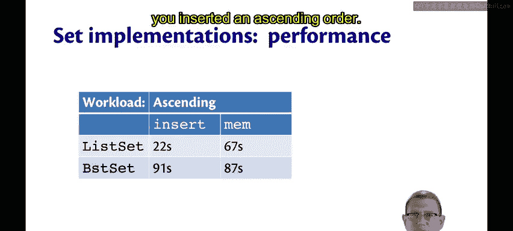
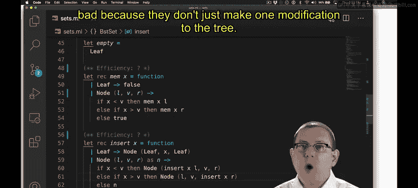
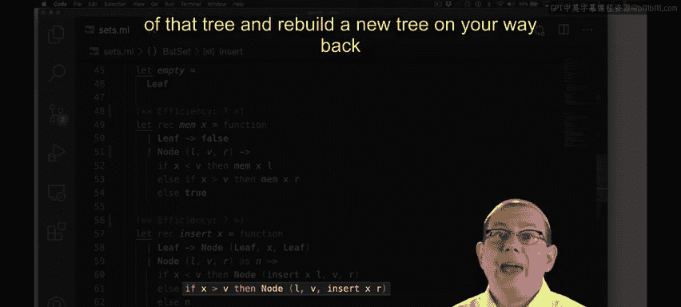
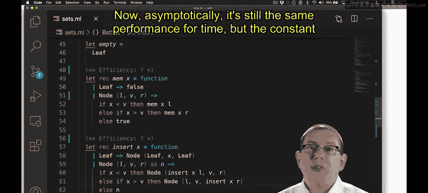

# 康奈尔大学《OCaml编程｜CS3110：OCaml Programming： Correct + Efficient + Beautiful》中英字幕 - P145：-145-Binary Search Tree Efficiency Chap8 Video 29.zh_en - GPT中英字幕课程资源 - BV1Tx4y1s7sP

What's the efficiency of insert as well as Mem。 So here's the bad news。

 The BST operations are not necessarily logarithmic， even though that's what inspired us。

On the tree that I've shown here， we do get nice logarithmic operations to be able to find an element of the tree or to insert into it。

And that's because the tree is very dense。 It's very compact。 It's all close together。

 None of the paths in the tree are very well。But。😡。

There are other shapes that that tree could have and still represent the same set。In fact。

The second tree that I've drawn here still satisfies the BST invariance。

But if you want to find out whether seven is an element in that tree。

 you have to look through all of the nodes in the tree rather than just following one short path down the tree。

In fact， this tree has degenerated to essentially being just a linked list。

And we know what the efficiency of a lengthless implementation of sets is。 We just created it。

 If you want to insert or find an element in it， that's linear time， not logarithmic。

So the tree shape here depends on the insertion order。

Suppose you were inserting the elements one through four。

 and you happened to insert them in this random order，3，2，4，1。You'd start off with three。

 then you'd go to insert 2 that would have to go to the left by the BST invariant。

Then you insert four that would have to go to the right by the BST invariant。

To insert one that would go to the left of two by the BS T invariant。

 So all of this is completely deterministic。 The invariant tells you exactly where each node has to be inserted。

It's only the insertion order that's controlling the shape of the tree。Well， suppose， though。

 that you were going to insert the same elements。 but in a linear order 1，2，3，4。

There's only one way to do that insertion。 You'd start off with one。Then by the BST invariant。

2 has to go to the right of that。3 has to go to the right of two。

 and four has to go to the right of three。So when you insert elements in this increasing order。

You end up with a tree that has just degenerated to a list。 We call such a tree unbalanced。

 It's leaning in one direction。 In this case， it's leaning to the right because we were inserting an ascending order。

If we happen to insert in descending order， we would get the symmetric case of a tree that's leading to the left。

This makes a big difference。The insertion order really matters to the performance of a set based on binary search trees。

😡，Let me make that point concrete。😡，I'm about to show you some numbers from some performance tests that I ran on this implementation of binary search trees。

I've got two workloads in the numbers I'm about to show you。

Workload1 is that ascending order in which I insert elements。Increasingly， one then two then three。

 then4 and so forth。Actually， what I'm going to do is insert 50，000 elements in ascending order。

And then after all that's done， I'm going to call them 100。

000 times half of those times it's going to be on elements that are in the set。

 so I have to look through the tree to find them half of the time it's going to be on elements that are not in the set。

 and so depending on how the tree shape ends up， I might get a faster or a solar map。😡。

Workload2 is going to be random。😡，I'm going to insert 50。

000 different elements in a completely random order。And then I'll again do 100，000 membership tests。

 half of which will be for elements in the set， half of which will be for elements not in the set。

Are you ready to see the numbers。Here we go。So first off。

 our list set implementation for the ascending workload。Insert took 22 seconds to do all 50。

000 insertions， and then Mem took another about a minute to check for 100，000 different elements。

This is not great performance， but we knew that lists were not an especially efficient implementation。

For binary search trees。Oh， oh。We wanted them to be faster than list sets。

 but look at those running times。They're terrible。It took 91 seconds to do the insert operations and 87 seconds to do the mem operations。

Why is that。We said earlier that a BST would degenerate to a list if you inserted an ascending order。

Well， the reason it gets even worse is if you look at the code。Insert。

And MEM actually both turn out to be nice implementations that although they have to read all the elements of the list。

 the only modification they make to the list is that most conzing one elements onto the front。

BST sets， on the other hand。In the insert operation are so bad because they don't just make one modification to the tree。

In fact， if you insert a node that's bigger than all the other nodes so far。

 you're going to walk down the right spine of that tree and rebuild a new tree on your way back up。

So you're actually creating new trees as you go。 and that costs time and space。 Now， asymptotically。

 it's still the same performance for time。But the constant factor here gets a lot bigger。

So that's why we end up with such an inefficient implementation with BST sets for the ascending workload。

For the random workload， we get a prettier picture。

It's just about the same performance for list sets， but for BST sets。

 notice how fast we now have them working。 We've got an insert that runs in 。05 seconds for all 50。

000 inserts and men that runs in 。04 seconds for all 00，000 membership tests。

Those are the kind of numbers that we're looking for。

And we get that better performance because the shape of the tree is better with the random workload。

The tree looks more like one with short paths in it instead of one very long path。

So insert and mem both have an efficiency that is worst case linear for binary search trees。

 This is a common mistake that programmers sometimes make。

They assume that binary search trees give you logarithmic performance， they don't。

It really depends on the worklift。But if you could find a way to guarantee that trees always had short paths instead of long paths。

 you could do better。 you could get that logarithmic performance。How can we get shorter paths。

But we need to balance the trees so that they're not leaning。

 even if the insertion order happens to be bad。

