# 数据结构与算法：8.3：平衡二叉树 🧑‍💻

在本节课中，我们将要学习平衡二叉树的概念及其重要性。我们将探讨几种著名的平衡二叉搜索树数据结构，了解它们如何通过不同的“不变量”来维持树的平衡，从而保证对数级别的时间复杂度。

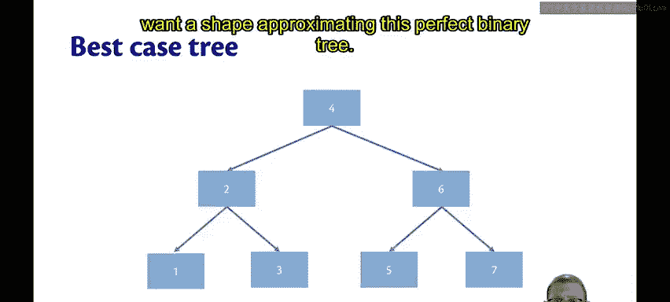

---

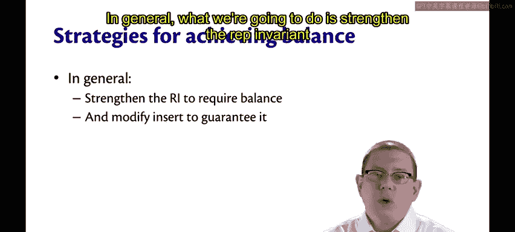

## 理想情况：完美二叉树 🌳

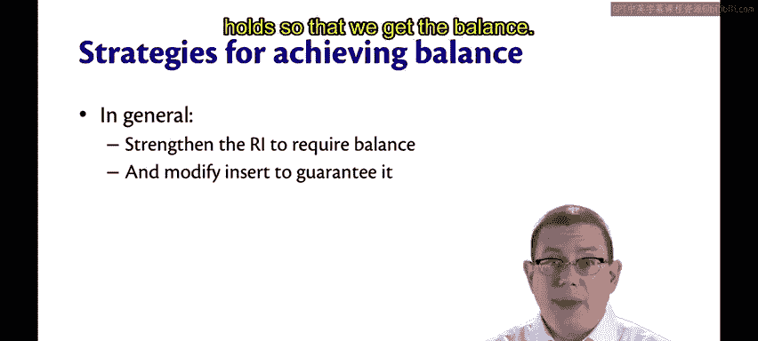

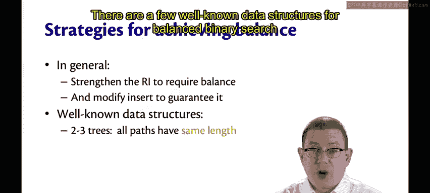

上一节我们介绍了二叉搜索树的基本操作。本节中我们来看看如何让这些操作更高效。最理想的情况是树的结构像下图所示。

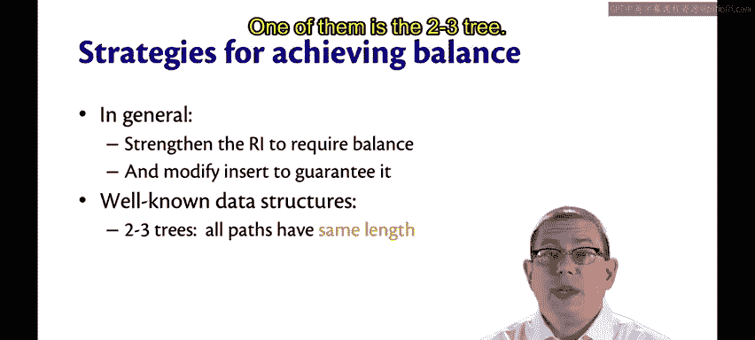

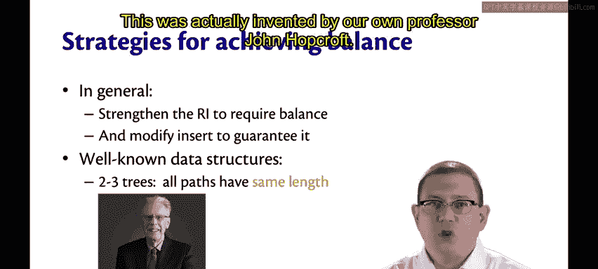

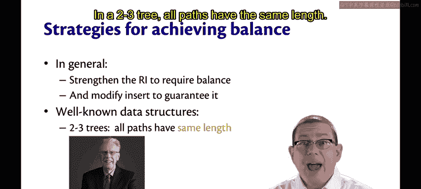

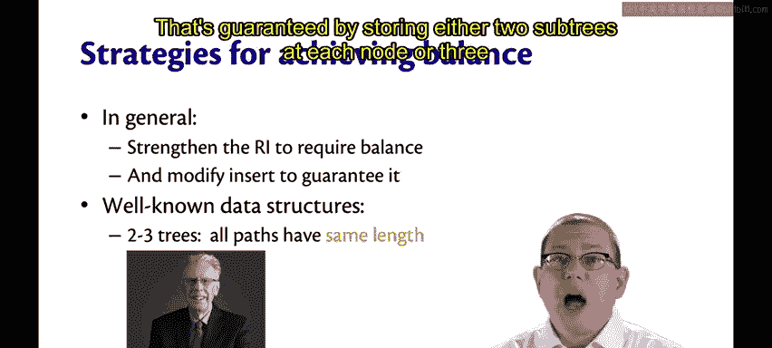

这是一棵**完美二叉树**，其中所有从根节点到叶子节点的路径长度都相同。在这种树中，查找、插入和删除操作的时间复杂度是**对数级别**的，即 `O(log n)`，其中 `n` 是树中节点的数量。

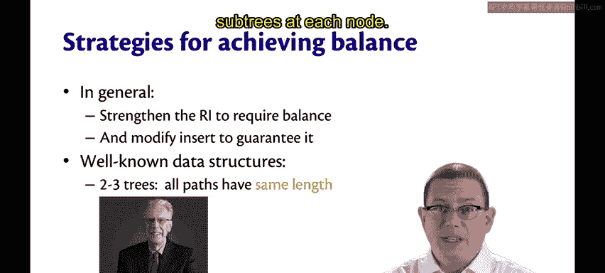

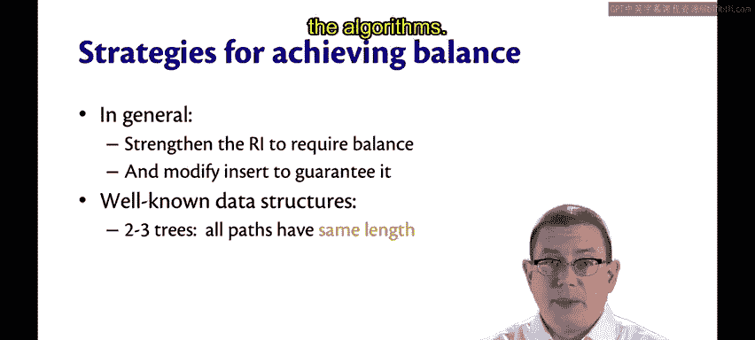

即使我们无法让树达到完美的状态，我们也希望其形状能近似于这种完美二叉树。

---

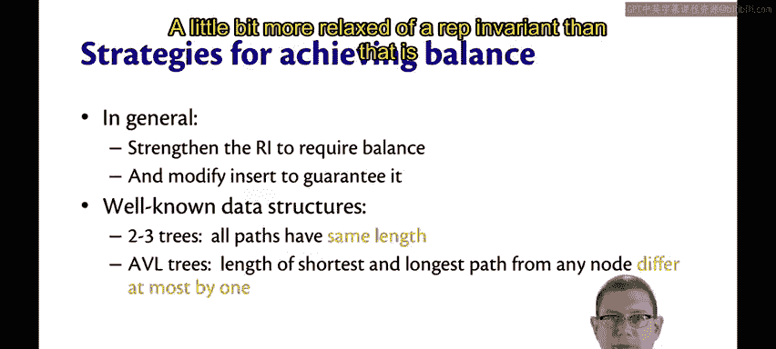

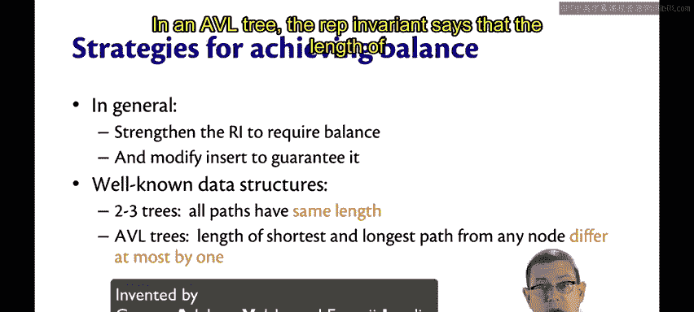

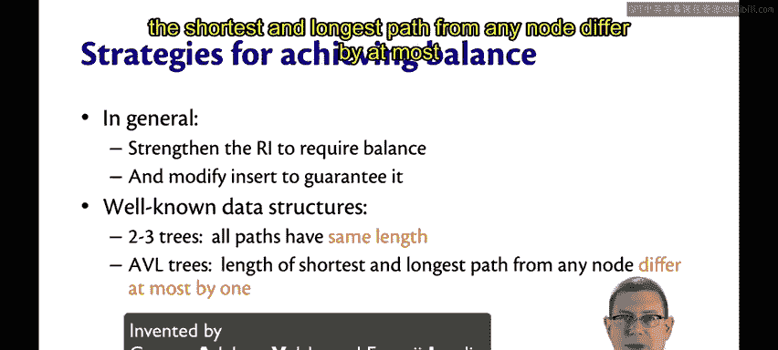

## 实现平衡的策略 ⚖️

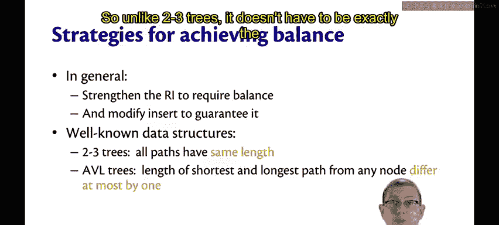

为了实现平衡，我们通常采取的策略是：强化二叉搜索树的“不变量”要求，使其包含平衡条件；并修改插入和删除操作，确保这个新的不变量始终成立。

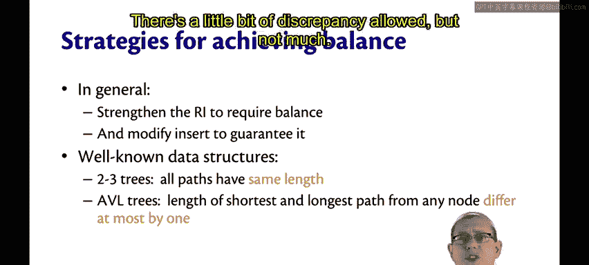

以下是几种著名的平衡二叉搜索树数据结构：

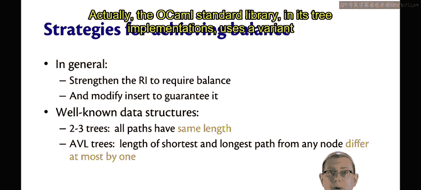

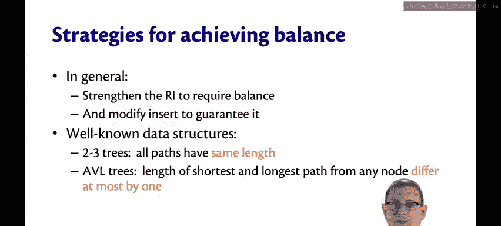

*   **2-3树**：由约翰·霍普克罗夫特教授发明。在2-3树中，所有路径的长度都相同。这是通过允许每个节点存储**两个或三个**子节点来实现的。这种结构保证了严格的平衡，但也使数据表示和算法变得稍微复杂一些。
*   **AVL树**：其不变量比2-3树稍宽松一些。它要求对于树中的**任何节点**，其**左子树和右子树的高度差最多为1**。这意味着路径长度不需要完全相同，但差异被严格控制在一个很小的范围内。
*   **OCaml标准库的变体**：实际上，OCaml标准库在其树实现中使用了一种AVL树的变体，它允许最短路径和最长路径的长度**最多相差2**，这是一个更为宽松的不变量。
*   **红黑树**：拥有一个更为宽松的不变量。它要求从任何节点到其子孙叶子节点的所有路径中，**最长路径的长度不超过最短路径长度的两倍**。虽然这听起来差异较大，但事实证明这足以实现平衡，并为我们提供对数时间复杂度的操作。

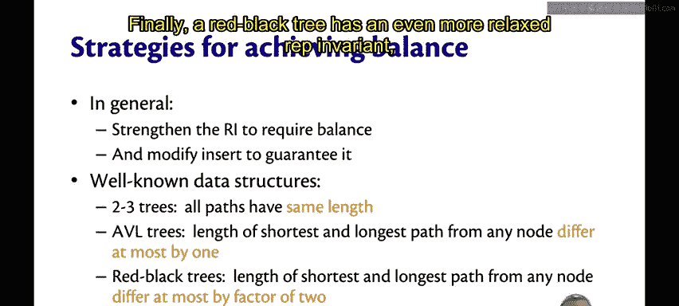

---

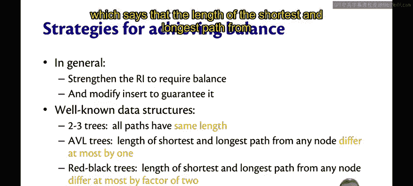

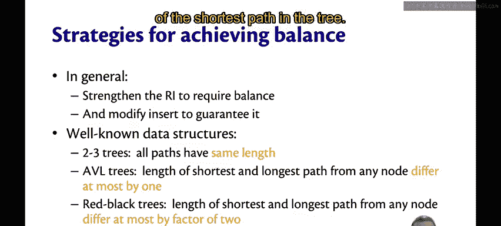

## 总结 📚

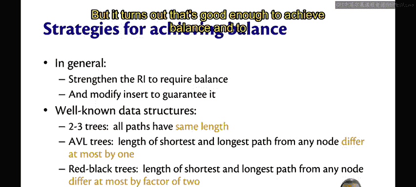

本节课中我们一起学习了平衡二叉树的核心思想。我们了解到，通过为树的结构引入并维护一个平衡的“不变量”（如高度差限制或路径长度比例限制），可以确保树不会退化成低效的链表形态。无论是严格的2-3树、高度平衡的AVL树，还是通过颜色规则维持平衡的红黑树，它们的目标都是一致的：**将操作的时间复杂度保持在 `O(log n)`**，从而构建出既正确、高效又优雅的数据结构。