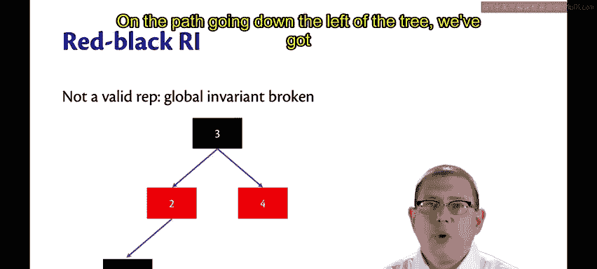
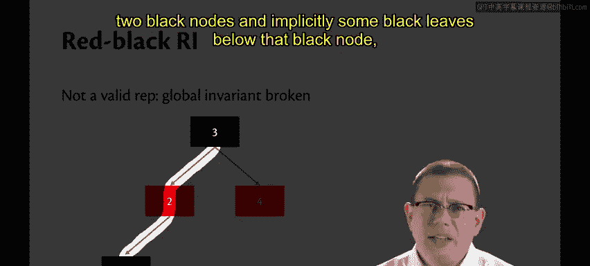
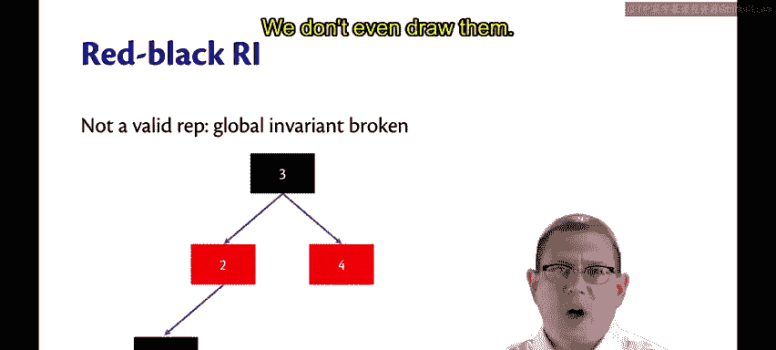
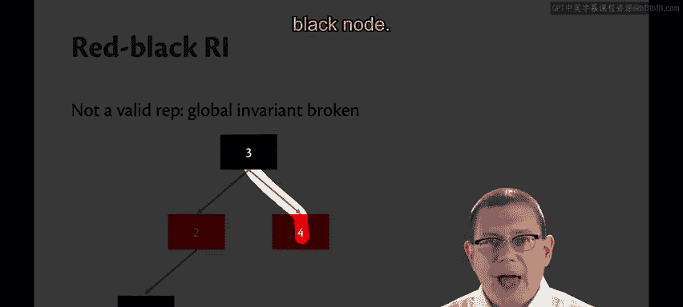
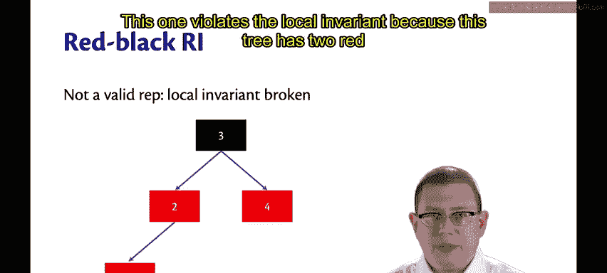
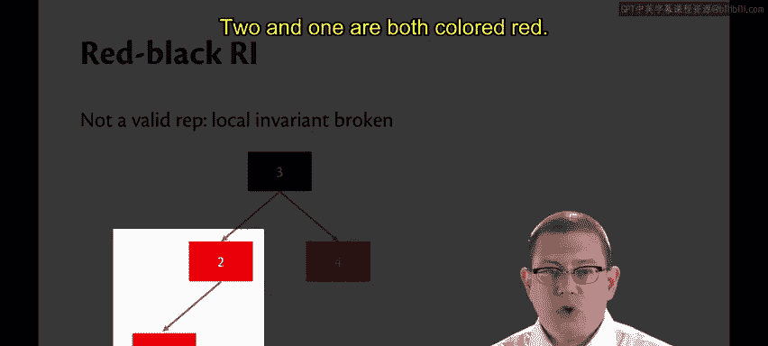
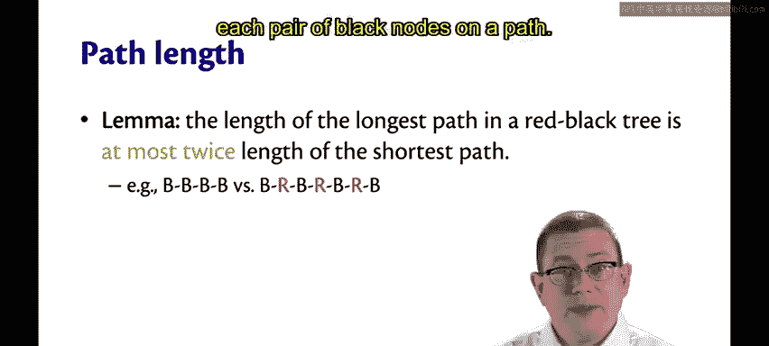
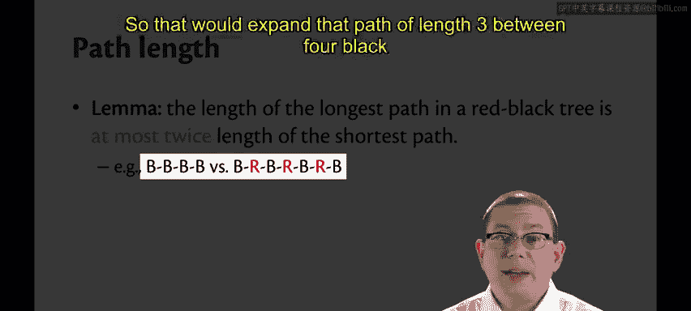

# 康奈尔大学《OCaml编程｜CS3110：OCaml Programming： Correct + Efficient + Beautiful》中英字幕 - P147：-147-Red-Black Trees Chap8 Video 31.zh_en - GPT中英字幕课程资源 - BV1Tx4y1s7sP

Red black trees are an incredibly useful， practical and common data structure。In fact。

 you will find them in the Linux kernel。😡，You will find them in the C++ standard templatelate library。

 You'll find them in Java's own treemap implementation。😡，And we love them here in 31，10。

 They're even a part of the 31，10 shield。 You can see this tree with some red and some black nodes in it。

😊，Of course， the other two pieces of that shield are lists and functions which transform inputs into outputs。

Red black trees were invented back in 1978。I'm going to be teaching you a functional version of them that was invented by Okasaki in 1998。

In a red black tree， first off， you have a binary search tree。But in addition to that。

 every node is colored， either red or black。Why those two colors？

 It vexes me because I happen to be red， green color blind。 I don't see red very well at all。

 It mostly just looks gray to me。I'm told those were the colors they chose originally because they had a color printer back then。

 and those were the two best colors they could print on that particular color printer。

These days were kind of stuck with it。The red black tree， by convention。

 has leaves and roots that are always colored black。

So it's just some nodes in between there that could end up being colored red。

The rapidin variant for a red black tree is one of the most important things to know about it。

First off， the repinvariant requires that the tree is a BST。

 so the BST invariant is part of the red black invari。Then there's two other pieces。The first。

 I'll call the local invariant。The local invariant for a red black tree says that no red node has a red child。

So you never get two reds in a row。I call that local because you can check it locally at each node。

 look at a node， and then just look at its children。Of course。

 you'd have to do that for all the nodes， but it's still something you can check locally at the note。

The global invariance， though， is something that is not so easy to check。

The global invariant says that every path from the root to a leaf has the same number of black nodes。

So if one path from the root to a leaf has five black nodes。

 then all of them have to have five black nodes。Now that doesn't mean all the paths have the same length。

 some of them could have some reds interspersed in between。

 but they've all got to have the same number of black。This， by the way， is a good example。

Of a time where we don't want to check an entire precondition or assert the precondition on entry to a function。

Because every red black tree operation is going to have this rein variant implicitly as a precondition and checking these invariants actually requires looking at every node in the tree。

So that would automatically cause every operation to become at least linear time， if not worse。

 if we were to assert the precondition， Let's look at some examples。

Here's a candidate for a red black tree， but it fails the repin variant because the global invariant is broken。

On the path going down the left of the tree， we've got two black nodes and implicitly some black leaves below that black node。

 but we're mostly not going to think about leaves， we don't even draw them。

On the right path down through the tree， we only have one black node。

So the black lengths of those paths are not the same。That violates the global invari。

Here's another tree。This one violates the local invariant。

Because this tree has two red nodes in a row。2 and1 are both colored red。

 You're not allowed to do that in a red black tree。

Here is a valid， red black tree。The black length of all paths is the same。

 There's two black nodes on every path。Or if you count the leaves，3。

And we don't have any two red nodes in a row。 Now it's fine that the length of sub paths differs。

We have some paths in this tree that have length two， some that have length one， that's okay。

It's also fine that we don't have the same number of red nodes in every path。

 that's not a part of any invariant。And it's fine that we have a couple black nodes in a row on a path。

What about those pathway？It's a lemma that we could prove that the length of the longest path in a red black tree is at most twice the length of the shortest path。

You can get some intuition for why that would be true by thinking about any path that has only black nodes。

So suppose there's a path in the tree that has four black nodes and it's only those nodes on that path。

Well， by the global invariance。Every other path in that tree must have four black nodes。

So how could you make the paths longer， Well you could insert some red nodes along some paths。

 but maybe not others。Where can you insert those red nodes？

Well we said by convention the root would be black， you can't insert it at the root。

And we said that you could never have two red nodes in a row， that's the local invariant。

So the most you could ever insert is one red node between each pair of black nodes on a path。

 So that would expand that path of length 3 between four black nodes。

To be length6， this is how red black trees achieve logarithmic performance。In fact。

 it's a theorem that the maximum depth of a node in a red black tree of size n is at most two times the floor of log n plus1 where we're taking the log base2 here。

So since Big O lets us ignore constant factors， we get to ignore that too， doesn't really matter。

That means all of our operations are going to run in logarithmic time in the size of the tree。

Isn't that great， We get logarithmic performance by enforcing those red， black invariants。

That means red black trees are balanced。And all the operations generally run in logarithmic。

