# 红黑树：8.4：旋转操作

在本节课中，我们将学习红黑树插入操作后，如何通过旋转来修复可能违反的局部不变式（即一个红节点不能有红子节点）。我们将详细分析四种可能的违规情况，并学习如何通过旋转和重新着色来恢复平衡。

上一节我们介绍了红黑树插入后可能违反的局部不变式。本节中我们来看看如何通过旋转操作来修复这些违规。

插入一个红节点后，只有四种可能的方式会违反局部不变式。所有情况都涉及一个黑父节点、一个红子节点，以及该红子节点下又出现了一个红节点（即违规的红节点）。父节点必须是黑色，因为原树满足局部不变式。之所以有四种情况，是因为在树的每个位置，你可以选择向左或向右走，然后再向左或向右走。

以下是四种违规情况的图示，我们将其命名为情况1到情况4。

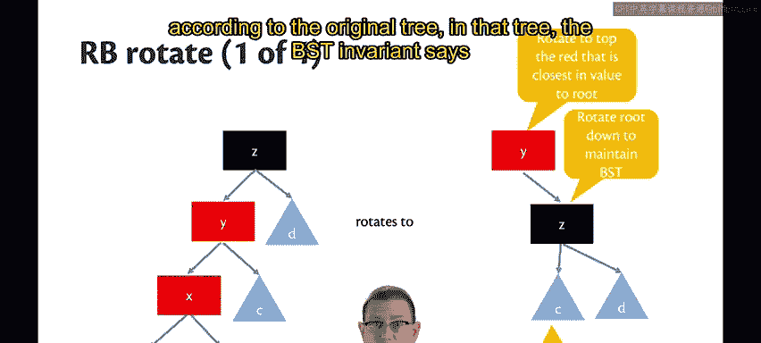
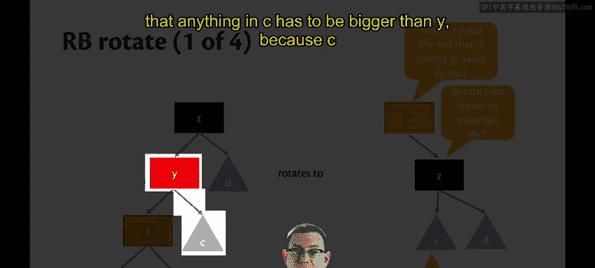


## 情况1分析

让我们先看第一种情况。图中节点标记为X、Y、Z，代表节点存储的值。从X、Y、Z延伸出的子树标记为A、B、C、D。我们暂时不关心这些子树的具体内容。


这里的违规点是X作为第二个红节点出现。我们来看看如何旋转这棵树以获得更多平衡，并恢复局部不变式。

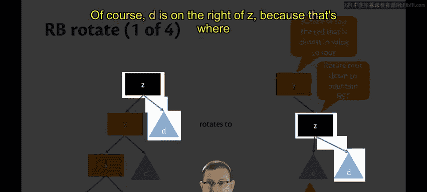

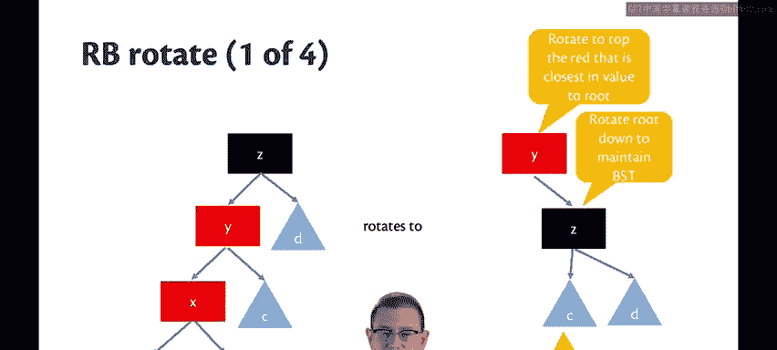

首先，我们将选择Y作为新构建子树的根节点。选择Y并非随机，因为它是违规的红节点中，在值上最接近Z的节点。根据二叉搜索树（BST）不变式，X < Y < Z，因此Y比X更接近Z。

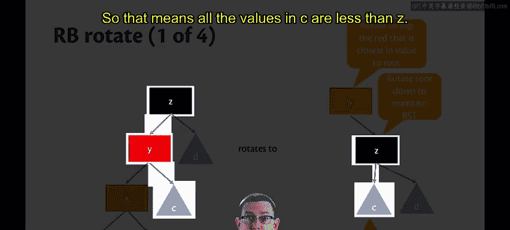

想象一下，我们物理上“提起”Y节点，其他节点因其“重量”在重力作用下围绕Y重新排列。以下是它们落下的位置：

*   Z落在Y的右侧。根据BST不变式，Z的值大于Y，所以它必须在Y的右边。
*   子树C和D也落在Y的右侧。在原树中，C是Y的右子树，所以C中的所有值都大于Y。同时，Y < Z，且D是Z的右子树，所以D中的所有值也大于Y。
*   具体来说，D成为Z的右子树，因为D中的所有值都大于Z。
*   C成为Z的左子树，因为原树中C就在Z的左侧，意味着C中的所有值都小于Z。

以上所有安排都遵循BST不变式。

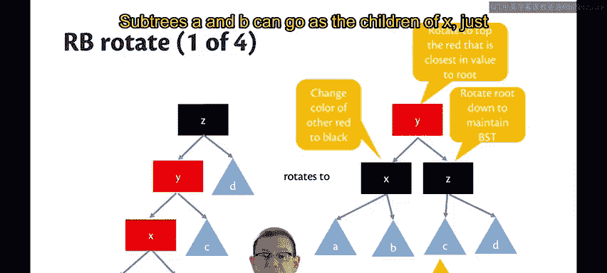

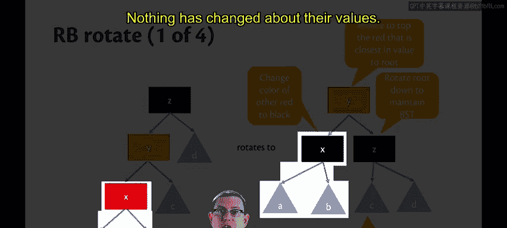

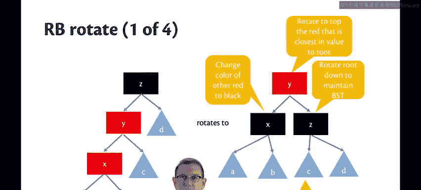

接下来，我们需要处理违规节点X。它将成为Y的左子节点（根据BST不变式）。我们将X的颜色改为黑色，这修复了X和Y之间的局部不变式违规。

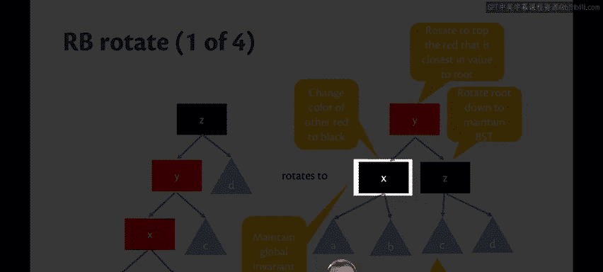

子树A和B成为X的子节点，位置与原树相同。它们的值没有变化，BST不变式对此没有影响。

现在考虑我们刚刚创建的黑色节点X。我们需要确认在操作过程中全局不变式（从根到任何叶子的路径上黑色节点数量相同）得以维持。在原树中，我们展示的所有路径上都有一个黑色节点。子树A、B、C、D中可能还有自己的黑色节点，但由于原树满足全局不变式，这些子树中的黑色节点数量是相等的。在新树中，我们展示的所有路径上仍然有一个黑色节点（即X）。A、B、C、D中的黑色节点数量保持不变，因此全局不变式得以维持。

至此，我们成功维持了BST不变式和全局不变式，并修复了X和Y之间的局部不变式违规。

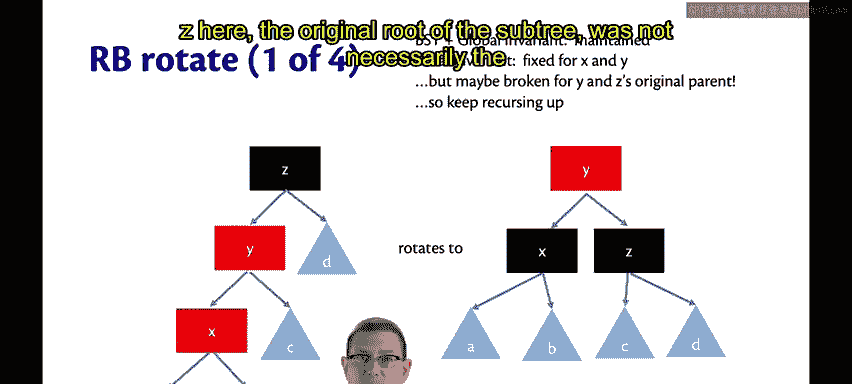

但出现了一个新问题：Z在原树中可能不是整个红黑树的根节点，它上面可能还有其他节点。当我们返回这个以红色节点Y为根的新子树时，可能会创造一个新的违规。因为Z在原树中的父节点可能是红色的，那么Y就会成为它下面的第二个红节点。因此，我们需要继续向上递归，处理Z的原父节点，重新平衡，并一直进行到整个红黑树的根节点。

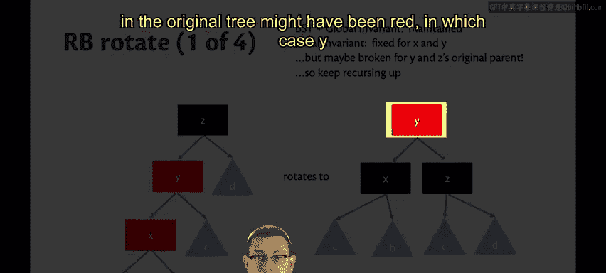

## 其他情况与Okasaki算法

第二种旋转操作与第一种类似。我们再次选择Y作为新根，因为它在值上最接近Z（X < Z，但Y > X，所以Y仍然比X更接近Z）。我们提起Y，让其他节点落在正确位置，并将X重新着色为黑色。

第三和第四种旋转操作与我们刚刚看到的操作基本对称，因此不在此详细展开。

但请注意这些幻灯片中每一页的右侧结果树。无论输入是哪种违规情况，输出树的结构都是相同的。这就是Okasaki算法的精妙之处。这意味着可以用模式匹配非常优雅地实现这个算法。

以下是实现代码：

```ocaml
let balance = function
  | Black, z, Node (Red, y, Node (Red, x, a, b), c), d
  | Black, z, Node (Red, x, a, Node (Red, y, b, c)), d
  | Black, x, a, Node (Red, z, Node (Red, y, b, c), d)
  | Black, x, a, Node (Red, y, b, Node (Red, z, c, d)) ->
      Node (Red, y, Node (Black, x, a, b), Node (Black, z, c, d))
  | color, value, left, right -> Node (color, value, left, right)
```

代码中的四个模式分别对应四种旋转情况。但只有一个右侧分支，我们使用`|`（或）模式将它们组合在一起。所有那些用图示展示的复杂逻辑，实际上可以用这几行模式匹配代码实现。

这并不是说你能直接从这段代码中获得算法如何运作的直觉。事实上，在这方面图示比代码更容易理解。但当你查看命令式语言（如Java、C++）中的红黑树实现时，你会发现它们远没有这么简洁。

## 算法收尾

让我们完成Okasaki算法的描述。我们先将新节点着为红色，然后递归向上回溯，在回溯过程中进行平衡操作。当我们到达最顶部时，算法的最后一步是将根节点着为黑色。因为有可能在重新平衡的过程中，我们将一个红节点推到了根的位置。如果根节点是红色，我们在此最后一步将其重新着为黑色，这将使树的**黑高**（任何路径上的黑色节点数量）增加1。这是整个算法中唯一允许黑高增加的地方。

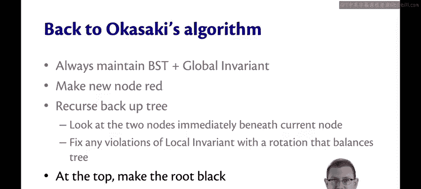

本节课中我们一起学习了红黑树插入后的四种旋转操作，理解了如何通过选择特定节点作为新根、重新排列子树以及重新着色来修复局部不变式违规，同时保持BST和全局不变式。我们还看到了Okasaki算法如何用简洁的模式匹配统一处理这四种情况，并在最后通过将根节点着为黑色来保证全局性质。