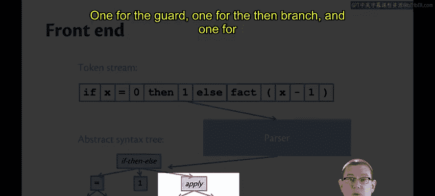
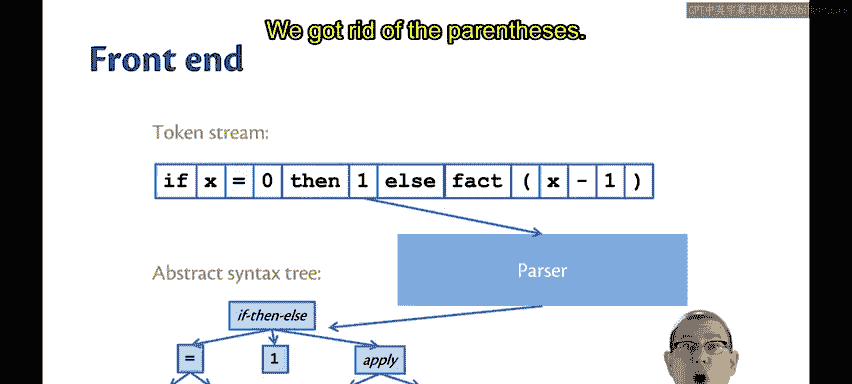
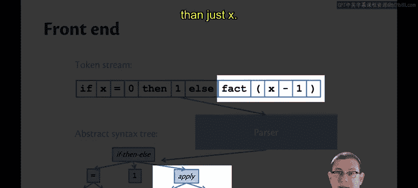

# OCaml编程：第九章：编译器架构 🏗️

在本节课中，我们将要学习编译器或解释器的基本架构。我们将了解其核心组成部分，特别是前端如何将源代码逐步转换为更结构化的形式，为后续的编译或解释执行做好准备。

## 编译器架构概览

当我们观察一个编译器或解释器时，其架构通常包含两个主要部分。

我们称之为编译的各个阶段。编译器的前端负责将该语言的源代码，翻译成一种称为**抽象语法树**（Abstract Syntax Tree， 简称 **AST**）的数据结构。

通常，前端会继续对这个AST进行一些转换。实际上，它可能会将程序重写多次，甚至很多次，逐步生成越来越简单的程序表示形式。

这些被称为**中间表示**（Intermediate Representations， 简称 **IRs**）。

编译器的后端则负责将某个中间表示翻译成机器码。

将编译器分解为这两个阶段的好处在于，你可以拥有一个定义明确的中间表示，作为两者之间的边界。

这意味着你可以将许多不同的源语言编译到那一个IR。然后，让后端根据那一个IR，面向许多不同的汇编语言（例如MIPS、X86等）生成目标代码。

解释器通常没有后端，因为它不试图翻译成机器码，它只是试图执行程序。

事实上，解释器通常甚至没有任何有意义的IR。

尽管如此，编译器和解释器的前端在很大程度上是相同的。

## 前端的三部分架构

前端架构可以细分为三个部分：词法分析器、语法分析器，以及一个没有确切名称的部分。词法分析器的工作是进行**词法分析**，语法分析器的工作是进行**语法分析**，最后一部分则是**语义分析**。

让我们更详细地看看每一部分的含义。

## 词法分析：从字符流到单词

假设你从一个源程序开始，它看起来像这样，这可能是OCaml中阶乘函数实现的一部分。

```ocaml
if x = 0 then 1 else fact (x - 1)
```

我们可以将其视为人类程序员输入的字符流，即他们在键盘上输入的单个字符。我们将其通过词法分析器。

词法分析器的工作是将该字符流分割成所谓的**词法单元流**。

因此，可以将这里的词法单元视为源语言中有意义的符号单位。

所以，词法分析，我喜欢将其理解为将字符流分割成单词。打个比方，这些就是源语言的“单词”。

以下是词法分析器可能生成的词法单元序列示例：


*   `IF`
*   `ID("x")`
*   `EQ`
*   `INT(0)`
*   `THEN`
*   `INT(1)`
*   `ELSE`
*   `ID("fact")`
*   `LPAREN`
*   `ID("x")`
*   `MINUS`
*   `INT(1)`
*   `RPAREN`



## 语法分析：从单词到结构树

前端的下一个步骤是获取词法单元流，并通过语法分析器进行处理。

语法分析器的工作是将词法单元流转换为**抽象语法树**（AST）。



这为数据提供了更多结构。它是一种不同的数据结构。我们实际上是在用语法分析器从列表数据结构中生成树形数据结构。

这棵树展示了程序的层次结构。

这个程序是一个`if-then-else`表达式，因此我们在树的顶部有一个代表`if-then-else`的节点。它有三个子树：一个用于条件判断部分，一个用于`then`分支，一个用于`else`分支。



```
      If-Then-Else
      /     |     \
     /      |      \
    /       |       \
Guard    Then      Else
(Binop)  (Int)   (Apply)
 =         1      /    \
 / \            fact  (Binop)
x   0                   -
                       / \
                      x   1
```

每个子树也有自己的结构。在条件判断部分，我们使用一个二元操作符来比较两个子表达式。在`else`分支，我们使用一个函数应用。它有一个特定的函数`fact`被应用于一个子表达式。该子表达式涉及减法运算。

现在注意语法分析过程中发生的一件非常有趣的事情：我们摆脱了括号。它们在词法单元流中是为了精确指示我们希望代码如何被解析。我们希望`fact`应用于整个子表达式`x - 1`，而不仅仅是`x`，这就是为什么我们必须写括号。

而这棵树通过让`x - 1`作为`apply`的一个子树，而不仅仅是`x`，隐式地表示了这种分组。因此，语法分析的部分工作是识别程序员希望如何对表达式进行分组，然后将它们适当地放入树中。

## 语义分析：检查程序含义

现在我们有了抽象语法树，前端的下一个阶段是**语义分析**。

广义上说，这项任务是确定程序在语义上是否有意义。

这里的语义正是我们一直以来讨论的**静态语义**，其中包括类型检查。因此，作为语义分析的一部分，前端通常会创建一个所谓的**符号表**，这只是一个将标识符映射到其类型的字典。根据编程语言的不同，符号表可能包含更多信息，但这是它的主要工作。

语义分析可能会继续进行，并生成一个新的抽象语法树，为每个AST节点用其类型进行装饰。语义分析还包括更多内容，例如在OCaml中，我们不仅进行类型检查，还会对模式匹配进行分析，以查看它是否详尽，或者是否有任何分支永远无法到达。Java也进行额外的语义分析，比如字段的初始化。所以，广义上这些都是编译这一部分的内容。

## 后续步骤：编译与解释

接下来会发生什么？这在很大程度上取决于我们是在看编译器还是解释器，也取决于语言和架构本身。

我们可能会将AST翻译成中间表示。然后，解释器可以执行那个IR，或者它可能直接执行AST。

然而，编译器将开始将AST翻译成越来越像机器的表示形式。关于这具体意味着什么，你需要学习计算机体系结构或系统编程课程（如CS 3410），我们不会深入探讨。

## 函数式语言的优势

函数式语言非常适合实现编译器和解释器。使用变体类型在函数式语言中表示这些树形数据结构非常容易。并且，通过对树进行模式匹配，可以轻松定义这些结构的编译和执行过程。

所以我们接下来将学习如何做到这一点。

## 总结


本节课中，我们一起学习了编译器与解释器的基本架构。我们了解到前端负责将源代码字符流转换为结构化的抽象语法树，这个过程分为词法分析、语法分析和语义分析三个阶段。后端则负责将中间表示转换为目标机器码。函数式语言因其强大的模式匹配和递归能力，是实现此类树形结构处理的理想选择。