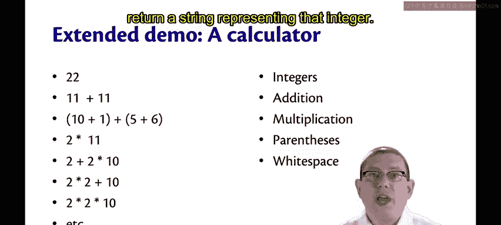
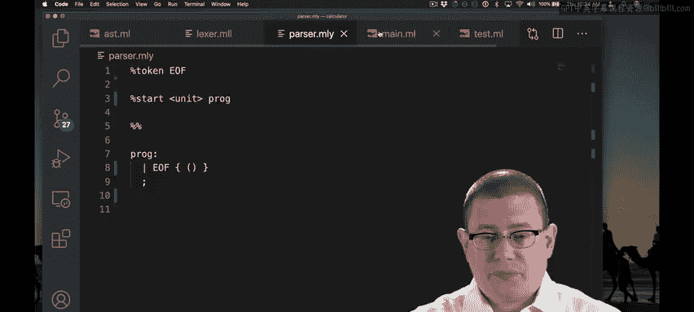
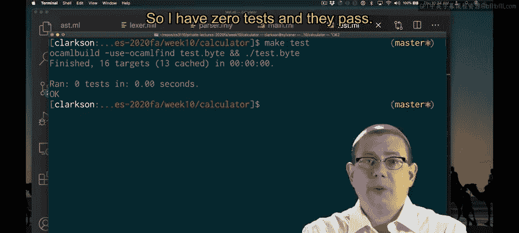

# 康奈尔大学《OCaml编程｜CS3110：OCaml Programming： Correct + Efficient + Beautiful》中英字幕 - P156：-156-Calculator_ Intro Chap9 Video 3.zh_en - GPT中英字幕课程资源 - BV1Tx4y1s7sP

I'm going to build together with you more or less from scratch， a very tiny calculator。😡。

And we're going to implement an interpreter for this calculator language。

Our language is just going to have integers， addition， multiplication， parentheses， and white space。

 so we'll be able to write very simple arithmetic expressions。

And my goal is to take in one of those arithmetic expressions as a string。

Evaluate it down to its final integer form and return a string representing that integer。

 I've started implementing an interpreter for our calculator language。

 Let me give you a brief guided tour of the files that I have so far。

There's actually a lot of files in this， the most important file to start off with is the AST。

 This is where we're going to have our type to represent the abstract syntax tree for our source language。

For now， I just have a type expert that's short for expression。

 represents an expression in our calculator language， and I've just put a placeholder of unit for it。

 We'll build that out later。I then have two stub files here for my Lexer and parser。

We're going to talk about each of those files in detail in a little bit。

 let's skip over them for now。

I have a main file here， which has two functions in it already。

 one for parsing a string into an AST and one for interpreting that string and producing a new string out of it that's mostly unimplemented right now。

😡，And I have a test file in which I have already written some unit tests that I would like to eventually make pass。

Let me start off then just by running this interpreter as it is right now。😡。

So I have zero tests and they vast。

But I've set it up so that if I run make， it puts me into Utah and I can interpret things there as well。

The only source code that this interpreter is capable of handling right now is the empty string。

 and for that it's just going to give failure unimplemented。

But there is a parse function that I wrote， you might have seen that earlier in the main file。

And that parse function is something that takes in a string and gives me back a value of the AST。

Well， that's just unit right now， but notice that I can parse the empty string right now。

 and that gives me back you。