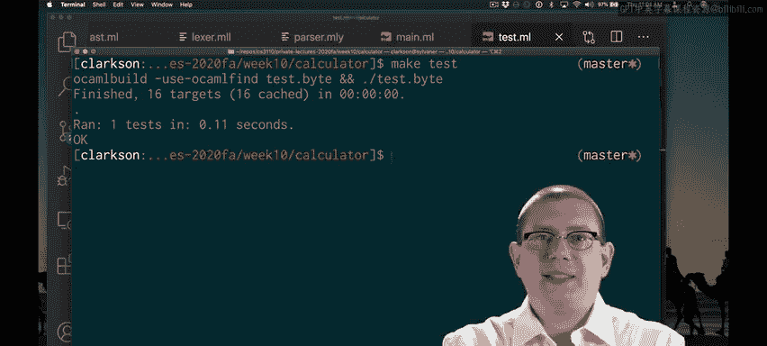

# OCaml编程：9.5：整数计算器求值

在本节课中，我们将学习如何为一个简单的整数计算器实现求值功能。我们将把字符串解释过程分解为解析、求值和转换回字符串三个步骤，并重点介绍“单步计算”的核心思想。

## 概述

为了解释一个字符串，我们需要完成三个步骤：解析它、求值它，然后将其转换回字符串。因此，我们将把解释函数分解为对应的几个部分。

## 值到字符串的转换

首先，我们实现一个辅助函数 `string_of_val`，用于将一个表达式 `E` 转换为字符串。作为前提条件，我们要求 `E` 必须是一个“值”，即已完成计算，没有更多求值步骤需要执行，这与我们在OCaml中的概念一致。

以下是 `string_of_val` 的实现：

```ocaml
let string_of_val e =
  match e with
  | Int n -> string_of_int n
```

由于目前我们的抽象语法树节点只有整数类型，转换非常简单。整数本身就是值，无需进一步计算，我们只需调用标准库函数 `string_of_int` 处理节点中的数据即可。

## 表达式的求值

接下来，我们看看求值部分。这需要更多的工作，并非因为整数本身难以规约为值（事实上它们已经是值），而是因为我们将使用“单步计算”的思想来构建AST的求值过程。我们希望每次只进行一小步计算，并持续进行，直到最终得到一个值。

以下是 `eval` 函数的基本框架实现：

```ocaml
let rec eval e =
  if is_value e then e
  else eval (step e)
```

`eval` 函数首先检查表达式 `e` 是否已经是一个值，这里我们写了一个辅助函数 `is_value` 来完成这个判断。目前，由于我们还没有像加法或乘法这样的复杂表达式，AST中的所有节点都是值。

如果 `e` 已经是值，则直接返回它。否则，我们对 `e` 执行一小步计算，然后递归地对结果调用 `eval` 函数。因此，`eval` 本质上会不断递归调用自身，直到得到一个值为止。

## 单步计算函数

那么，`step` 函数具体做什么呢？对于一个整数节点，没有计算需要执行。实际上，你可以认为它的计算已经完成。

因此，虽然这起初可能看起来有点违反直觉，但我们将规定：当遇到一个整数时，无法执行任何计算步骤，并在此抛出一个异常 `Does_not_step`。

```ocaml
exception Does_not_step

let step e =
  match e with
  | Int n -> raise Does_not_step
```

请注意，如果代码其他部分工作正常，我们永远不应该触发这个异常。因为当我们对一个整数调用 `eval` 时，它已经是一个值，`is_value` 会返回 `true`，所以我们永远不会在整数上调用 `step` 函数。

## 测试验证

现在，我们应该能够让第一个测试用例通过了。回想一下，我们的第一个测试用例是检查 `22` 是否求值得出 `22`。它确实通过了。

我们可以解析 `22`，现在也可以解释它了。

## 总结



本节课中，我们一起学习了如何为整数计算器实现求值器。我们引入了“值”的概念和“单步计算”的求值策略，并成功实现了将整数表达式求值为最终结果的功能。虽然目前只处理整数，但这个框架为后续添加更复杂的运算操作奠定了基础。