# OCaml编程：9.6：实现加法运算 🧮

在本节课中，我们将学习如何为我们的计算器语言添加加法运算功能。我们将从定义抽象语法树（AST）开始，逐步实现词法分析、语法分析和求值步骤，最终让 `11 + 11` 这样的表达式能够被正确计算。

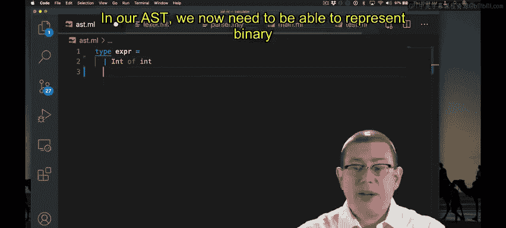

---

上一节我们实现了整数字面量的求值，本节中我们来看看如何支持加法运算。


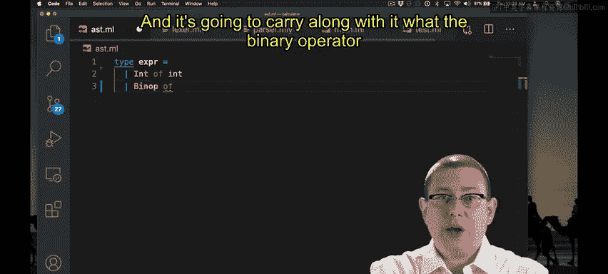


首先，我们需要在抽象语法树（AST）中表示加法这样的二元运算符。

```ocaml
type binop = Add | Mult

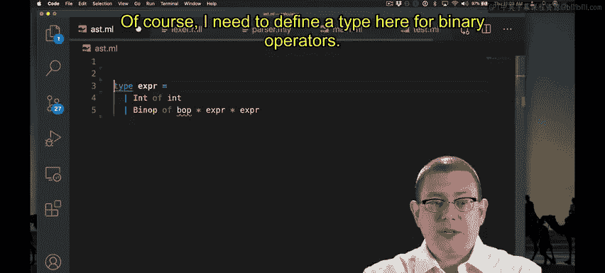


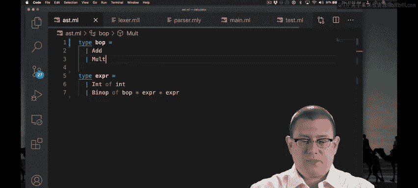

type expr =
  | Int of int
  | Binop of binop * expr * expr
```

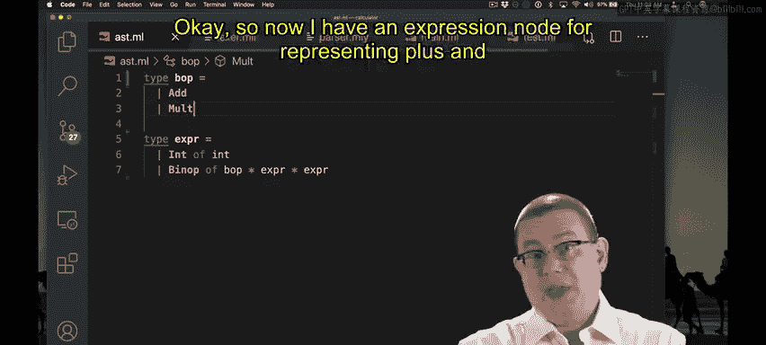

我们定义了一个新的类型 `binop` 来表示二元运算符，目前只包含 `Add`（加法）。`expr` 类型新增了一个 `Binop` 构造器，它包含一个运算符和左右两个子表达式。

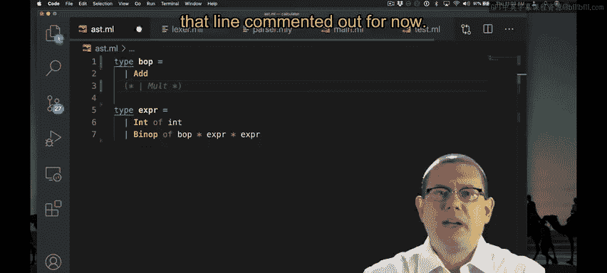

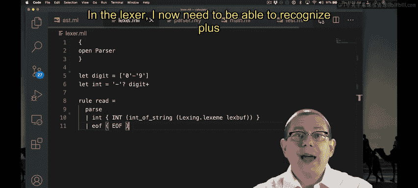

---

接下来，我们需要让词法分析器（Lexer）能够识别加号 `+` 字符。

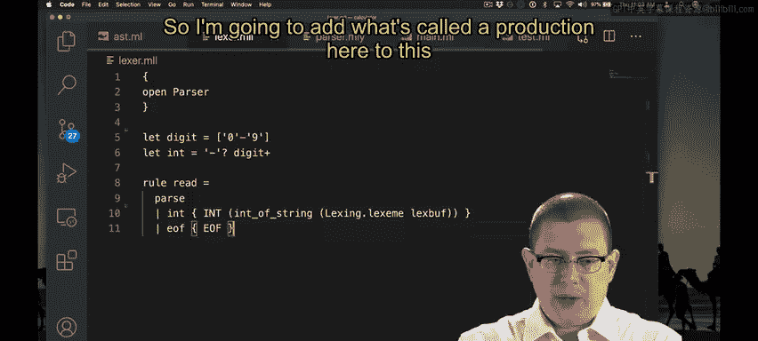

以下是需要在词法分析规则中添加的内容：

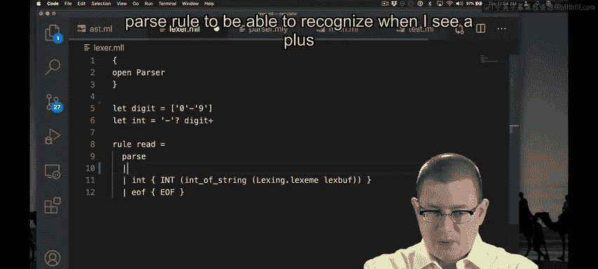

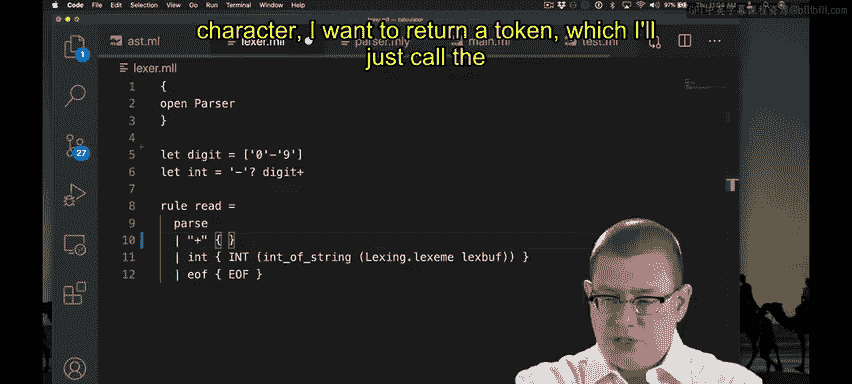

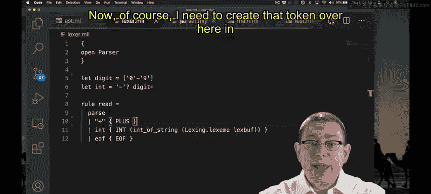

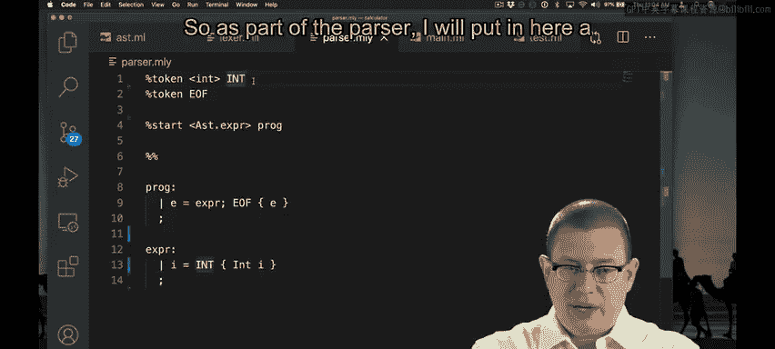

```ocaml
rule token = parse
  ...
  | '+' { PLUS }
  ...
```

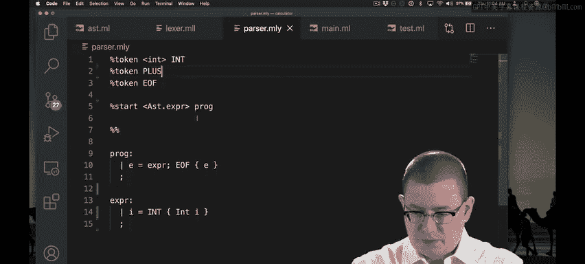

我们在词法分析规则中添加了一个分支，当遇到 `+` 字符时，返回一个名为 `PLUS` 的标记（Token）。

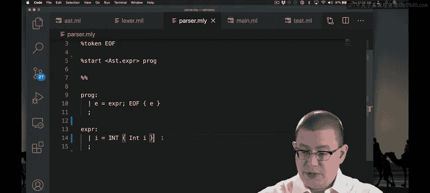

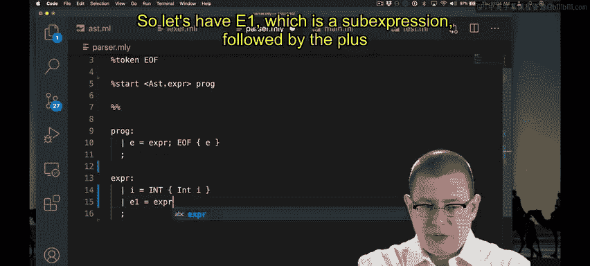

---

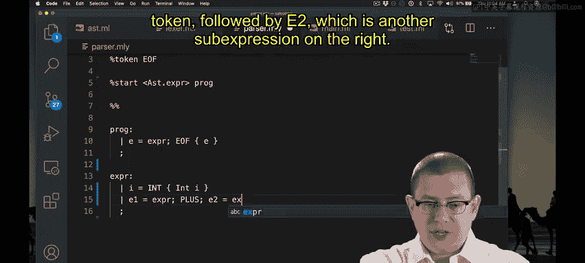

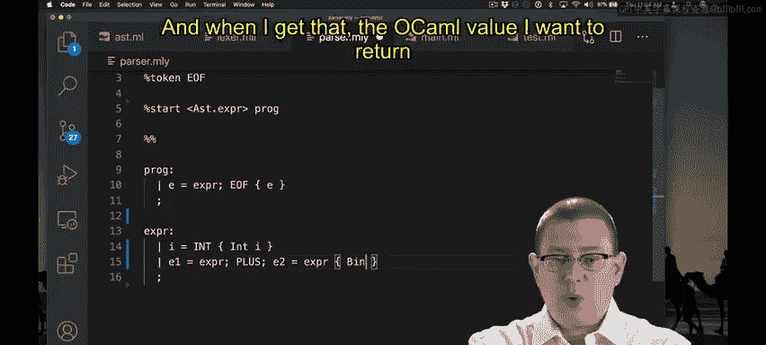

然后，我们需要在语法分析器（Parser）中声明这个新的 `PLUS` 标记，并定义如何将 `表达式 + 表达式` 的结构解析成 AST。

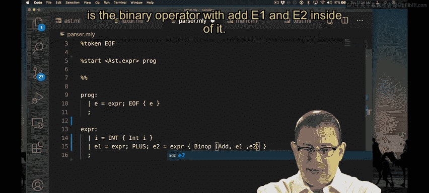

以下是需要在语法分析器中添加的声明和规则：


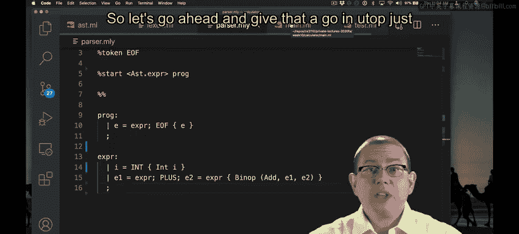

```ocaml
%token PLUS
...
expr:
  | e1=expr PLUS e2=expr { Binop (Add, e1, e2) }
  | i=INT { Int i }
```

我们声明了 `PLUS` 标记，并添加了一条新的语法规则：一个表达式可以是由 `PLUS` 连接的两个子表达式，解析后会生成一个 `Binop (Add, ...)` 节点。

---

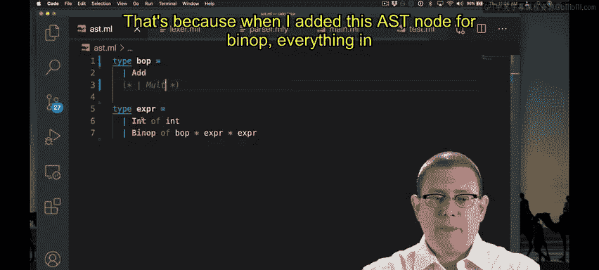

此时，语法分析器应该已经可以解析加法表达式了。我们可以进行测试：

```ocaml
parse "1 + 1"
(* 应返回：Binop (Add, Int 1, Int 1) *)
```

然而，我们还不能对这个表达式进行求值，因为求值函数 `step` 还没有处理 `Binop` 节点。编译器会提示模式匹配不完整，这正是我们接下来需要修复的。

---

我们需要更新几个函数来完善对 `Binop` 节点的处理。

首先，更新 `string_of_val` 函数。该函数只应接收一个值（`Int`），如果收到 `Binop` 则违反前提条件。

```ocaml
let string_of_val = function
  | Int i -> string_of_int i
  | Binop _ -> failwith “precondition violated”
```

其次，更新 `is_val` 函数。任何 `Binop` 节点都不是最终值。

```ocaml
let is_val = function
  | Int _ -> true
  | Binop _ -> false
```

最后，也是最关键的，我们需要在 `step` 函数中实现加法运算的求值步骤。我们采用**最左优先**的规约策略。

```ocaml
let rec step = function
  | Binop (op, Int n1, Int n2) -> step_binop op (Int n1) (Int n2)
  | Binop (op, v1, e2) when is_val v1 -> Binop (op, v1, step e2)
  | Binop (op, e1, e2) -> Binop (op, step e1, e2)
  | _ -> failwith “Not a reducible expression”
```

规则如下：
1.  如果左右两边都是值（`Int`），则调用 `step_binop` 进行计算。
2.  如果左边已经是值，但右边不是，则对右边表达式求一步。
3.  如果左边还不是值，则对左边表达式求一步。

---

现在，我们需要实现 `step_binop` 这个辅助函数，它负责在操作数都是值的时候执行实际的运算。

```ocaml
let step_binop op v1 v2 =
  match op, v1, v2 with
  | Add, Int n1, Int n2 -> Int (n1 + n2)
  | _ -> failwith “precondition violated”
```

对于加法，我们直接将两个整数相加，结果包装在 `Int` 构造器中。这里，我们将计算器语言中的加法“编译”或“规约”到了 OCaml 语言的加法运算上。

---

完成以上所有步骤后，我们的测试用例 `11 + 11` 应该就能通过求值，最终得到结果 `22`。

本节课中我们一起学习了如何为解释器添加一个新的二元运算符（加法）。我们扩展了 AST 定义，更新了词法分析和语法分析规则，并实现了最左优先的求值策略，最终成功将加法表达式规约到 OCaml 的原生运算上。这个过程清晰地展示了如何逐步构建一个语言解释器的核心功能。