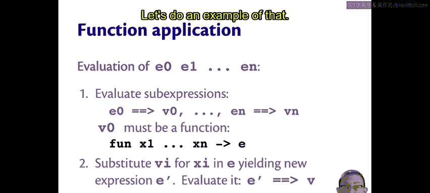
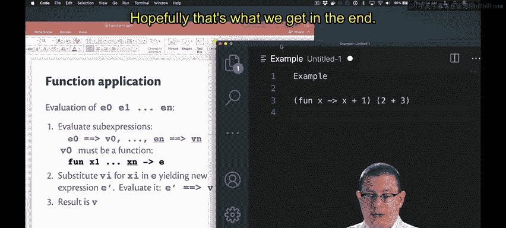
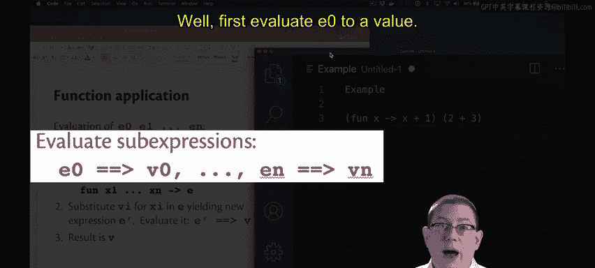
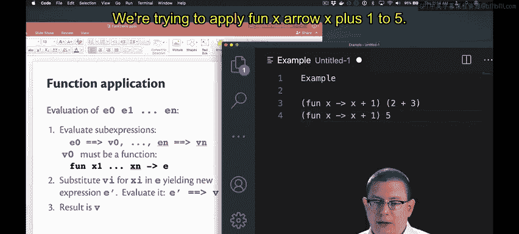
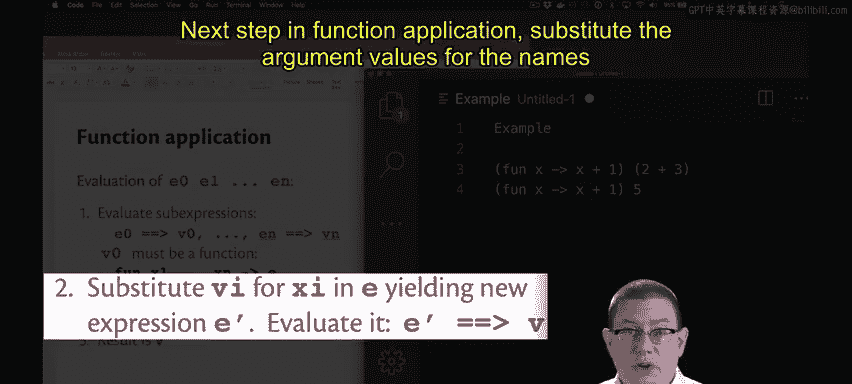
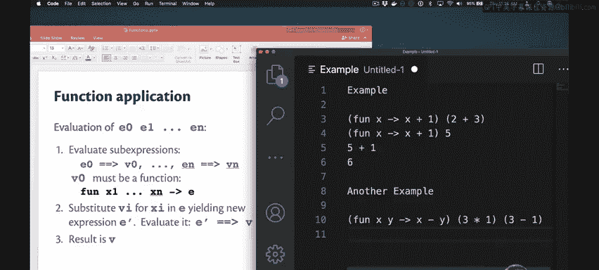
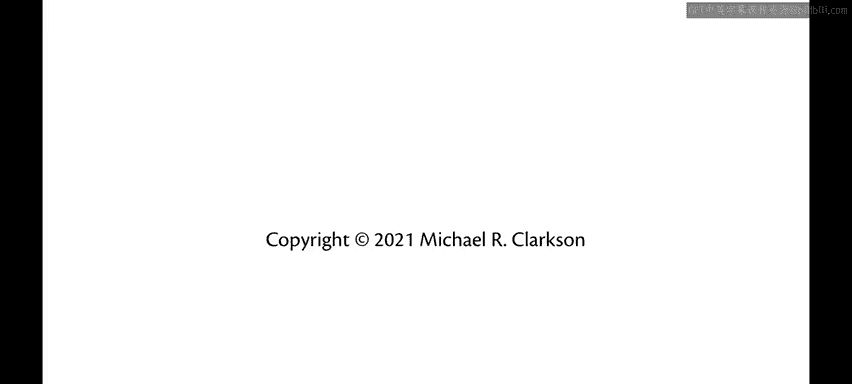

# OCaml编程：2.10：函数应用 🧮

在本节课中，我们将要学习OCaml中函数应用的核心概念和具体执行过程。函数应用是调用函数并传递参数的基本方式。

## 函数应用的语法

函数应用的语法非常简单，只需将表达式并排放置即可。

如果你想将一个函数应用到N个不同的参数上，你可以这样写：`E0 E1 ... EN`。其中`E0`是代表函数的表达式，`E1`到`EN`是其他表达式。

除非你需要强制特定的求值顺序，例如在算术运算中，或者确保OCaml按照你期望的方式解析代码，否则不需要括号或标点符号。

请改掉在函数参数周围写括号的习惯。你不需要它们，事实上，如果你添加了括号，OCaml甚至可能无法理解你的意图。

特别需要注意的是，不要在函数参数之间添加逗号。这里没有逗号，添加逗号实际上是错误的。

## 函数应用的求值过程

函数应用的求值过程遵循以下步骤。

首先，将所有子表达式求值为值。也就是说，将`E0`求值为值`v0`，将`E1`求值为值`v1`，依此类推，直到`EN`。

完成这一步后，`E0`必须求值为一个函数值`v0`。我们可以将其写成一个匿名函数，例如 `fun x1 ... xn -> e`。

现在我们有了这个函数，我们可以将参数的值代入函数体中的那些名称。

因此，将`v1`代入`x1`，将`v2`代入`x2`，依此类推。在函数体表达式`e`内部进行这些替换。

这将得到一个新的表达式`e'`，它可能因为我们在内部进行了一些替换而发生了变化。

最后，将`e'`求值为值`v`。这个值`v`就是整个函数应用表达式的结果。

## 示例一：单参数函数应用

让我们通过一个例子来具体说明这个过程。

假设我们应用一个将其参数加一的匿名函数到表达式`2 + 3`上。当然，如果我们对`2 + 3`的结果加一，我们应该得到6。

以下是求值规则的具体应用。

首先，将`E0`求值为一个值。这一步已经完成，因为`fun x -> x + 1`是一个匿名函数，因此已经是一个值，无需进一步操作。

接着，将参数求值为值。这意味着求值`2 + 3`，这当然会得到`5`。

接下来，我们尝试将`fun x -> x + 1`应用到`5`上。

函数应用的下一步是，将参数值代入参数的名称。

因此，我想在匿名函数体内部将`5`代入`x`。这给了我`5 + 1`。

这就是求值规则中提到的表达式`e'`。

最后，将`e'`求值为一个值。`5 + 1`求值为值`6`，这就是整个函数应用表达式的结果。

## 示例二：多参数函数应用

让我们尝试第二个例子。

假设我们应用一个将其第二个参数从第一个参数中减去的匿名函数到另外两个表达式上。

以下是函数应用规则的具体步骤。

首先，求值所有子表达式。第一个子表达式已经完成，因为它已经是一个值（那个匿名函数已经是一个值）。

求值第二个子表达式和第三个子表达式。`3 * 1`求值为`3`，`3 - 1`求值为`2`。

现在我们可以将这些值分别代入函数体中的名称。函数体是`x - y`，我们将`3`代入`x`，将`2`代入`y`。这就是替换后得到的子表达式`e'`。

最后，将`e'`求值为一个值。`3 - 2`求值为值`1`。

---

本节课中我们一起学习了OCaml函数应用的语法和求值过程。我们了解到函数应用只需将表达式并置，无需括号或逗号。求值过程分为三步：先求值所有子表达式为值，然后将参数值代入函数体，最后求值替换后的表达式得到最终结果。通过两个具体示例，我们清晰地看到了这个过程是如何一步步执行的。