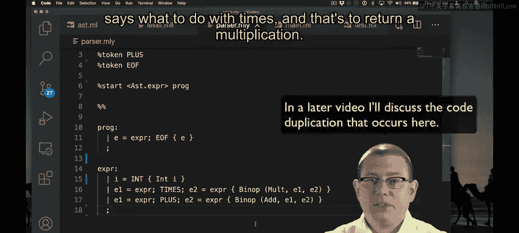

# OCaml编程：9.7：实现乘法运算 🧮

在本节课中，我们将学习如何为我们的计算器程序添加乘法运算功能。我们将遵循与实现加法运算相同的步骤，但会进行得更快一些。

上一节我们成功实现了加法运算，本节中我们来看看如何实现乘法运算。

## 实现步骤

以下是实现乘法运算需要完成的几个关键步骤。

1.  **扩展二元运算符类型**：首先，我们需要在定义二元运算符的类型中添加乘法运算符。
    ```ocaml
    type binop = Plus | Minus | Times | Div
    ```

2.  **更新词法分析器**：接着，修改词法分析器（`lexer`），使其在遇到星号字符 `*` 时能识别并返回对应的乘法记号（`TIMES`）。
    ```ocaml
    | '*' -> TIMES
    ```

3.  **更新语法分析规则**：然后，在语法分析器（`parser`）的专家级规则中，添加处理 `TIMES` 记号的部分，使其返回 `Multiplication` 节点。
    ```ocaml
    | e1 = parse_expr; TIMES; e2 = parse_expr { Binop (Multiplication, e1, e2) }
    ```

4.  **扩展求值函数**：最后，在求值函数（`eval`）的模式匹配中添加针对 `Multiplication` 的分支，以执行实际的乘法计算。
    ```ocaml
    | Binop (Multiplication, e1, e2) -> eval e1 * eval e2
    ```

## 测试与验证



在实现过程中，我们可以通过一个测试用例来验证乘法功能当前是否有效。运行测试后，确认它确实会失败，这符合我们的预期。


完成上述所有修改后，我们再次运行测试。这次，乘法测试应该能够成功通过了。


这里有一个需要注意的细节：在最初的求值函数中，我们使用了一个“捕获所有情况”的模式（如 `| _ -> ...`）。这意味着即使我们没有显式添加 `Multiplication` 的分支，编译器也不会发出警告或提示未完成。这有时是危险的，因为它可能掩盖未实现的功能。


本节课中我们一起学习了如何为OCaml计算器添加乘法运算。我们回顾了从扩展类型定义、更新词法分析和语法分析规则，到最终在求值函数中实现运算的完整流程。这个过程与实现加法运算高度一致，体现了代码的模块化和可扩展性。