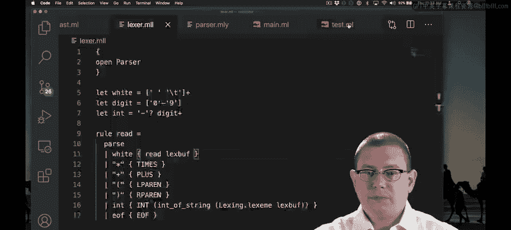
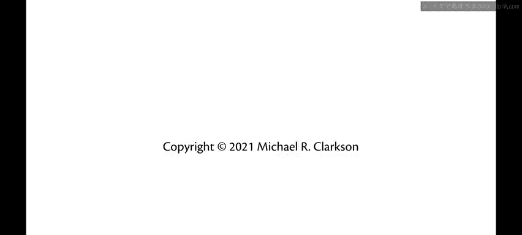

# OCaml编程：9.9：空白字符与括号 🧮

在本节课中，我们将学习如何扩展我们的小型计算器语言，使其能够处理表达式中的空白字符（如空格和制表符）以及括号。这将使我们的语言更具可读性，并允许用户显式地指定运算的优先级。

上一节我们介绍了如何解析和求值基本的算术表达式。本节中我们来看看如何让解析器忽略无关的空白字符，并识别括号来强制改变运算顺序。

---

## 扩展词法分析器

首先，我们需要修改词法分析器（Lexer），使其能够识别并处理两种新的输入元素：括号和空白字符。

以下是需要添加到词法分析器中的新规则：

*   **左括号与右括号**：我们添加两条新规则来生成对应的词法单元（Token）。
    *   `"("` 将生成 `LPAREN` 词法单元。
    *   `")"` 将生成 `RPAREN` 词法单元。
*   **空白字符**：我们添加一条规则来匹配并跳过空白字符。
    *   我们定义空白字符为一个或多个空格（` `）或制表符（`\t`）的混合。在正则表达式中，`+` 表示“一个或多个”。
    *   当词法分析器遇到空白字符时，我们不返回任何词法单元，而是**递归地调用自身**以继续读取输入缓冲区，从而有效地跳过所有空白字符。

在OCaml的`ocamllex`语法中，跳过空白字符的规则看起来像这样：
```ocaml
rule read = parse
  | [' ' '\t']+ { read lexbuf }  (* 跳过空白字符 *)
  | ...
```

---

## 扩展语法分析器

接下来，我们需要更新语法分析器（Parser），使其能够理解这些新词法单元并构建正确的抽象语法树（AST）。

以下是语法分析器的关键修改：

*   **声明新词法单元**：首先，我们需要在语法分析器的头部声明 `LPAREN` 和 `RPAREN` 这两个新词法单元。
*   **添加新的表达式形式**：我们为表达式添加一个新的解析规则。当语法分析器看到一个左括号 `LPAREN`，后跟一个表达式，再后跟一个右括号 `RPAREN` 时，它只需返回括号内表达式的解析结果。
    *   这意味着括号本身不会在AST中显式表示，它们的作用通过改变AST的结构（即子表达式的嵌套关系）来隐式体现。

在OCaml的`menhir`语法中，这条新规则可以写作：
```
expr:
  | LPAREN expr RPAREN { $2 }  (* 返回括号内表达式的值 *)
```

---

## 测试与验证

完成以上修改后，我们现在可以测试像 `(10 + 1)` 或带有空格的 `10 + 1` 这样的表达式。

测试结果显示，我们的计算器现在能够成功解析并求值这些包含空白字符和括号的表达式。



至此，我们已经为这个小型计算器语言实现了一个完整的解释器，它能够处理数字、加法、减法、乘法、除法、空白字符和括号。




---

## 总结


本节课中我们一起学习了如何增强计算器语言的词法分析器和语法分析器。
*   我们通过添加规则让词法分析器能够**跳过空白字符**，使输入格式更灵活。
*   我们通过添加对**括号**的识别和处理，让用户能够显式控制运算的优先级和分组。
*   这些修改使得我们的语言解释器更加实用和健壮，为理解更复杂的语言特性打下了基础。