# OCaml编程：9.10：词法单元与抽象语法树

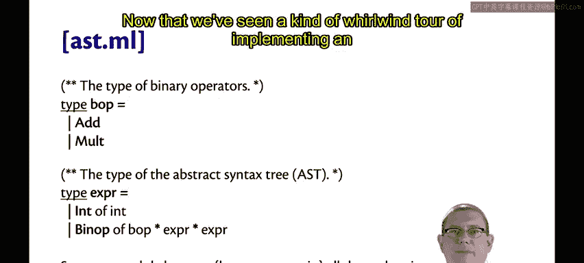

在本节课中，我们将详细探讨解释器实现中的两个核心组件：词法单元和抽象语法树。我们将了解它们在编译流程中的角色、相互关系以及具体实现方式。


上一节我们快速浏览了实现一个解释器的整体流程，本节中我们将深入分析其中的关键部分。

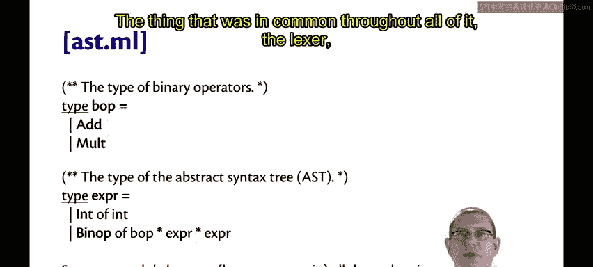

## 数据视角：词法单元与AST节点


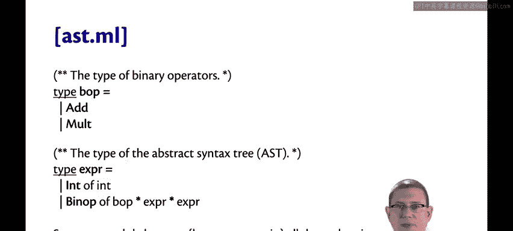

从数据流动的视角来看，编译过程主要涉及两种数据结构。

### 词法单元

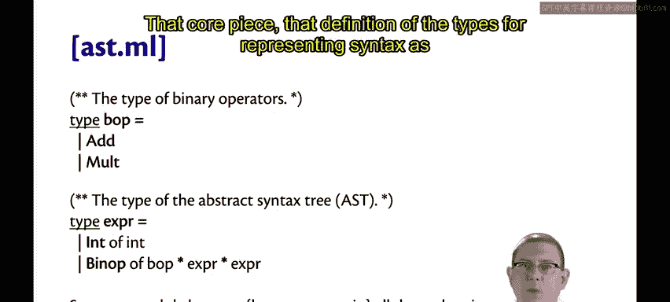

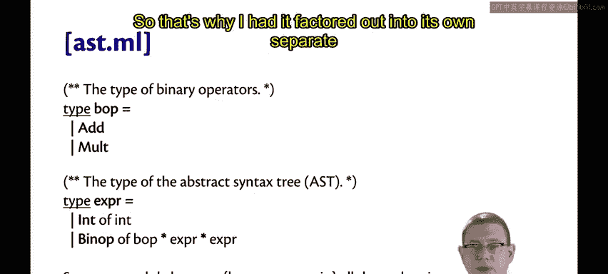

词法单元是词法分析器的输出，也是语法分析器的输入。在我们的计算器语言中，词法单元在语法分析器文件中声明，例如使用 `%token INT`。词法分析器的职责就是读取源代码字符流，并将其转换为一系列词法单元。

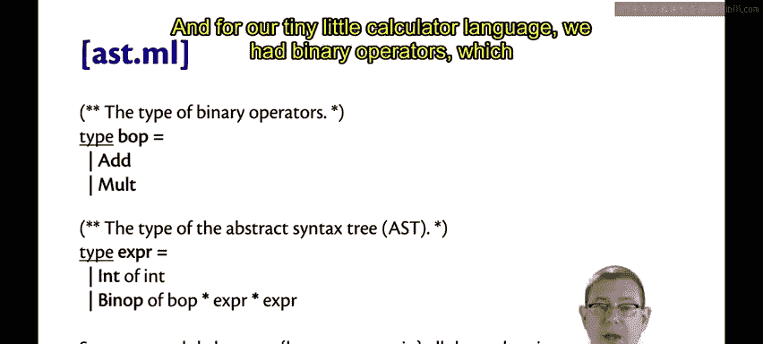

### AST节点

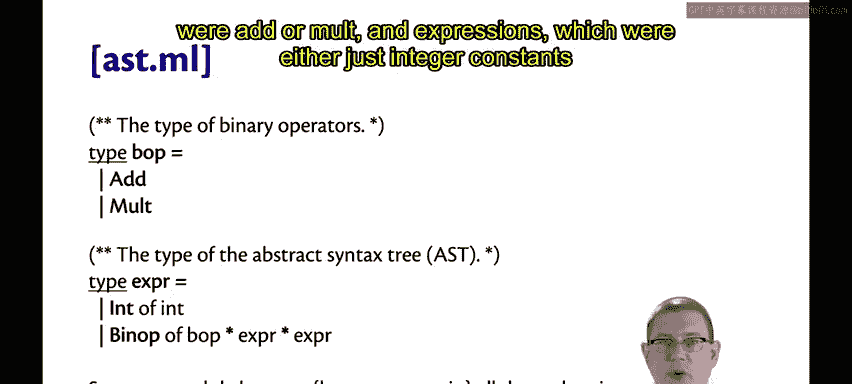

AST节点是抽象语法树的构成元素，由语法分析器根据词法单元序列构建而成。它们定义在独立的AST模块中，并成为语法分析器与后续编译阶段（特别是求值器）之间的接口。

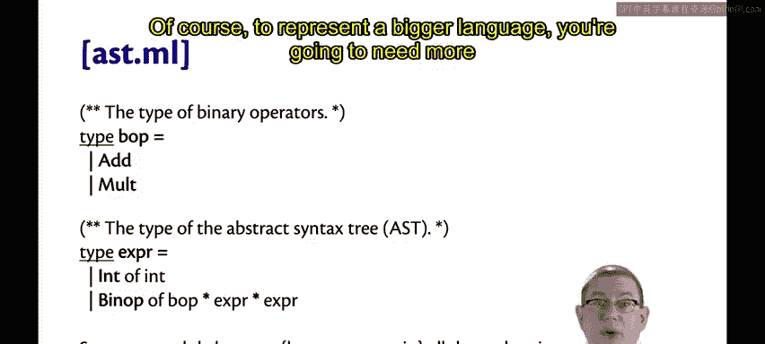


因此，词法单元是词法分析器与语法分析器之间的接口，而AST节点则是语法分析器与编译流程中其他所有部分之间的接口。

## 工具视角：各模块的职责

从实现工具和模块分工的视角，我们可以这样理解：

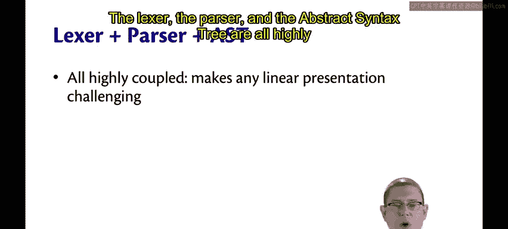

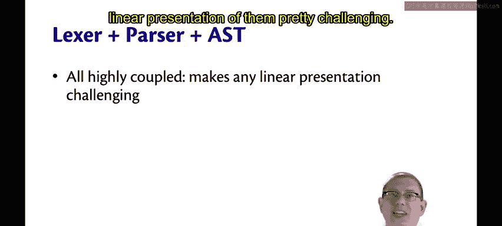

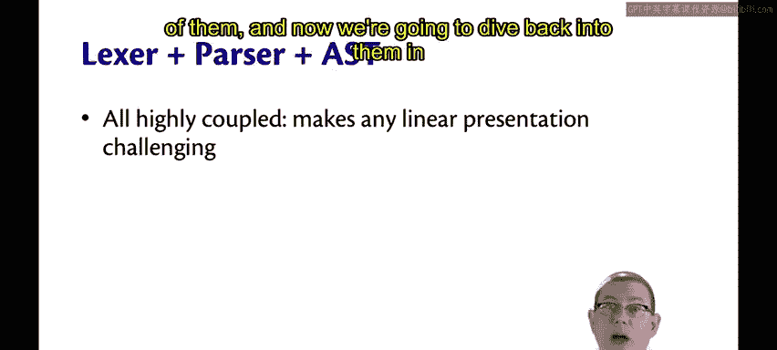

以下是各个组件的核心职责：
*   **词法分析器**：负责生成词法单元。
*   **语法分析器**：负责生成AST节点。同时，它还有一个额外的责任，即声明所有词法单元的类型。
*   **求值器**：负责对AST节点进行计算。

词法分析器、语法分析器和抽象语法树三者紧密耦合。这种高度关联性使得按线性顺序讲解它们颇具挑战，这也是我们先进行高层概述，再深入细节的原因。

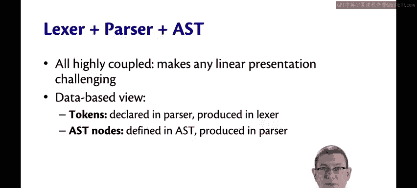

## 核心数据结构：AST类型定义

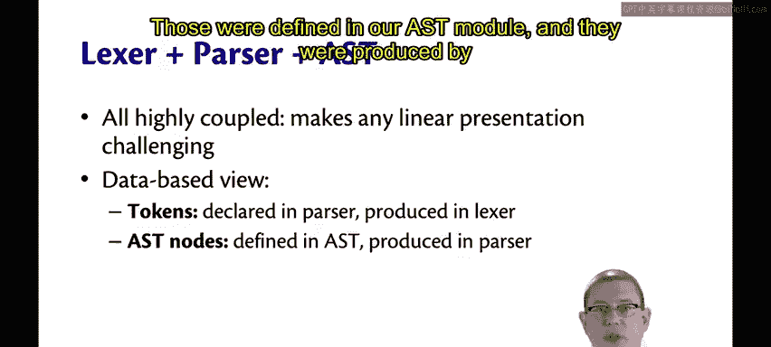

贯穿整个解释器实现（词法分析、语法分析、求值）的一个共同核心，是一个名为抽象语法树的数据结构。

这个用于表示语言语法的类型定义，被所有模块共享，因此我们将其提取到独立的文件中。

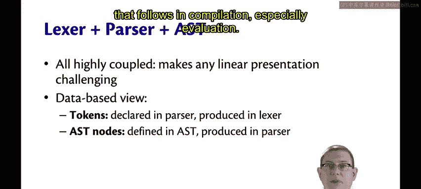

对于我们简单的计算器语言，其AST定义可能如下所示：


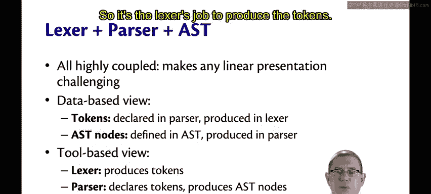

```ocaml
type binop = Add | Mult
type expr =
  | Int of int
  | Binop of binop * expr * expr
```

这个定义包含二元运算符（加法和乘法）和表达式。表达式要么是整数常量，要么是由运算符和两个子表达式构成的二元运算。

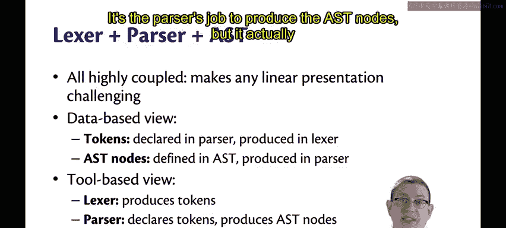

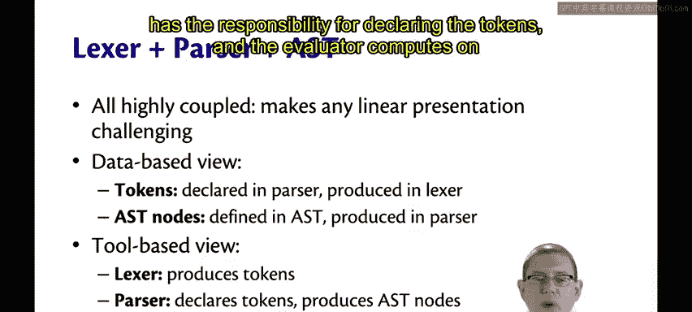

当然，为了表示更复杂的语言，你需要定义更多种类的表达式和运算符。

词法分析器、语法分析器和抽象语法树之间的这种组织方式，很大程度上是OCaml相关工具设计方式的产物。OCaml在这方面继承了来自C语言等更早一代工具的工作模式。


## 总结

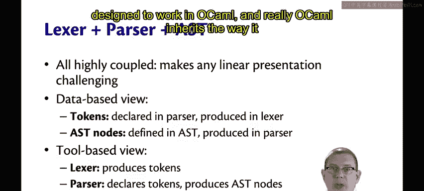

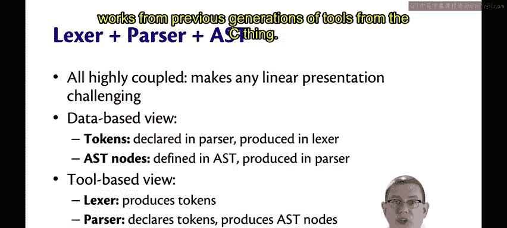


本节课中，我们一起学习了编译过程中的两个基础概念：**词法单元**和**抽象语法树节点**。我们了解了它们分别作为词法分析器与语法分析器、以及语法分析器与后续阶段之间的数据接口。同时，我们也明确了词法分析器、语法分析器和求值器各自的职责，并看到了如何用OCaml类型来定义简单的AST。理解这些组件及其相互关系，是构建语言解释器或编译器的关键第一步。