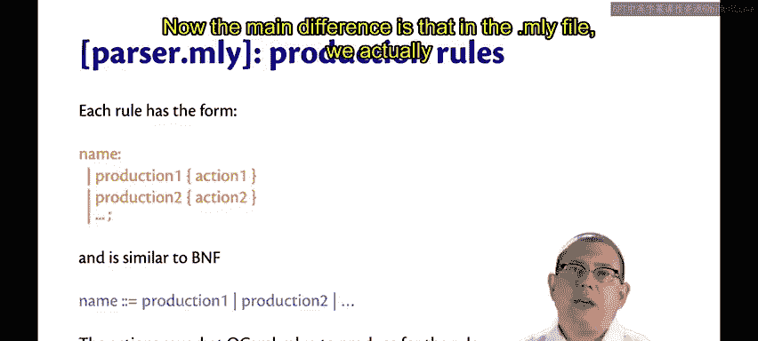
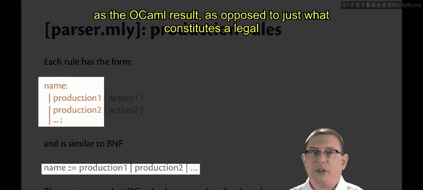
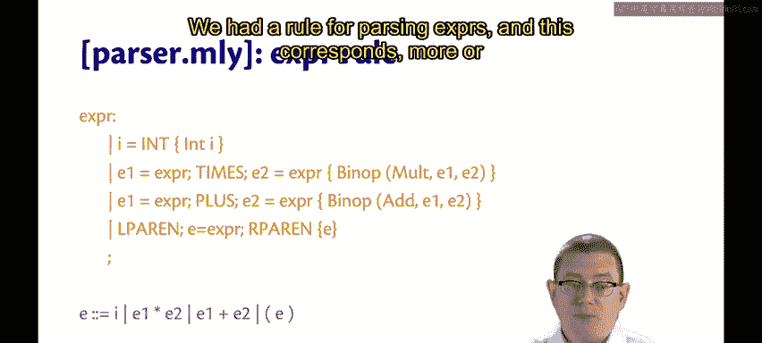
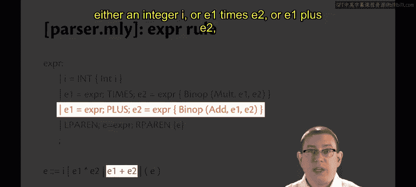
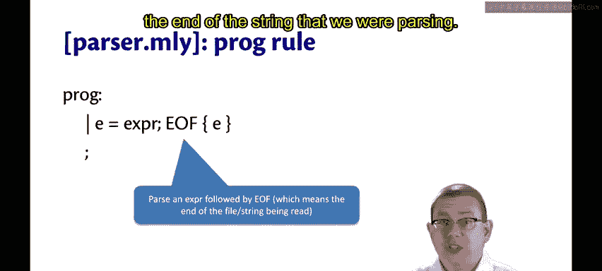

# OCaml编程：9.12：语法与BNF 🧩

在本节课中，我们将学习如何用语法和巴科斯-诺尔范式（BNF）来描述编程语言的语法结构。我们将看到语法规则如何与抽象语法树（AST）紧密对应，并了解如何在解析器生成器（如`ocamlyacc`）中实现这些规则。

## 概述

我们之前已经能够解析包含空格、括号和运算符优先级的表达式。所有这些元素最终都被转换成一棵树，用以表示各个标记之间的关系。在树中，括号变得无关紧要，它们通过树的结构来体现；运算符优先级则通过树的构建方式来表示，即哪些子树成为其他树的一部分。

我们可以使用一种称为“语法”的数学符号来完整地描述这一切。

## 语法与巴科斯-诺尔范式（BNF）

语法是一种数学符号。一个表达式可以是以下三种情况之一。

以下是表达式的BNF定义：

```
E ::= I
    | E1 BINOP E2
    | ( E )
```

在这个定义中：
*   `E` 是一个**元变量**，代表表达式。
*   `I` 代表整数。
*   `BINOP` 代表二元运算符（如 `+` 或 `*`）。
*   `::=` 和 `|` 是**元语法**的一部分，用于描述语言本身的语法，它们并不出现在源语言（如我们的计算器语言）中。

当然，如果你要描述的语言本身就包含 `::=` 或 `|` 符号，就需要更仔细地区分语法和元语法。但对于我们的计算器语言，这不是问题。

我们还需要定义语言中的其他部分：

```
BINOP ::= +
        | *

I ::= (整数标记的集合)
```

以这种方式书写语法被称为**巴科斯-诺尔范式**。巴科斯和诺尔是两位图灵奖得主，他们在1960年代设计ALGOL语言时共同发明了BNF。你会在许多地方看到BNF，它被用来描述各种语言的语法。

## BNF与抽象语法树（AST）的对应关系

BNF和AST之间通常存在非常紧密的对应关系。

在BNF中，表达式可以是整数、二元运算或带括号的表达式。在AST类型定义中，我们有对应的构造器来处理前两者（整数和二元运算符）。我们不再表示第三种情况（括号），因为当我们抽象为树时，这些具体的语法就不再需要了。

同样，在BNF中，二元运算符可以是加号或乘号，而在AST中，我们也有相应的类型来表示加法和乘法。

因此，你为语言设计的语法（BNF）和AST之间通常会有这种紧密的对应。

## 在解析器生成器中的实现

回到我们之前创建的`.mly`文件。我们在其中声明了解析的起始点是名为 `prog` 的规则，并为其注解了返回的OCaml类型。之后，我们有一些产生式规则，它们或多或少地对应着我刚才展示的语法规则。

每个规则都具有以下形式：`名称:`，然后是一些由竖线 `|` 分隔的产生式，最后是花括号 `{}` 中的一个动作（有时称为语义动作）。





这与BNF非常相似：BNF有一个元变量名、`::=` 以及一些由竖线分隔的产生式。主要区别在于，在`.mly`文件中，我们实际上添加了那些花括号中的动作，用以说明返回什么作为OCaml结果，而不仅仅是说明什么构成了语言中的合法表达式。

让我们看其中一个规则。我们有一个用于解析表达式的规则，它大致对应一个BNF规则：`E ::= I | E1 * E2 | E1 + E2 | (E)`。





以下是该规则在`.mly`文件中的实现：

```ocaml
expr:
  | i = INT { Int i }
  | e1 = expr; TIMES; e2 = expr { Binop (Mult, e1, e2) }
  | e1 = expr; PLUS; e2 = expr { Binop (Add, e1, e2) }
  | LPAREN; e = expr; RPAREN { e }
```

为什么这里没有为二元运算符设置一个单独的规则？这涉及到解析器生成器如何工作的技术细节。像这样内联它们通常效果更好。如果你想深入了解，可以选修CS4120课程。

现在，我们来分解这个产生式：
*   第一个产生式针对整数：它解析一个携带整数值 `i` 的 `INT` 标记，并返回一个同样携带该整数的AST节点 `Int i`。
*   下一个产生式针对乘法：它解析一个表达式，后跟一个 `TIMES` 标记，再跟另一个表达式。我们将解析第一个表达式的结果绑定到OCaml变量 `e1`，将解析第二个表达式的结果绑定到 `e2`。然后，我们构造一个AST节点 `Binop (Mult, e1, e2)` 作为动作返回。
*   加法的产生式同理。
*   对于括号，我们基本上丢弃了括号。我们不再需要具体语法，现在只表示抽象语法，因此直接返回内部的表达式 `e`。

最后，最高层级的规则是解析整个程序：我们解析一个完整的表达式，然后必须是文件或标记流的结尾。

```ocaml
prog:
  | e = expr; EOF { e }
```

## 总结



本节课中，我们一起学习了如何使用BNF形式化地描述语言的语法。我们看到BNF规则与抽象语法树（AST）的数据构造器之间存在直接的映射关系。最后，我们探讨了如何在`ocamlyacc`的`.mly`文件中实现这些语法规则，其中每个产生式都附带一个“动作”来构建对应的AST节点。理解语法、BNF和AST之间的关系，是构建编译器或解释器的关键基础。