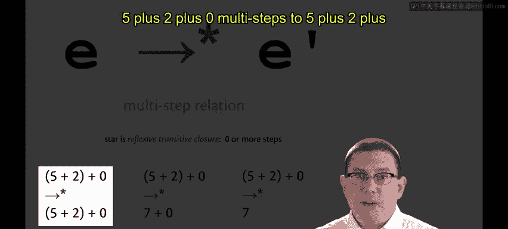
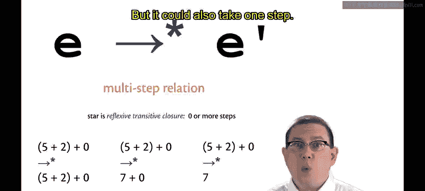
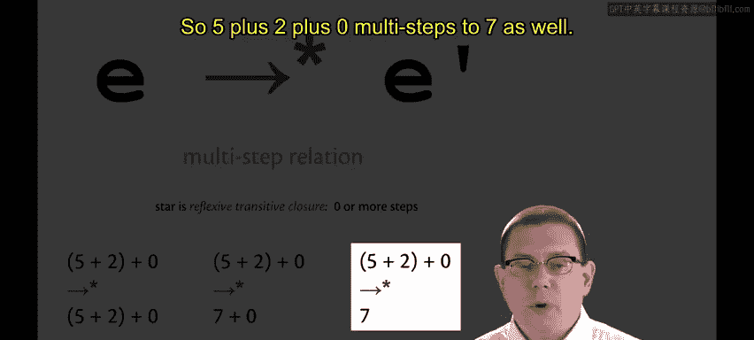
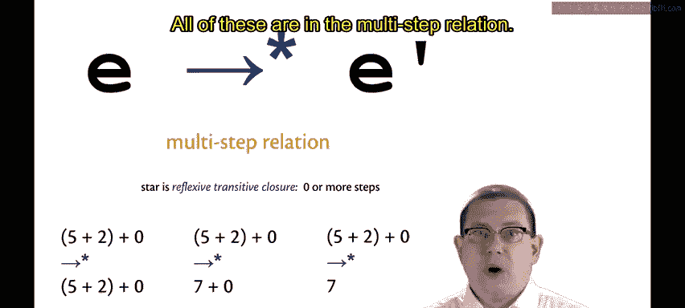
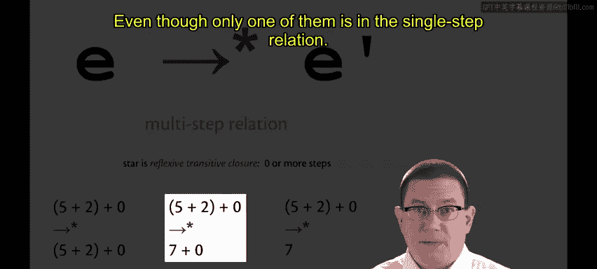

# 康奈尔大学《OCaml编程｜CS3110：OCaml Programming： Correct + Efficient + Beautiful》中英字幕 - P167：-167-Evaluation Relations Chap9 Video 14.zh_en - GPT中英字幕课程资源 - BV1Tx4y1s7sP

As we build up to larger languages than just our small calculator language。

 we're going to want to have some mathematical notation around to describe the dynamic semantics of a language。

Let's base that on single steps。I'll write E， right arrow E prime to indicate that E takes a single small step of evaluation and becomes E prime。

😡，This is just the step function that we implemented。😡。

So 5 plus 2 plus 0 would take a single step to 7 plus0。And that would take a single step to7。

 As an example of that， let's express the binary operator semantics。

E1 plus E2 takes a single step to E1 prime plus E2。If E1 itself can take a single step to E1 prime。

That makes this an inductively defined relation。This is similar to inductively defined sets。

 which you'll have seen in C S 2800。The next piece of the binary operator semantics says what to do if we already have a value on the left hand side。

V1 plus E2 steps to V1 plus E2 prime If E2 steps to E2 prime。

So notice that we're saying syntactically that the expression showing up on the left hand side of the plus here must in fact。

 already be of value。😡，Finally， V1 plus V2 steps to I if I is the result of doing that primitive operation V1 plus V2。

 and of course that primitive operation is being implemented by the underlying computational platform。

 although I've written this only for plus here， this would work for star as well。

 so think of this as being a description of binary operators rather than just the addition operator。

😡，Values， as we've said， do not step。So although I could reduce 5 plus 2 plus0 down to seven by taking two steps of computation。

 that seven does not step any further。So there is no notion that seven steps to itself with this relation。

 you really must take exactly one step， you're not allowed to take zero steps。Of course。

 we do eventually want to evaluate an expression all the way down to a value。

 and the multistep relation can help us with that。So here I'm writing right arrow star。

 the star denotes a reflexive transitive closure， in other words。

 zero or more steps in this relation。😡，So an expression can multi step to itself， phi plus 2 plus0。

 multistep to phi plus 2 plus0 by taking zero steps。

But it could also take one step。 So 5 plus 2 plus 0， multi stepss to 7 plus 0。

And it can take many steps， including two， so 5 plus 2 plus0， multisteps to seven as well。

All of these are in the multi step relation。

Even though only one of them。

Is in the single step relation。Since our goal at the end of the day is to produce a value。

Let's also introduce a relation for expressing the idea that an expression can step all the way down to a value。

 We'll call this the big step relation， which is kind of complementary to the small single step relation we had before。

This is just the Eval function that we implemented in our interpreter already。😡。

It takes an expression and reduces it all the way down to a value。So，5 plus 2 plus 0， big steps to 7。

 Of course， it wouldn't big step to itself because it's not a value yet。

You might expect there there would be a relationship between these two models of evaluation， well。

 suppose you had an expression E。And it stepped E1 and E2 and then E3 and kept on taking these single small steps of evaluation until it eventually got to a value。

Let's just forget about all those intermediate steps and just think about how E reaches V。😡。

That is the big step relation， it's just taking the endpoints of that chain of small evaluation steps。

And furthermore， you really want these two relations to be consistent。

 So however you end up defining them， what you want is that for all expressions E and values V。

E big steps to V， if and only if E multistep to V。So that expresses that the big step relation is consistent with the small step relation Okay。

 we just introduced several new relations， let me put them all on one slide for you so you can see a comparison。

The single step relation is exactly one step of evaluation。

 It corresponds to the step function that we implemented in our interpreter。

And it is mostly what I'm going to use to express the formal dynamic semantics of languages for now。

 Later on， we're going to move to the big step model entirely。

 The multistep relation is just zero or more single steps。😡。

And the big step relation is all the steps of evaluation and it corresponds to the eval function that we wrote。

