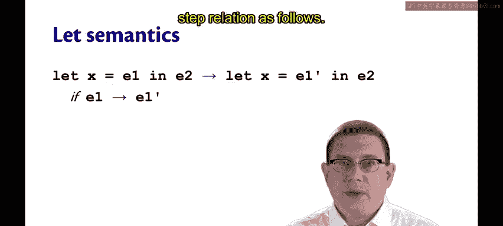
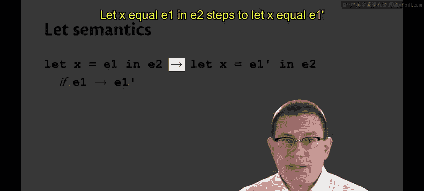
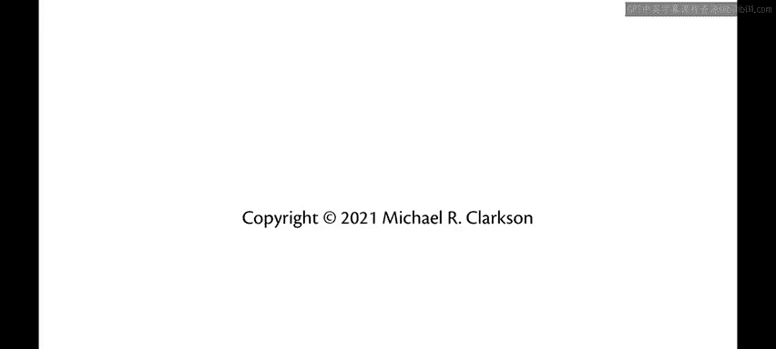

# 康奈尔大学《OCaml编程｜CS3110：OCaml Programming： Correct + Efficient + Beautiful》中英字幕 - P168：-168-Let Semantics Chap9 Video 15.zh_en - GPT中英字幕课程资源 - BV1Tx4y1s7sP

Perhaps you've owned a calculator that lets you store values in the memory of that calculator。

 and maybe it had different memory banks you could store them in。

We can think of that as kind of being like a calculator with let expressions that let us bind values to variable names and use those variable names later on as we're doing some sort of calculation。

So let's add variables and let expressions to our calculator language。

Variables will be represented by the meta variableable X， which stands for identifiers。

 we're not going to carefully specify here what the syntactic class of identifiers is。

 we will have to do that in our parser and Leer。And we will add let expressions just like they are from Ocal。

 let X equal E1 in E2。The semantics of a let expression we can write using the single step relation as follows。

Let x equal E1 and E2。Steps。

To let x equal E1 prime in E2。If E1 steps to E1 prime。

So we're saying what we've been saying from the beginning of the semester。

 which is that in order to evaluate a let expression。

 the first thing you do is evaluate its binding expression E1。😡。

So we'll take a step there and keep taking steps there until we reach a point that we get a value。

And when we have let x equal v1 in E2， where v1 is a value， that will step to E2 the body expression。

With V1 substituted for X。 again， as we've been saying all along。

But now I want to be careful about what substitution means。We've been a little。

Loose with our definition of it， up till now。Let's introduce a piece of notation for substitution。

I'm going to write E。And then curly braces and inside the curly braces， V slash X to mean E。With the。

Substituting away all occurrences of x。 So wherever we see an x， we're going to replace it by V。

So that piece of notation there， I can instead of having to write English words。

 say that let x equal v1 and E2 steps to E2 with V1 substituted for x。

But now I need to actually give a definition。

