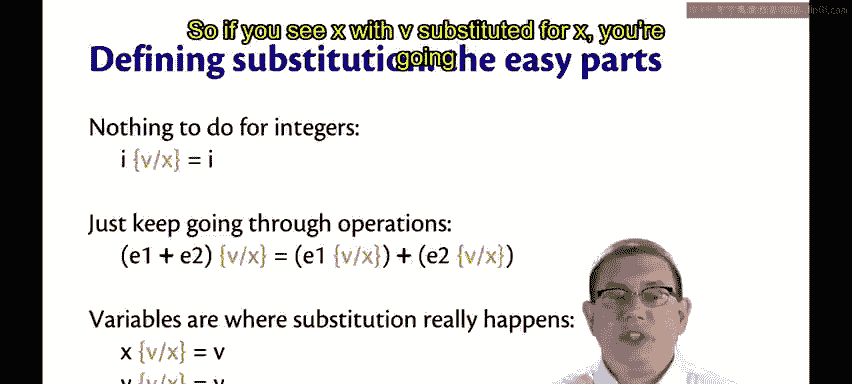
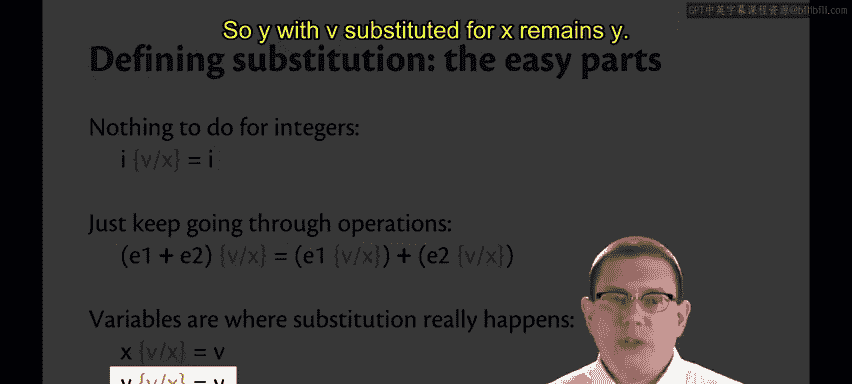
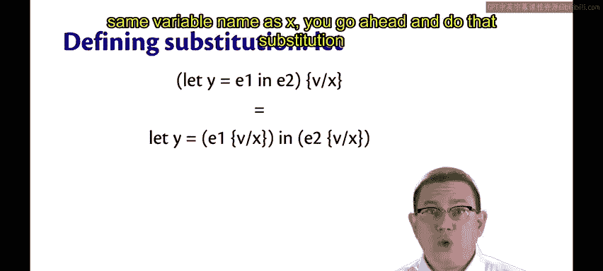
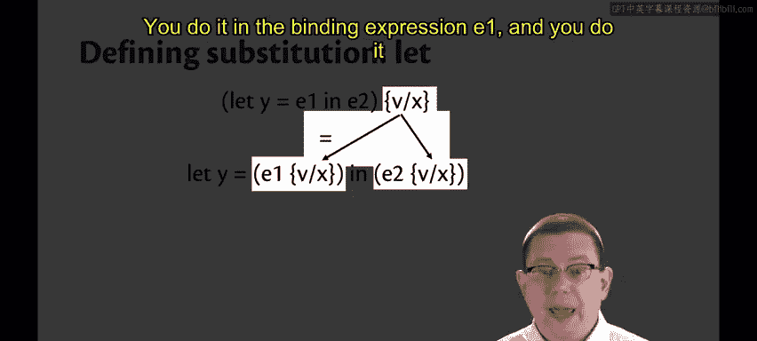
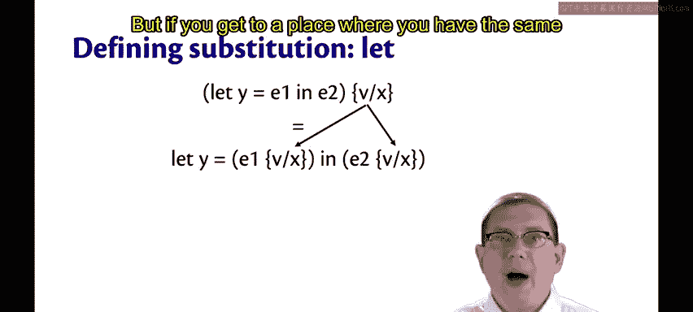
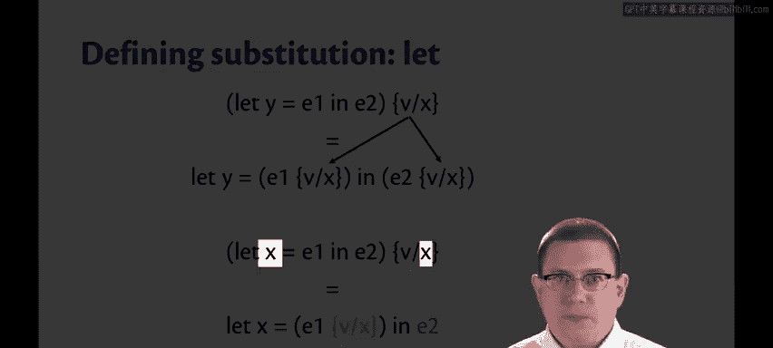
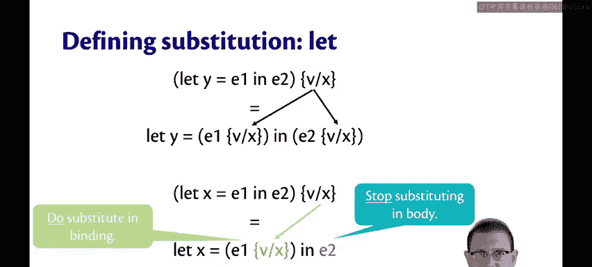

# 康奈尔大学《OCaml编程｜CS3110：OCaml Programming： Correct + Efficient + Beautiful》中英字幕 - P170：-170-Definition of Substitution Chap9 Video 17.zh_en - GPT中英字幕课程资源 - BV1Tx4y1s7sP

Here is a definition of substitution。For integers， there's really nothing to do You know if you've got the integer 42 and you're substituting 0 for x。

 who cares there's no x inside of an integer， so it just leaves the integer unchanged。

When you have a binary operator， you just want to push that substitution down through the operator。😡。

So take that substitution of v for x， do it recursively inside of E1， do it recursively inside of E2。

Variables are where the substitution really ends up happening。😡。

And it depends on whether the variable name is the one being substituted away or not。

So if you see x with v substituted for x， you're going to replace that x with V。

But if you see y a different variable name than x， and you're doing a substitution， well， who cares。

 It's a different variable， you should leave it untouched， So y with v substituted for x remains y。

And now the let expression， which is what we went through those examples for。

If you have let Y equal E1 and E2。And you're substituting V for x inside of that。

Then since y is not the same variable name as x， you go ahead and do that substitution in two places。

 you do it in the binding expression E1 and you do it in the body expression E2。

But if you get to a place where you have the same variable name being rebound。

Then we have to be careful about the substitution。

We do go ahead and do the substitution inside of the binding expression。

But we stop substituting in the body。 We don't do the substitution。

And if you thought that was tricky， it's going to get even trickier in the presence of functions eventually。

 but we're not there yet， so let's just leave it here for now。😡。

