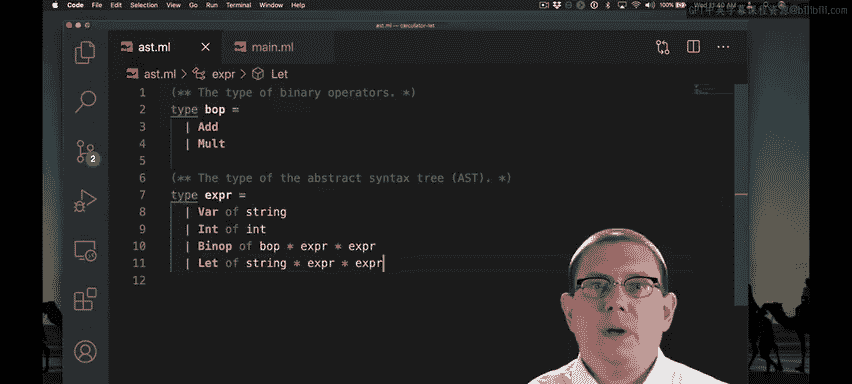
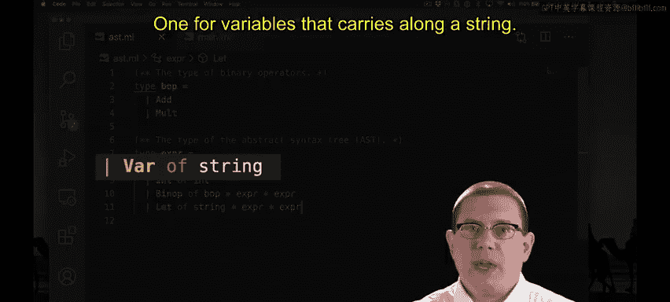
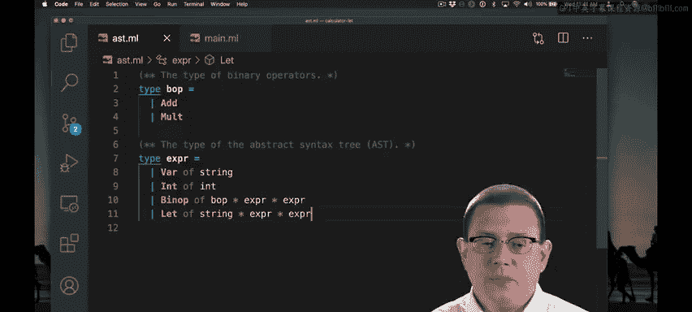
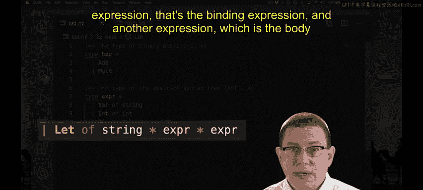
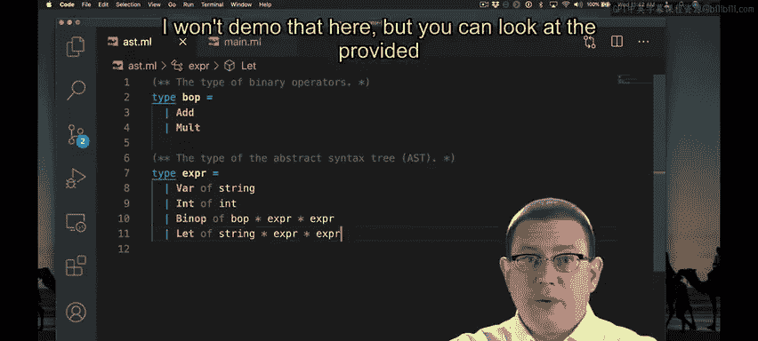

# OCaml编程：9.18：在计算器中实现Let表达式 🧮



在本节课中，我们将学习如何为我们的计算器解释器实现 `let` 表达式。我们将扩展抽象语法树（AST）以支持变量和 `let` 绑定，并实现相应的求值和替换逻辑。



---



## 扩展AST以支持变量和Let



上一节我们介绍了计算器的基本结构，本节中我们来看看如何扩展它。首先，我们需要修改AST类型定义，增加两个新的构造器来表示变量和 `let` 表达式。

```ocaml
type expr =
  | Int of int
  | Binop of binop * expr * expr
  | Var of string          (* 新增：变量，携带一个字符串标识符 *)
  | Let of string * expr * expr  (* 新增：let表达式，三元组（变量名，绑定表达式，主体表达式） *)
```

*   **`Var of string`**：表示一个变量，其标识符用OCaml的字符串表示。
*   **`Let of string * expr * expr`**：表示一个 `let` 表达式。它包含一个三元组：被绑定的变量名（字符串）、用于绑定的表达式以及主体表达式。



词法分析器和语法分析器也需要相应扩展以识别新的语法结构，这部分代码已提供。

---

## 更新解释器与求值函数

由于我们向AST添加了新的节点，原有的模式匹配将变得不完整，编译器会产生警告。因此，我们需要更新解释器中的相关函数，特别是 `is_value` 和 `step` 函数。

### 判断是否为值

对于 `is_value` 函数，只有整数是值。变量和 `let` 表达式本身都不是值。

```ocaml
let is_value = function
  | Int _ -> true
  | Var _ | Let _ | Binop _ -> false
```

### 单步求值函数

接下来，我们实现 `step` 函数来处理变量和 `let` 表达式。

**1. 处理变量**

当求值过程到达一个变量名时，意味着这个变量从未被绑定过（例如，在顶层直接输入 `x`）。此时，解释器应报错。

```ocaml
let unbound_var_err = "Unbound variable"
let step = function
  | Var x -> failwith unbound_var_err
  (* ... 其他模式 ... *)
```

我们将错误信息定义为一个常量 `unbound_var_err`。这样做的好处是，在后续编写测试用例时，可以直接引用这个常量，避免在代码中重复硬编码字符串，减少重复。

**2. 处理Let表达式**

`let` 表达式的求值规则我们已经推导过：
*   如果绑定表达式 `e1` 还不是一个值，则先对 `e1` 进行一步求值。
*   如果绑定表达式 `e1` 已经是一个值，则执行一步求值：将主体表达式 `e2` 中的变量 `x` 替换为值 `e1`。

以下是代码实现：

```ocaml
let step = function
  | Let (x, e1, e2) when is_value e1 -> subs e2 e1 x
  | Let (x, e1, e2) -> Let (x, step e1, e2)
  (* ... 其他模式 ... *)
```

这里用到了替换函数 `subs e v x`，它的含义是“在表达式 `e` 中，将变量 `x` 替换为值 `v`”。我们接下来就实现它。

---

## 实现替换函数

替换函数 `subs` 是 `let` 表达式求值的核心。它的实现需要对表达式 `e` 进行结构递归，并根据其语法形式采取不同操作。

以下是替换函数的实现逻辑，对应四种AST节点：

```ocaml
let rec subs e v x = match e with
  | Int _ -> e                          (* 整数：无需替换，直接返回 *)
  | Binop (op, e1, e2) ->               (* 二元操作符：递归替换两个子表达式 *)
      Binop (op, subs e1 v x, subs e2 v x)
  | Var y ->                            (* 变量：检查标识符 *)
      if x = y then v else e            (* 相同则替换，不同则保留 *)
  | Let (y, e1, e2) ->                  (* Let表达式：需要处理变量作用域 *)
      let e1' = subs e1 v x in          (* 总是替换绑定表达式e1 *)
      if x = y then
        Let (y, e1', e2)                (* 变量名相同：停止对e2的替换 *)
      else
        Let (y, e1', subs e2 v x)       (* 变量名不同：继续替换e2 *)
```

关键点在于处理 `Let` 表达式时的变量作用域规则：
1.  **总是**对绑定表达式 `e1` 进行替换。
2.  然后检查 `let` 绑定的变量名 `y` 是否与要被替换的变量名 `x` 相同。
    *   如果相同（`x = y`），意味着这个 `let` 表达式重新绑定了变量 `x`，形成了新的作用域。因此，我们**不应对**主体表达式 `e2` 进行替换（替换在此停止）。
    *   如果不同（`x != y`），则继续对主体表达式 `e2` 进行替换。

---

## 测试与总结

至此，我们已经为计算器语言成功实现了 `let` 表达式。可以运行配套的测试文件来验证实现的正确性，所有测试都应通过。

本节课中我们一起学习了：
1.  **扩展AST**：增加了 `Var` 和 `Let` 节点来支持变量和绑定。
2.  **更新求值器**：在 `step` 函数中处理了未绑定变量错误和 `let` 表达式的分步求值规则。
3.  **实现替换**：定义了关键的 `subs` 函数，它通过结构递归和变量作用域检查，正确地实现了表达式中的变量替换。


通过实现 `let`，我们为计算器语言增加了定义和重用中间结果的能力，使其表达能力大大增强。