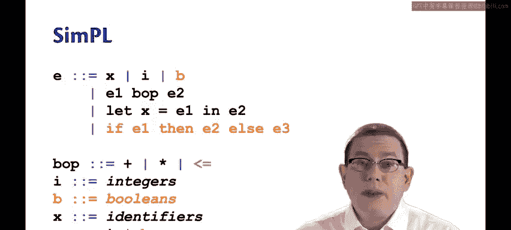
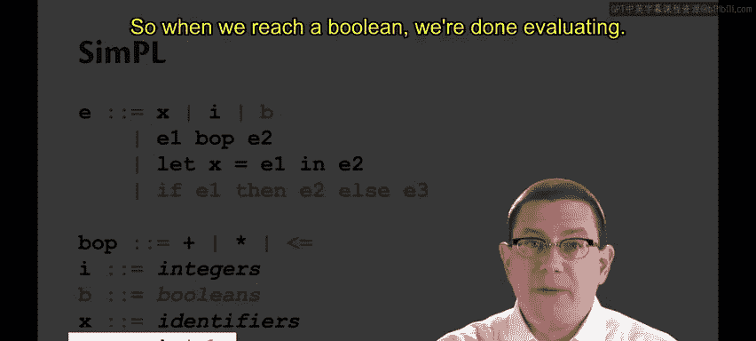
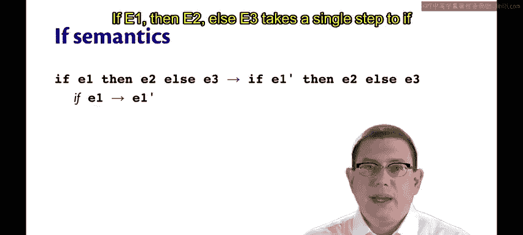
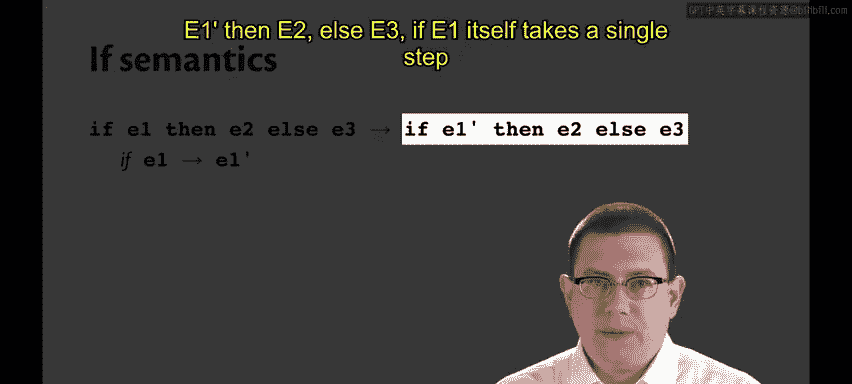
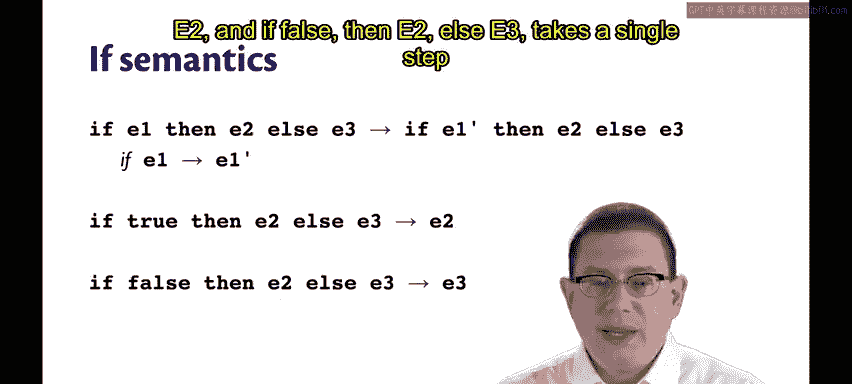
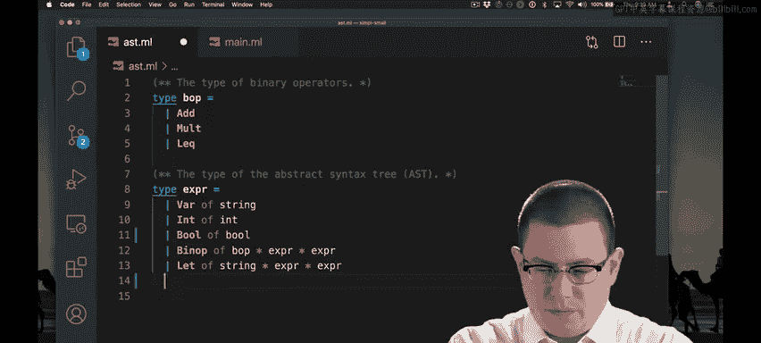
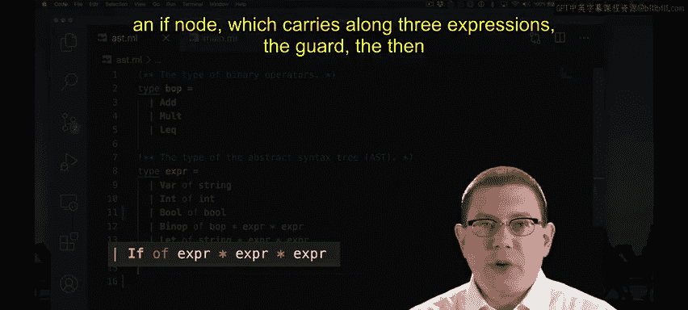

# 康奈尔大学《OCaml编程｜CS3110：OCaml Programming： Correct + Efficient + Beautiful》中英字幕 - P172：-172-SimPL Small Step Chap9 Video 19.zh_en - GPT中英字幕课程资源 - BV1Tx4y1s7sP

We implemented our interpreter for the calculator with let expressions。

Now we're going to add if expressions to that same language， and since we have if expressions。

 we'll add Booleions at the same time。I'm going to call this language simple S IMPL。

 because now we're really going beyond a calculator since we have if expressions。

 this is kind of a simple little fragment of Ocal。😡。

So we're adding Boolean constants B once more I'm not carefully specifying what those are。

 but they will be true and false。We're adding if expressions， if E1， then E2 else E3。

We'll extend Boolean operators to have a less than or equal to comparison。

 which of course will take in two integers and give us back a Boolean。And Booleions will be values。

 of course， so when we reach a Boolean， we're done evaluating。

If E1， then E2 LC3。Takes a single step。

To if E1 prime， then E2 L E3。

If E1 itself takes a single step to E1 prime。So this is saying that to evaluate an if expression first。

 we evaluate its guard， that's how it's always been for us。Once we reach a boolean in the guard。

A Boolean value。 that is we can reduce to either the then or the else branch。So if true， then E2。

 LC3 takes a single step to E2。And if false， then E2 L E3 takes a single step to E3。

Let's extend our AST to handle all of the new kinds of expression syntax that we have in simple。

I've added a less than or equal to constructor for the binary operator type。

I've added a bo constructor which carries along with it just an Ocael Boolean for representing Booleions in simple。

And I've added an if node， which carries along three expressions， the guard， the then branch。

 and the elsese branch。

After rebuilding the code， we're going to get many more in exhaustive pattern match warnings because of course we now have AST nodes that we're not handling in all of these matches Let's start fixing that up。

I've added Boolean nodes and if nodes is value， Booleions are values。

 so that returns true if expressions are not values so that returns false。For substitution。

 if I reach a Boolean constant， there is no substitution to be done because of course there cannot be a variable name inside of that。

 so we just return E， the original expression。If I'm doing a substitution of V for x inside of an if expression。

 I just recursively push that down through each of the subexpressions of the if。

 doing the substitution inside each one individually。😡，To implement the step or single step function。

 I need to now account for Booleions and if expressions。Let's pause here。Booulions。

 since they're already values， do not take a single step。As for if expressions。

 I need to be careful in order to make sure I evaluate the right piece of it first。

 just like I had to be careful with binary operators。😡，So when I do have a value for the guard。

 I will go ahead and step the if expression， I have introduced a new helper function for that that I'm about to write in a minute。

😡，On the other hand， E1 is not yet a value， then I will go ahead and step it。

Let's write the helper function next。Okay， so I have now finished most of the implementation of step if。

If V1 is true， the if will step to E2 the then branch。If V1 is false， then it will step to E3。

 the else branch。If V1 is any other type of value at this point。

 the only type of value we have is an integer。So if V1 is an integer。

 we are going to need to say something about how this doesn't have the right type。😡。

We do have to take care of those kinds of runtime type errors that might occur。😡，So for int。

 what I've done is gone ahead and introduced an error message that I want to raise。😡。

It's up here at the top of the file， if guard error， guard of if must have type boo。Otherwise。

 the precondition of Step if has been violated because there's only those two types of values。

 bo and int。I'm a little uneasy with this catch all case because if later on I decide to add more values to my language。

 the type checker is not going to find the fact that I have missed those for me。😡，Later on。

 we're going to implement an interpreter with a separate type for values that's distinct from the type for expressions When we get to that point we'll have solved that problem。

😡，So I've now finished implementing the single step relation。

 but there are more pattern matches below that are inexhaustive。

 I still need to go fix them one of them is the stepping of binary operators。

 you recall I added a new binary operator less than or equal to， so I need to deal with it as well。😡。

Now I've implemented less than or equal to， if it takes two integer values。

 then it's just going to reduce that to the Ocaml comparison between those values wrapped with a bo constructor。

 anything else is a binary operator error。There's one other function that I need to complete。

 I now need to be able to convert Booleions to strings。

Now I should be able to run all of my test cases， I have new test cases now for if expressions。

 this is not an industrial strength test suite yet。

 it could be built out further but this does serve to demonstrate what we have completed so far。Yea。

 all of those test cases passed， we have now implemented if expressions in the little language simple。

