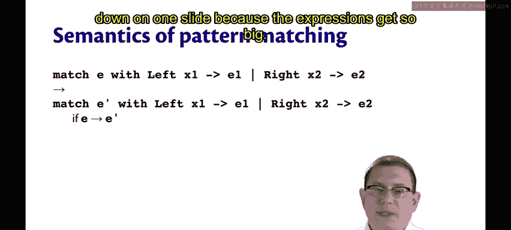
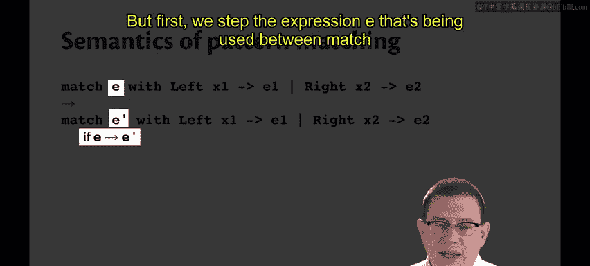
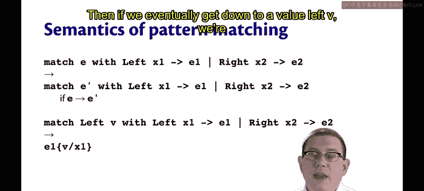
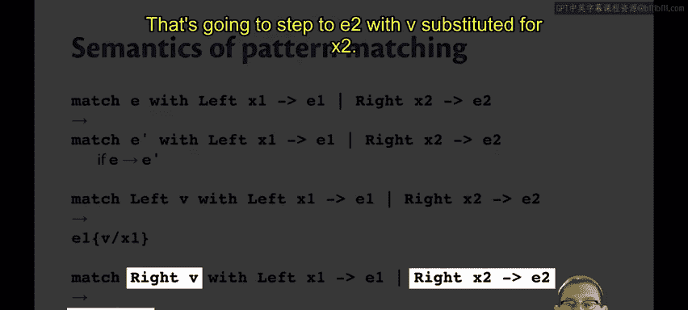
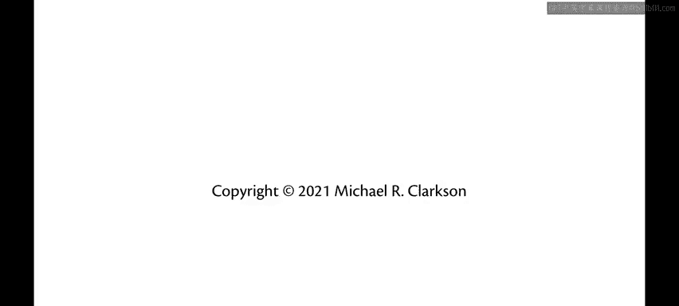

# OCaml编程：9：核心OCaml小步语义

在本节课中，我们将学习如何将之前为Simple语言定义的语义扩展到OCaml的一个更大片段，我们称之为“核心OCaml”。这个片段包含了OCaml作为函数式编程语言几乎所有核心特性。

上一节我们为Simple语言实现了一个解释器。本节中，我们来看看如何构建一个更强大的语言片段。

## 🧩 核心OCaml的扩展特性

核心OCaml在Simple语言的基础上增加了以下关键特性：

*   **函数与应用**：这是Simple语言中缺失的部分。
*   **序对**：包括序对的构造以及获取其第一和第二分量。
*   **模式匹配**：我们目前只硬编码了两个构造器（`Left`和`Right`），并可以针对它们进行模式匹配。

对于值，我们现在有：
*   函数本身是值。
*   由值构成的序对本身是值。
*   应用于一个值的`Left`或`Right`构造器也是值。

## 🔄 核心OCaml的小步语义

接下来，我们介绍核心OCaml的小步语义规则。

### 函数应用

以下是函数应用的求值规则：

1.  如果表达式`E1`可以单步求值为`E1'`，那么应用`E1 E2`可以单步求值为`E1' E2`。
    *   用公式描述为：**`E1 -> E1'` 蕴含 `E1 E2 -> E1' E2`**。
2.  如果`E1`已经是一个值`V1`，而`E2`可以单步求值为`E2'`，那么应用`V1 E2`可以单步求值为`V1 E2'`。
    *   用公式描述为：**`E2 -> E2'` 蕴含 `V1 E2 -> V1 E2'`**。
3.  当应用的两个部分都是值（即`V1 V2`）时，第一个值`V1`必须是一个函数（例如`fun x -> E`）。此时，该应用单步求值为函数体`E`，其中函数的形参`x`被实参值`V2`替换。
    *   用公式描述为：**`(fun x -> E) V2 -> E[V2 / x]`**。

### 序对

序对的求值规则比较直观：

1.  如果`E1`可以单步求值为`E1'`，那么序对`(E1, E2)`可以单步求值为`(E1', E2)`。
    *   用公式描述为：**`E1 -> E1'` 蕴含 `(E1, E2) -> (E1', E2)`**。
2.  一旦序对的第一个分量是值`V1`，就可以开始求值第二个分量。如果`E2`可以单步求值为`E2'`，那么`(V1, E2)`可以单步求值为`(V1, E2')`。
    *   用公式描述为：**`E2 -> E2'` 蕴含 `(V1, E2) -> (V1, E2')`**。
3.  函数`fst`应用于一个由两个值构成的序对`(V1, V2)`时，求值结果为第一个值`V1`。
    *   用代码描述为：**`fst (V1, V2) -> V1`**。
4.  函数`snd`应用于一个由两个值构成的序对`(V1, V2)`时，求值结果为第二个值`V2`。
    *   用代码描述为：**`snd (V1, V2) -> V2`**。

### 构造器与模式匹配

对于构造器（如`Left`和`Right`），我们只需对构造器内部的表达式进行求值。

1.  如果`E`可以单步求值为`E'`，那么`Left E`可以单步求值为`Left E'`，`Right E`同理。
    *   用公式描述为：**`E -> E'` 蕴含 `C(E) -> C(E')`**，其中`C`代表`Left`或`Right`。

模式匹配的规则稍复杂一些。考虑表达式 **`match E with Left x1 -> E1 | Right x2 -> E2`**。

以下是其求值步骤：

1.  首先，对匹配对象`E`进行求值。如果`E`可以单步求值为`E'`，那么整个`match`表达式单步求值为 **`match E' with ...`**。
    *   用公式描述为：**`E -> E'` 蕴含 `(match E with ...) -> (match E' with ...)`**。
2.  当`E`最终求值为一个值，例如`Left V`时，整个`match`表达式将单步求值到与`Left`构造器对应的分支（即`E1`），并且将匹配到的值`V`替换该分支中的模式变量`x1`。
    *   用公式描述为：**`match (Left V) with Left x1 -> E1 | ... -> E1[V / x1]`**。
3.  对称地，如果`E`求值为`Right V`，则求值到`E2`分支，并用`V`替换`x2`。
    *   用公式描述为：**`match (Right V) with ... | Right x2 -> E2 -> E2[V / x2]`**。

## 💡 关于替换的说明

我们在函数应用和模式匹配的规则中多次提到了“替换”（例如`E[V / x]`）。为了精确定义这些语义，我们需要为**核心OCaml**给出一个替换操作的形式化定义。这将是下一节的主要内容。

本节课中，我们一起学习了如何将小步语义扩展到包含函数、序对和模式匹配的**核心OCaml**片段。我们定义了各类表达式如何单步求值，并看到替换操作在函数应用和模式匹配中的核心作用。