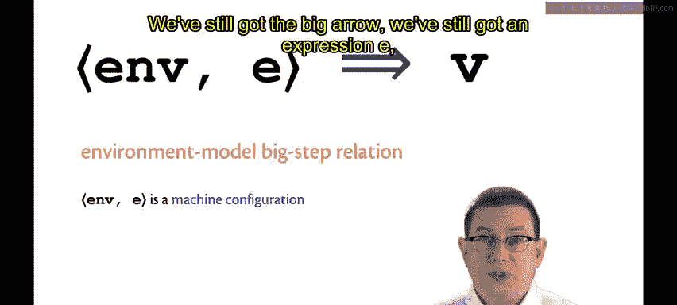
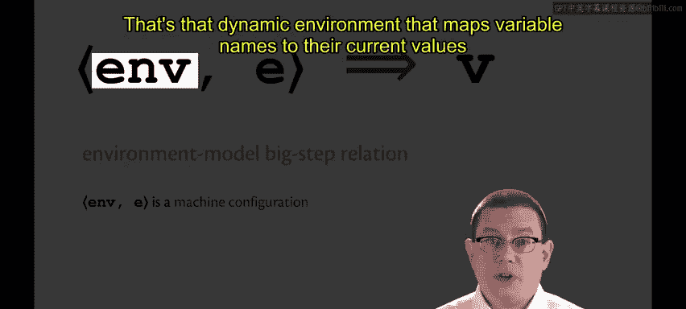
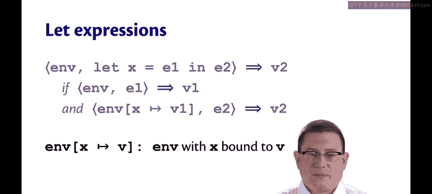
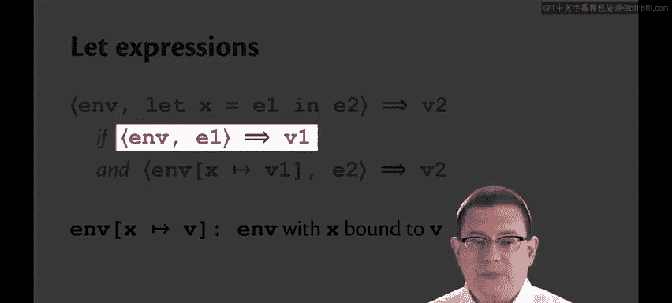
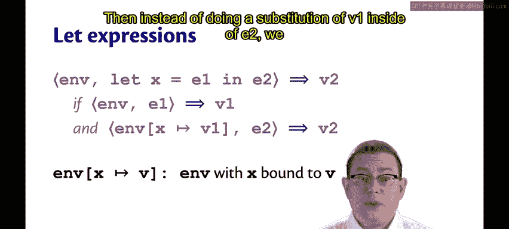
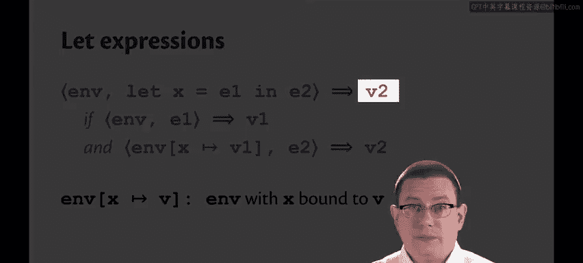
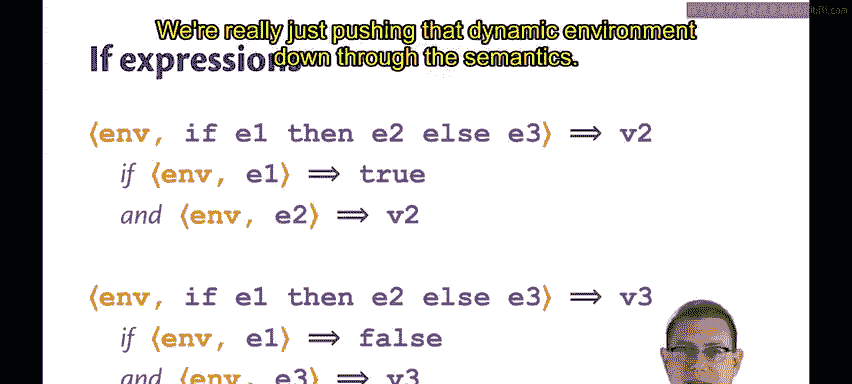

# OCaml编程：9.23：SimPL的环境模型 🧠

在本节课中，我们将学习编程语言动态语义的另一种模型——环境模型。我们将看到它如何比替换模型更贴近真实机器的执行方式，并学习如何使用它来定义语言的语义。

## 概述

替换模型是理解语言动态语义的优秀思维模型，它以一种简单的方式思考计算过程。然而，替换模型并非对真实机器的现实模拟。在真实机器中，代码和数据通常是分开存储的。我们有一个单独的内存区域用于存储代码，另一个单独的区域用于存储数据。在运行时，机器不会通过编辑代码来执行变量替换，而是将数据保存在内存中，并在需要时进行查找。

## 环境模型的核心概念

上一节我们提到了替换模型的局限性，本节中我们来看看更贴近机器实现的**环境模型**。

在环境模型中，我们引入了一个称为**动态环境**的概念。动态环境是一个映射，它将变量名关联到其在该作用域内的当前值。这可以看作是一种“惰性替换”：变量名最终可能会被其值替换，但我们并不立即执行替换，而是在需要时查找该值。

为了对这种求值过程进行建模，我们将引入一个新的**大步关系**。与之前替换模型的大步关系不同，这是**环境模型的大步关系**。

它的形式如下：
```
<env, e> ⇓ v
```
其中：
*   **`env`** 是动态环境。
*   **`e`** 是要求值的表达式。
*   **`v`** 是求值结果。

箭头左侧用尖括号括起来的部分称为**机器配置**。你可以将其视为程序执行时机器的当前状态。其中第一个组件（`env`）类似于内存，第二个组件（`e`）则是正在求值的程序。



我们将环境抽象地视为映射。我们使用花括号 `{}` 表示空环境。例如，`{x: 42, y: “red”}` 表示将变量名 `x` 映射到值 `42`，将变量名 `y` 映射到字符串 “red” 的环境。环境是偏函数，记作 `env(x)` 表示在环境中查找变量 `x`。如果查找一个未绑定的变量，则会发生未绑定变量错误。



## SimPL语言的环境模型语义

现在，我们可以使用这个环境模型的大步关系来定义 SimPL 语言的动态语义。

### 变量求值

对于变量，我们只需在环境中查找它。这正体现了惰性替换的发生。
```
<env, x> ⇓ env(x)
```
请注意这与替换模型的不同之处。在替换模型中，我们会说这是一个未绑定变量。在这里，它可能绑定也可能未绑定。如果 `x` 在环境中没有映射，则是一个未绑定变量错误；如果已绑定，则这正是执行了最终惰性替换的结果。

### Let 表达式求值

对于在环境 `env` 中求值 `let x = e1 in e2` 表达式：
1.  首先，在相同的动态环境 `env` 中求值 `e1`，得到值 `v1`。
    ```
    <env, e1> ⇓ v1
    ```
2.  然后，我们不是将 `v1` 替换到 `e2` 中，而是记录 `x` 应该是什么。我们取环境 `env`，并在其中将 `x` 绑定到 `v1`。我们引入一个新的符号 `env[x -> v1]` 来表示扩展环境以绑定（或重新绑定，如果变量已存在）一个值。
3.  接着，我们在那个记录了 `x` 到 `v1` 的惰性替换的扩展环境中求值 `e2`，得到值 `v2`。
    ```
    <env[x -> v1], e2> ⇓ v2
    ```
4.  整个 `let` 表达式的求值结果就是 `v2`。

### 其他表达式求值



以下是其他类型表达式的求值规则：



*   **值**：像在替换模型中一样，值直接求值为自身。
    ```
    <env, v> ⇓ v
    ```



*   **二元操作符**：其工作方式与替换模型几乎相同，我们只需要在子表达式求值时传入相同的环境。
    ```
    <env, e1> ⇓ v1    <env, e2> ⇓ v2    v = v1 op v2
    ————————————————————————————————————————————————
              <env, e1 op e2> ⇓ v
    ```



*   **If 表达式**：同样，我们只是将动态环境向下传递到语义中。
    ```
    <env, e1> ⇓ true    <env, e2> ⇓ v
    ———————————————————————————————————
        <env, if e1 then e2 else e3> ⇓ v

    <env, e1> ⇓ false    <env, e3> ⇓ v
    ————————————————————————————————————
        <env, if e1 then e2 else e3> ⇓ v
    ```

## 总结



本节课中我们一起学习了 SimPL 语言的**环境模型**。我们了解到，与替换模型不同，环境模型通过维护一个**动态环境**（即变量名到其值的映射）来模拟求值过程，这更贴近真实计算机在内存中存储和查找数据的机制。我们定义了基于环境模型的大步求值关系 `<env, e> ⇓ v`，并详细说明了变量、`let` 表达式、值、二元操作符和 `if` 表达式在该模型下的求值规则。环境模型本质上实现了一种**惰性替换**，只在需要时才查找变量的值，从而提供了对程序运行时行为更现实的描述。