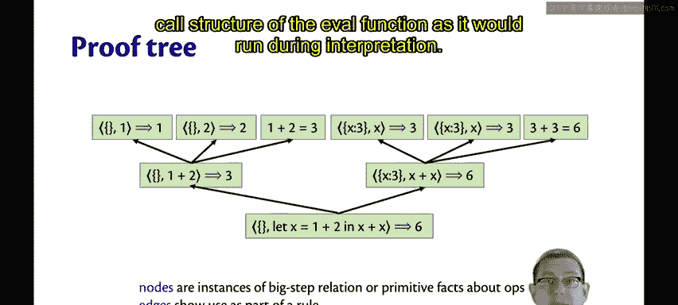
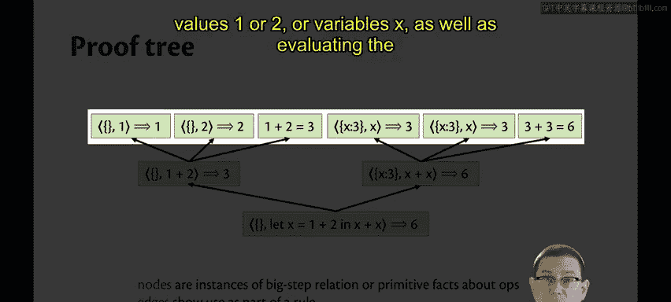
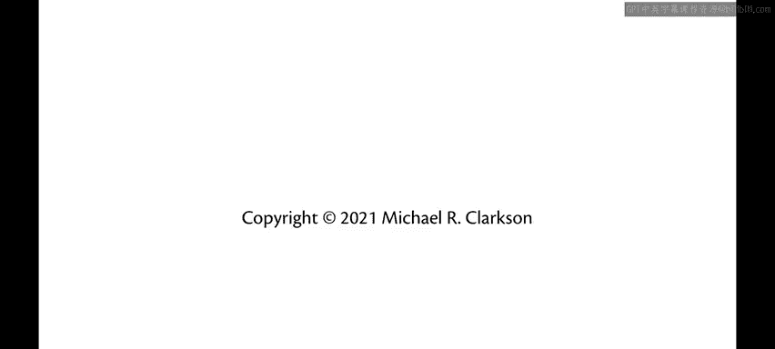

# 康奈尔大学《OCaml编程｜CS3110：OCaml Programming： Correct + Efficient + Beautiful》中英字幕 - P177：-177-Environment Model Example Chap9 Video 24.zh_en - GPT中英字幕课程资源 - BV1Tx4y1s7sP

Let's try an example of using the big step environment model to evaluate this little piece of code。

 Now， in the small step model， we modeled computations like lists。 in a sense， it was like a list of。

 we start with expression E and then it steps to E1 and then to E2 and so forth and so on and eventually to evaluate。

In this big step environment model， we're structuring computations as trees instead。

So here's what that tree looks like， I've nested each use of the evaluation relation here to show how it supports kind of upper level uses of it。

😡，So let's start at what would be the leaves of this tree done at the kind of most indented part here here I've used the value rule twice in the empty environment one evaluates to one。

 two evaluates to two。I've then used the binary operator rule kind of on top of that to conclude that 1 plus2 evaluates to three。

😡，And that's because I need to individually evaluate each of the subexpressions， E1 and E2。😡。

And then do the result of the primitive operation。Again， I need to do that for x plus x。

 So here I use the variable rule twice。 I'm looking up x inside of the dynamic environment and finding its value。

 which is 3。I then use the binary operator rule to add three and three together and get six。😡。

And then finally， at the highest level of this tree。

 I'm using the let rule to figure out how to evaluate the binding expression， record it。😡。

As the value of x inside of the dynamic environment， and then evaluate the body expression。

Another way to draw this tree instead of the kind of indentation that I had on the previous slide is actually as a tree in which the nodes are instances of the big step relation or primitive facts about operations。

😡，And the edges are showing their use as part of a rule。

 as part of one of these definitions in the big step semantics。In fact。

 you can think of this tree as showing the recursive call structure of the eval function as it would run during interpretation。

First you call eval on the lead expression， that's going to call aval on the binary operators that are part of the binding and body expressions。

And each of those is going to call a Val then on those values one or two or variables x。

 as well as evaluating the primitive operation。

Another way to write a proof tree and perhaps you've seen this before if you've taken a class on mathematical logic is like this。

Here we've kind of gotten rid of nodes and edges， and instead we have lines。😡。

So the lines here each show the use of a rule from our semantics。

 whether it's the variable rule or the binary operator rule or whatever。

So the name of the rule here is written next to the line。

There are conclusions below the line and premises above the line at each use of a rule。

 So we've got three different ways of notating these trees。

I find it more convenient to use the textual notation with indentation when I'm working on slides。😡。

When I'm working myself on a whiteboard or on paper。

 sometimes I use this proof tree notation instead though because it's a little more graphical and nice to read。

