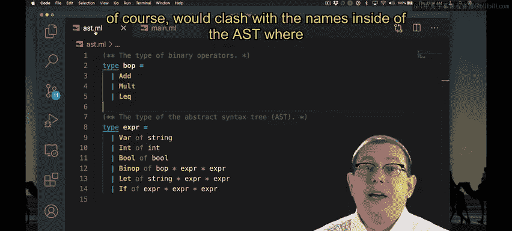

# OCaml编程：9.25：SimPL环境模型解释器实现 🧠

在本节课中，我们将学习如何基于大步骤环境模型，为SimPL语言实现一个解释器。我们将看到，与之前基于表达式的解释器相比，环境模型通过引入“值”类型和动态环境，使实现更加清晰和直接。

## 概述

我们将实现一个解释器，其核心变化在于求值部分。解析器、抽象语法树（AST）等组件与之前保持一致。解释器将引入一个动态环境来存储变量绑定，并定义一个专门的“值”类型来表示求值结果。

## 实现详解

### 定义动态环境与值类型

首先，我们需要定义动态环境。我们使用OCaml标准库的`Map`模块来创建一个从变量名（字符串）映射到“值”的数据结构。

```ocaml
module Env = Map.Make(String)
type env = value Env.t
```

这里的`env`类型是一个映射表，其键是字符串，值是`value`类型。`value`是我们为SimPL语言定义的新类型，用于明确区分“表达式”和“求值结果”。

SimPL语言中只有两种值：整数和布尔值。为了避免与AST中同名的表达式构造器冲突，我们在构造器名称前加上`V`。

```ocaml
type value =
  | VInt of int
  | VBool of bool
```

### 求值函数

求值函数`eval`现在接受两个参数：一个表达式`expr`和一个动态环境`env`。它返回一个`value`类型的结果，而不是表达式。

```ocaml
let rec eval (env : env) (e : expr) : value =
  match e with
  ...
```

以下是针对不同语法结构的求值规则实现。



#### 字面量

整数和布尔字面量直接转换为对应的值类型。

*   **整数**：`Int i` 求值为 `VInt i`。
*   **布尔值**：`Bool b` 求值为 `VBool b`。

#### 变量

对于变量`Var x`，我们需要在动态环境`env`中查找其绑定的值。我们使用一个辅助函数`lookup`来实现。

```ocaml
| Var x -> lookup env x
```

如果变量未在环境中找到，`lookup`函数将引发一个“未绑定变量”错误。

#### 二元操作符

对于二元操作符表达式`Binop (op, e1, e2)`，我们首先在**当前环境**中分别求值`e1`和`e2`，得到两个值`v1`和`v2`。然后，根据操作符`op`的类型，对这两个值进行相应的运算（例如加法、逻辑与等），并返回结果值。这确保了操作符的语义正确性。

#### Let表达式

Let表达式`Let (x, e1, e2)`的求值步骤如下：
1.  在当前环境`env`中求值`e1`，得到值`v1`。
2.  将绑定`(x, v1)`添加到当前环境中，创建一个新的环境`env'`。
3.  在这个新环境`env'`中求值`e2`，其结果即为整个Let表达式的值。

#### If表达式

对于条件表达式`If (e1, e2, e3)`：
1.  首先求值条件守卫`e1`，得到一个值`v1`。
2.  匹配`v1`：
    *   如果是`VBool true`，则求值`e2`并返回其值。
    *   如果是`VBool false`，则求值`e3`并返回其值。
    *   如果是其他值（例如一个整数），则引发类型错误，因为守卫必须是布尔值。

### 辅助函数更新

最后，我们需要更新将值转换为字符串的函数。由于现在有了明确的`value`类型，我们可以安全地进行模式匹配，而不再需要通用的“捕获所有”分支。

```ocaml
let string_of_value = function
  | VInt i -> string_of_int i
  | VBool b -> string_of_bool b
```

## 总结

本节课中，我们一起学习了如何为SimPL语言实现一个基于环境模型的解释器。关键点在于：
1.  引入了**动态环境**（`env`）来管理运行时的变量绑定。
2.  定义了专门的**值类型**（`value`）来清晰地区分表达式和求值结果。
3.  求值函数`eval`现在接收环境作为参数，并返回一个值。
4.  针对每种语法结构，我们严格遵循了环境模型的语义规则进行实现，使得代码结构清晰，逻辑直接。


这种实现方式避免了早期将所有东西都视为表达式所带来的模式匹配复杂性，使解释器的设计与语言的形式化语义更加贴合。