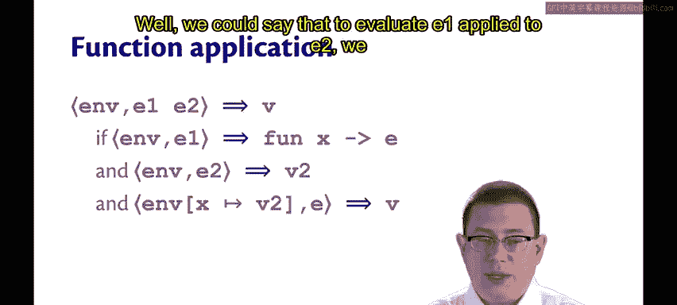
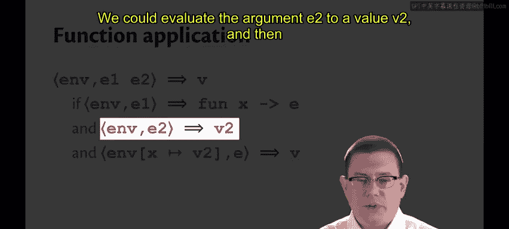
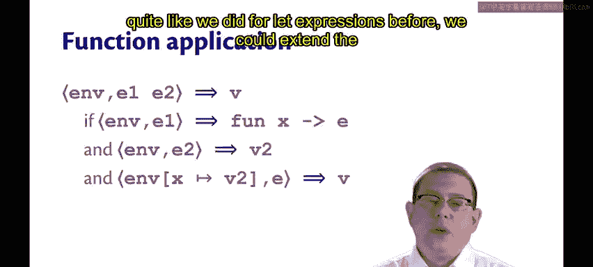
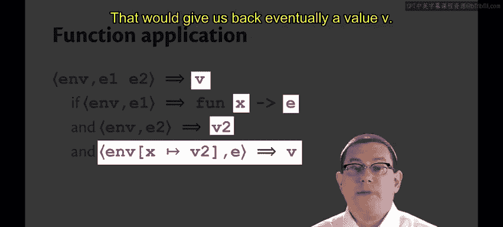
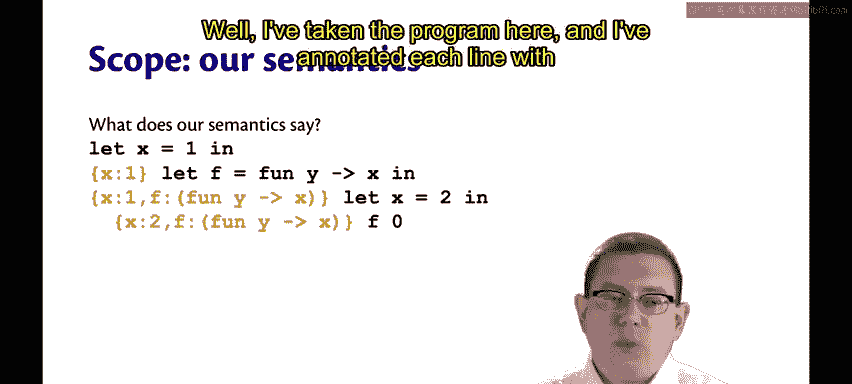
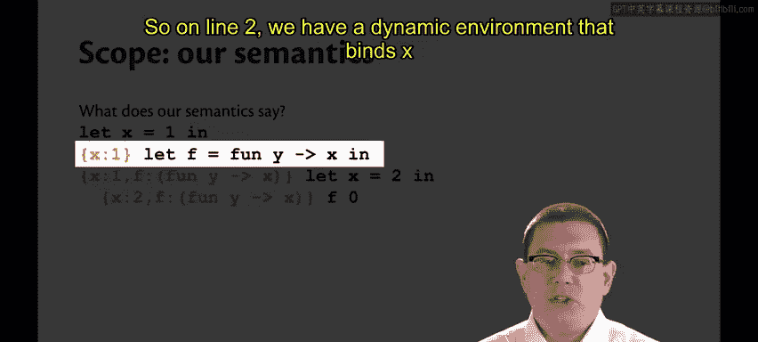
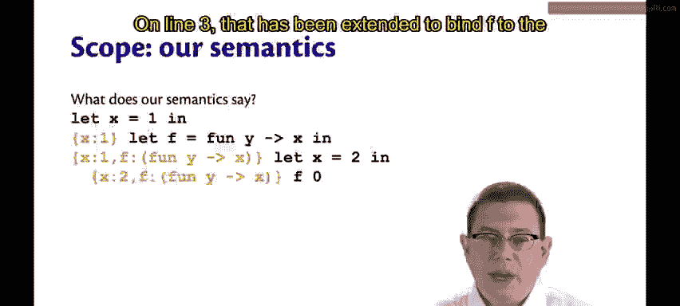
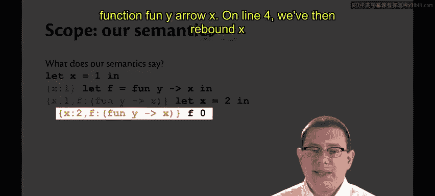
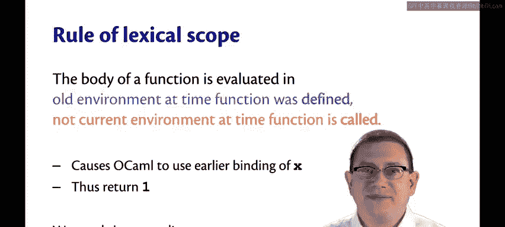

# 康奈尔大学《OCaml编程｜CS3110：OCaml Programming： Correct + Efficient + Beautiful》中英字幕 - P179：-179-Function Semantics in the Environment Model Chap9 Video 26.zh_en - GPT中英字幕课程资源 - BV1Tx4y1s7sP

Let's extend simple to a bigger language we're going to push out towards corere Ocal now by adding anonymous functions and function application。

😡，How could we give a big step environment model semantics for this？Well， since functions are values。

 we could say that evaluating the anonymous function fund X RE inside of an environment end just gives you back the value。

 much like if we were just evaluating an integer value or just give us back that integer。

This is tempting。Simple。And very， very wrong。I'm going to show you why， in a minute。

What about function application？Well， we could say that to evaluate E1 applied to E2。

 we first evaluate E1， of course， if this expression pipe checkedck that has to give us back a function eventually。

 so let's say that that's the function fun X R E。😡。

We could evaluate the argument E2 to evaluate V2。😡。

And then quite like we did for lead expressions before。

 we could extend the dynamic environment to bind x to V2 and evaluate the function body E。😡。

That would give us back eventually a value V， that would be the result of the entire function application。

Once more， this is tempting， simple and wrong。So what's the problem？Well。

 here's a little piece of code that will help make it clearer。Suppose we bind x to1。

And then we bind F to the function， fun Y arrow X。Then we red x to 2。And call F on 0。

So what should this evaluate to？It all comes down to which binding of x should get used。

 Is it the binding of x to1 or the binding of x to 2。Please take a minute， Stop the video。

 and you decide what you think the result should be。😡，O。Perhaps some of you put that into Utah。

 if so， I applaud you。What does OCl say that this evaluates to？WellWhen I put it in U。

 I got back that it evaluated to1， so it was the binding of x to1 that in the end was used。😡。

But what does our semantics currently say？Well， I've taken the program here and I've annotated each line with what the dynamic environment would be at the beginning of that line。

😡。

So on line too， we have a dynamic environment that binds x to1。

On line 3， that has been extended to bind F to the function， fun Yarrow X。

On line 4， we've then rebound x to B2。😡。

And now in that dynamic environment， we need to evaluate F applied to0。So what is that。

 according to the semantics that we just gave？Well， first， we would evaluate F to a value。

 That would be the function fun YarrowO X。 All we have to do is look that up in the dynamic environment。

Second， we would evaluate its argument  zero to a value， it's already a value。Third。

 we would extend the environment to map that function parameter。

So why the parameter of that function would be bound to zero， which is the argument being passed in。

Then we would evaluate the body of the function in the current environment。😡，And in that environment。

 when we look up X， we get 2。So we would return two as the result of evaluation。Well。

 I hope you'll agree with me， two is not equal to one。

So Ocael's semantics versus the semantics we've written down at this point do not agree on how this program evaluates。

That's why I said that the semantics was wrong。So why are we getting two different answers？

It's because there are two ways of defining variable scope that we're exploring right now。

1 is called the rule of dynamic scope。 And that's what our wrong semantics has been using so far。

 Now， I'm going to backpedal a little bit here。 It's not that it's wrong。

 It's that it's not what you expect。 according to Ocael's semantics。

 We'll come back to that later and discuss it more。The Ocael semantics or the quote。

right semantics uses what's called the rule of lexical scope。

The rule of dynamic scope says that the body of a function is evaluated in the current environment at the time the function is called。

Not in the old environment that existed at the time， the function was defined。

So that difference between which environment gets used for the body is what caused our semantics to use the latest binding effects。

 the one at the time the function was called。And that caused it to return too。

The rule of lexicalco says that the body of a function is evaluated in the old environment at the time the function was defined。

 not in the current environment at the time the function is called。

And that's what caused Ocal to use the earlier binding of x from when the function had been defined and thus return1。

So Ocal's semantics to get lexical scope。Requires returning to an old environment at the time a function is called because you can't keep using the new environment。

 you've got to go back in time to that old environment at the time the function was defined。😡。

What that means is that OcaMl semantics requires implementing time travel。

