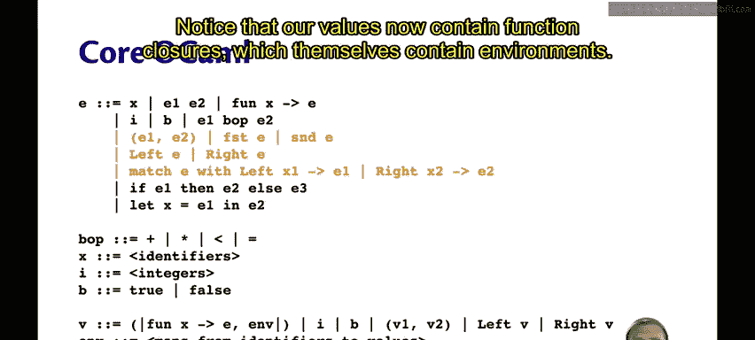
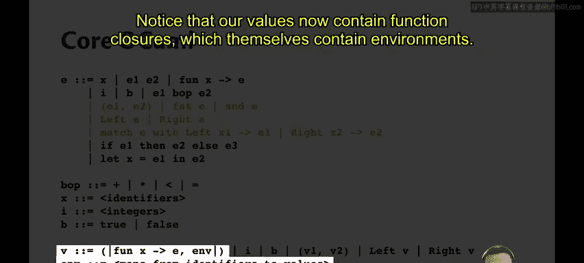
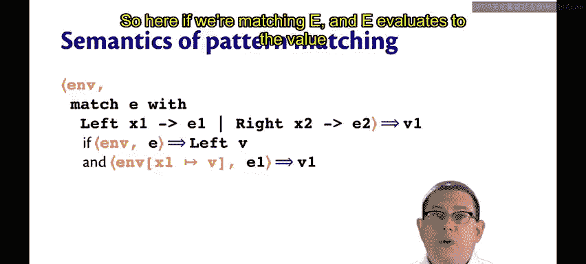
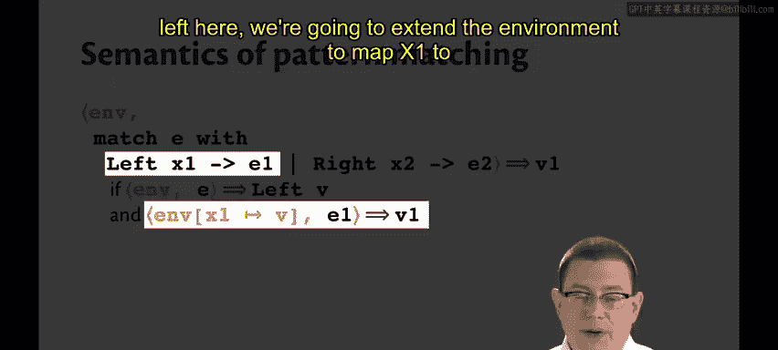
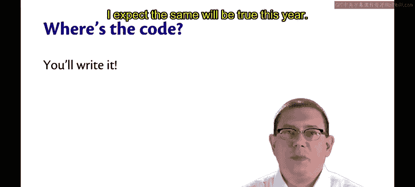

# OCaml编程：9：剩余核心OCaml环境模型

在本节课中，我们将学习如何将大步环境模型扩展到完整的核心OCaml语言，具体方法是引入**对**和**模式匹配**。我们将看到，现在的值包含了函数闭包，而闭包本身又包含了环境。

---

## 扩展环境模型以包含对

上一节我们介绍了环境模型的基本概念。本节中，我们来看看如何将模型扩展到处理**对**。

我们的值现在包含了函数闭包，这些闭包本身又包含了环境。这类似于之前处理引用和位置时的情况，即存在一种无法用语言语法直接写出的值。这再次说明，并非所有值本身都是表达式。

对（Pairs）的语义非常直接。下图展示了其求值规则：

图中黑色部分与使用环境模型之前相同，新增的橙色部分表示：**使用当前的动态环境来求值对中的每个分量**。

对于 `first` 和 `second` 操作，规则是类似的，同样是利用动态环境来求值。

---

## 扩展环境模型以包含构造器和模式匹配

理解了对的求值后，我们继续探讨构造器和模式匹配的规则。

对于构造器（例如 `Left` 或 `Right`），规则与对类似，我们同样将动态环境传递下去，用于求值构造器内的表达式。

模式匹配的规则与之前几乎完全相同，但有一个关键区别。以下是其求值规则：

当求值一个分支及其表达式（`E1` 或 `E2`）时，我们需要**扩展动态环境**，将模式变量映射到被匹配表达式的值。

具体来说，如果我们匹配表达式 `E`，且 `E` 求值为值 `Left V`，那么在求值对应的分支 `E1` 时，我们将扩展环境，将模式变量 `X1` 映射到值 `V`。如果匹配的是 `Right` 模式，规则是对称的。

---

## 实现环境模型解释器

您可能会好奇，核心OCaml的大步环境模型解释器代码在哪里。

答案是：**将由您来编写**。

在过去的至少五年（甚至二十年）里，CS3110课程始终包含一个解释器作业。在该作业中，学生需要实现OCaml（或一个密切相关的函数式语言）的一个实质性片段。预计今年也不例外。

---

## 总结

本节课中，我们一起学习了如何将大步环境模型扩展到完整的核心OCaml。我们引入了**对**和**模式匹配**的求值规则，并理解了函数闭包作为值的一部分如何携带环境。最后，我们了解到实现这样一个解释器是课程实践环节的重要组成部分。