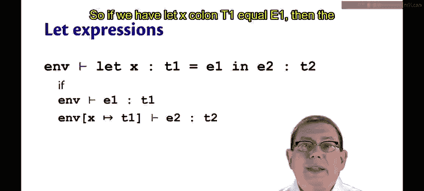
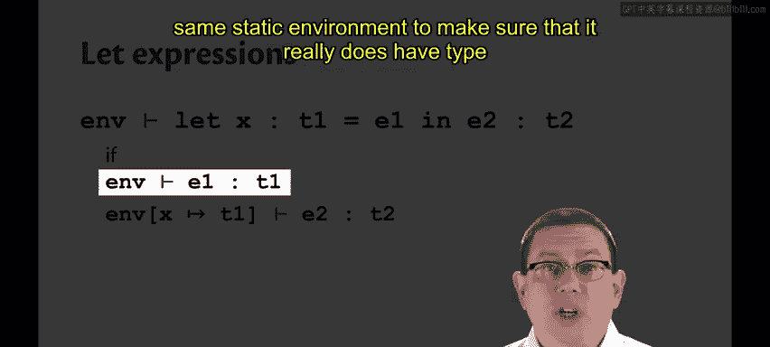
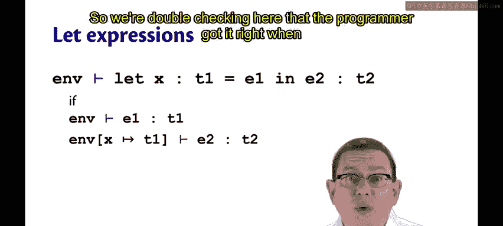
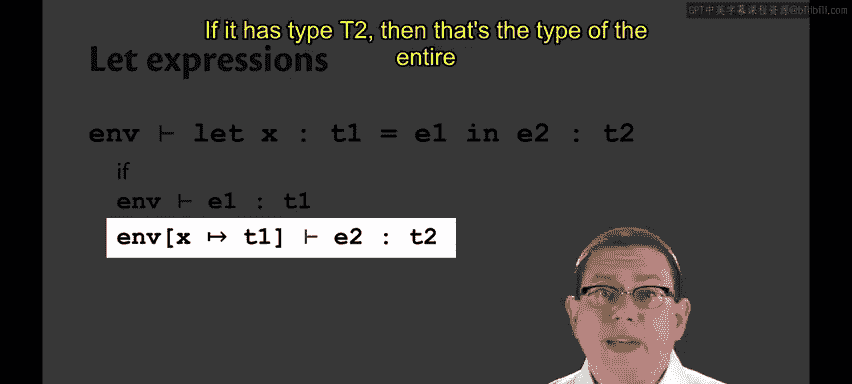
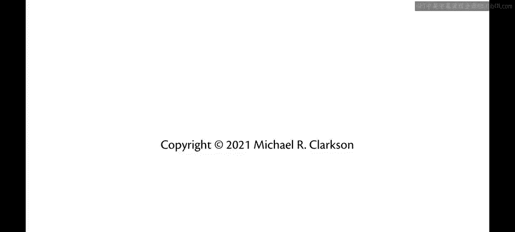

# 类型化编程语言：第9章：SimPL类型系统 🧠

在本节课中，我们将学习一种名为“类型化SimPL”的语言，并深入探讨其类型系统的规则。我们将看到，通过为变量和表达式指定类型，编译器可以在程序运行前发现潜在的错误，从而确保程序的正确性。

---

## 语言概述

我们将在一个名为“类型化SimPL”的语言背景下进行讨论。这个语言几乎与原始的SimPL语言完全相同，唯一的区别是我在其中加入了一些类型。

因此，我现在要求程序员在`let`绑定中写下冒号和类型`T`。这里没有类型推断，你必须明确写出类型。我们稍后会再讨论类型推断。这个语言中只有两种类型：`int`（整数）和`bool`（布尔值）。

## 值与变量的类型检查

值和变量的类型检查相当简单。无论静态环境（我们称之为`Γ`）是什么，它总是能表明一个整数常量具有`int`类型，而一个布尔常量具有`bool`类型。

此外，变量名的类型将是它在那个环境中被绑定的类型。当然，如果变量名在环境中没有被绑定，那么就无法查找它，因此如果变量不在静态环境中，我们就永远无法推断出该变量具有某个类型。

## 二元运算符的类型检查

所有二元运算符的类型检查规则看起来都大致相同。对于每一个运算符，我们都会递归地检查其子表达式`E1`和`E2`。

我们确定在静态环境中，每个子表达式都具有`int`类型。基于此，我们能够为每个二元运算符推断出适当的类型。

以下是具体规则：
*   对于加法（`+`）和乘法（`*`），整个表达式的类型是`int`。
*   对于小于等于（`<=`），整个表达式的类型是`bool`。

请注意，我们每次递归检查这些子表达式时，都使用相同的静态环境，它并没有改变。原因是，无论对`+`运算符左侧的`E1`进行何种求值，都不会改变当我们去求值右侧子表达式`E2`时在作用域内的变量。从语法上讲，变量就是以这种方式被限定在作用域内的。

## 条件表达式的类型检查

对于一个`if`表达式，我们需要检查三个前提条件，即这条规则的三个前提。

我们需要检查：
1.  `E1`具有`bool`类型。
2.  `E2`具有某个类型`T`。
3.  `E3`具有相同的类型`T`。

因此，整个`if`表达式就具有类型`T`，因为这是两个分支的类型。

## Let表达式的类型检查

最后，`let`表达式是最复杂的，因为它们的语法结构中实际出现了类型。

如果我们有 `let x : T1 = E1 in E2`，那么我们需要做的第一件事是在相同的静态环境中对`E1`进行类型检查，以确保它确实具有类型`T1`。我们在这里进行双重检查，以确认程序员写下的类型注解是正确的。

然后，我们递归地对`E2`进行类型检查。但是，是在一个新的静态环境中进行。这是我们在所有这些规则中第一次改变环境。

在这里，我们将`x`在静态环境中绑定到程序员为其指定的类型`T1`。在这个扩展后的环境中，我们将继续对`E2`进行类型检查。如果它具有类型`T2`，那么这就是整个`let`表达式的类型。

请注意，`let`的类型检查规则与在大步环境语义中`let`的求值规则之间存在非常强的相似性。在两者中，我们都扩展了环境以记录关于标识符的信息。在类型检查中，我们只记录类型；在求值中，我们记录实际的值。当然，那个类型将是值的一个近似或抽象。

---

## 总结

本节课中，我们一起学习了“类型化SimPL”语言的基本类型系统。我们了解了如何对常量、变量、二元运算符、条件表达式和`let`绑定进行类型检查。核心在于，类型系统通过静态环境（`Γ`）跟踪变量的类型，并利用一套规则递归地验证整个程序的类型正确性，从而在运行前保障程序的安全性。`let`表达式的规则尤其体现了类型环境扩展与值环境扩展之间的对应关系。