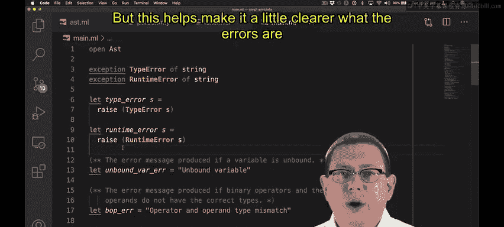

# OCaml编程：9.34：SimPL类型检查器（第一部分） 🧠

在本节课中，我们将学习如何为SimPL语言实现一个类型检查器。我们将看到类型检查如何作为解析和求值之间的关键环节，确保程序在运行前是类型安全的。

## 概述

类型检查发生在解析和求值之间。解析后我们得到抽象语法树（AST），在求值之前，我们需要对这个AST进行类型检查。因此，我们将在解释器的执行流程中添加类型检查步骤。

## 实现类型检查函数

上一节我们讨论了类型检查在流程中的位置，本节中我们来看看如何具体实现类型检查函数。

首先，我们定义类型检查函数 `type_check` 的规范。如果表达式 `e` 类型检查成功，该函数将返回 `e` 本身。这意味着在空的静态环境中，必须存在一个类型 `t`，使得 `e` 具有类型 `t`。如果 `e` 无法通过类型检查，函数将引发一个失败异常。

为了实现 `type_check`，我们需要实现一个名为 `type_of` 的函数，它定义了类型关系。

`type_of` 函数的规范是：`type_of env e` 返回在环境 `env` 中表达式 `e` 的类型 `t`。你可以将函数的输入视为类型判断中冒号左侧的所有内容，输出视为冒号右侧的所有内容。

在 `type_check` 中，我们需要在空环境中调用 `type_of` 函数。对于环境的实现，我们选择使用关联列表，因为它简单直接。空列表即代表空环境。

根据规范，`type_check` 应该返回表达式 `e` 本身，而不是其类型。因此，我们计算表达式的类型，如果成功，则忽略返回的类型值并返回原表达式。如果 `type_of` 无法找到类型，它也会引发异常。从 `type_check` 的角度看，我们只关心 `type_of` 是否成功执行而不引发异常。

## 实现 `type_of` 函数

现在，让我们开始实现 `type_of` 函数。我们将逐步实现所有的类型检查规则。

首先处理布尔常量。如果表达式 `e` 是一个布尔常量（`true` 或 `false``），那么它的类型必须是 `TBool`。这是由我们的类型规则规定的。

```ocaml
match e with
| Bool _ -> TBool
```

接下来，我们需要实现其他类型规则。让我们一次处理几个。

我们知道整数常量的类型是 `TInt`。当我们遇到一个变量名时，我们应该在静态环境中查找它，并返回找到的类型。如果环境中没有该变量的绑定，则出现未绑定变量错误，这属于类型检查错误。

我们将查找变量的逻辑提取到一个辅助函数中。我们使用标准库中的函数来实现这个查找函数，如果变量名未绑定，则引发未绑定变量错误。

在解释器中，现在有两个地方可能引发未绑定变量错误：一个是在类型检查期间，另一个是在求值期间。类型检查将拒绝任何可能出现未绑定变量错误的程序。然而，在求值器的模式匹配中，我们仍然需要保留处理 `Var` 构造函数的分支，以满足OCaml的模式匹配穷尽性检查。我们知道由于类型检查的存在，运行时永远不会到达这个分支，但它必须存在。

为了区分运行时错误和编译时（类型检查）错误，我引入了两个新的异常类型以及两个方便的函数来分别引发它们。这样可以使错误信息更清晰。

## 处理二元操作符

现在，让我们回到实现 `type_of` 函数。我知道实现二元操作符的类型检查规则需要不止一行代码，因此我提前为其提取了一个相互递归的辅助函数，就像之前实现求值器时做的那样。



为了类型检查一个二元操作符，我们需要匹配操作符本身，并递归地类型检查子表达式 `e1` 和 `e2`，以判断该操作符的应用是否正确。

目前只有三个二元操作符：`Add`、`Mult` 和 `Leq`。每个操作符都必须接受两个整数作为参数，并返回适当的类型：`Add` 和 `Mult` 返回整数，`Leq` 返回布尔值。如果类型不匹配，我们将引发一个预定义好的类型错误。

这个错误可能在类型检查时被捕获，确保程序不会进入求值阶段。同样，在求值器的实现中，理论上类型检查器会阻止此类错误，但为了满足OCaml的模式匹配穷尽性检查，我们仍然需要一个分支来处理，并在那里引发一个运行时错误。

以下是实现二元操作符类型检查的核心逻辑结构：

```ocaml
let rec type_of env e =
  match e with
  | Binop (op, e1, e2) ->
      let t1 = type_of env e1 in
      let t2 = type_of env e2 in
      (match op with
       | Add | Mult ->
           if t1 = TInt && t2 = TInt then TInt
           else raise (TypeError "operator and type mismatch")
       | Leq ->
           if t1 = TInt && t2 = TInt then TBool
           else raise (TypeError "operator and type mismatch"))
  (* ... 其他分支 ... *)
```

## 总结


本节课中我们一起学习了如何为SimPL语言构建类型检查器的第一部分。我们定义了 `type_check` 和 `type_of` 函数的规范，并开始实现基础类型（布尔、整数）和变量的类型检查。我们还引入了辅助函数来查找环境中的变量，并创建了特定的异常类型来区分编译时类型错误和运行时错误。最后，我们讨论了二元操作符类型检查的实现框架。在下一节中，我们将继续实现其他表达式结构的类型检查规则。