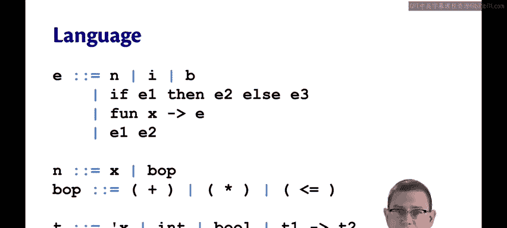
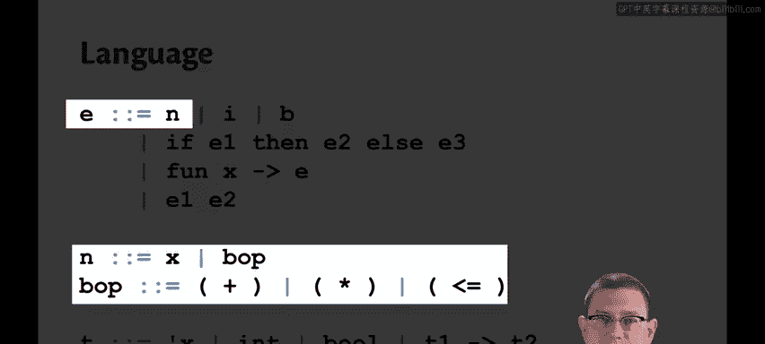
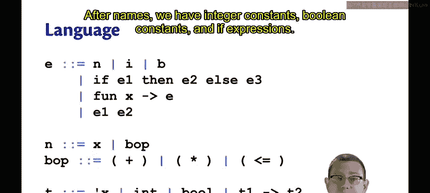
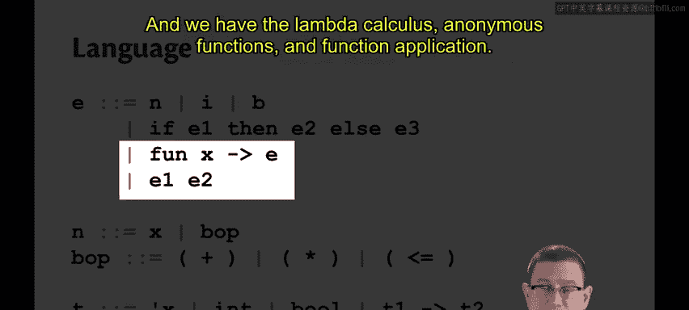
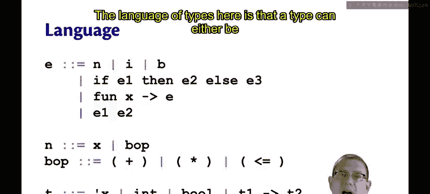
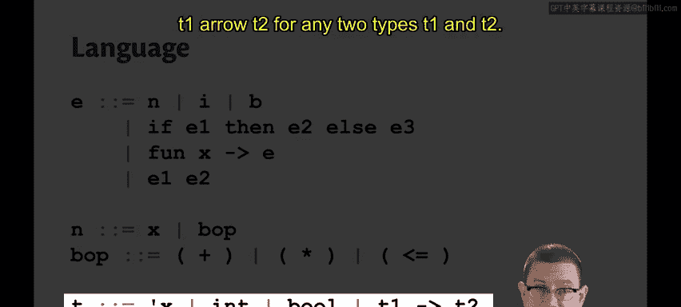

# OCaml编程：9：Hindley-Milner类型推断 🧠

在本节课中，我们将要学习Hindley-Milner类型推断算法。我们已经学会了如何为OCaml程序进行类型检查，但那种情况需要程序员写下类型注解，然后由编译器或解释器进行检查。本节中我们来看看，如果程序员像在OCaml中允许的那样省略类型注解，我们如何推断或重建这些缺失的类型。

OCaml及相关语言使用一种由Hindley和Milner在20世纪60年代和70年代开发的类型推断算法。他们实际上是各自独立发现的，因此该算法通常以两人的名字共同命名，称为Hindley-Milner类型推断，或简称HM。HM在某种程度上更像是一个相关算法家族，而非单一特定算法，但它们都有一个共同点：它们永远不会为程序推断出错误的类型。😡

它们几乎不需要程序员的帮助来寻找类型。事实上，在足够小的语言片段中，它们完全不需要程序员的帮助。在整个庞大的OCaml语言中，存在一些角落，HM无法完美地进行类型推断，确实需要你的帮助。😡

此外，该算法通常以线性时间运行。你可能从未需要等待很长时间让OCaml推断你程序的类型，这是因为对于大多数程序来说，它确实非常高效。😡

Robin Milner因其在类型推断算法上的贡献，部分地获得了图灵奖。他于1991年因ML语言获奖，ML是第一个包含多态类型推断的语言。

那么，你如何在脑海中推断类型呢？在你学习OCaml和其语法的过程中，你也潜移默化地学会了推断类型。😡

在Java甚至Python中也是如此。作为程序员，你学会了查看程序并弄清楚类型是什么，因为没有语言会强制你写下其中每个子表达式的类型。😡

那么，你将如何推断这个程序的类型：`let g x = 5 + x`？也许可以暂停一下。我相信你已经知道它的类型了，但想一想，反思一下你是如何弄清楚的。

当我查看这个程序时，我首先注意到的是加号。😡 在OCaml中，这个加号将接受两个`int`作为输入。因此，我了解到关于其两侧操作数`5`和`x`的一些信息。`5`显然是一个`int`。但我从`x`和加号出现的位置得知，`x`也必须是一个`int`。所以，`x`相对于加号出现的位置对`x`的类型施加了一个约束，即它必须是`int`。

现在，整个表达式`5 + x`的类型呢？当我查看它时，我知道加法操作保证会输出一个`int`，所以现在我了解了等号右侧表达式的一个约束或事实。😡 这个函数`g`必须输出一个`int`。

现在我知道了函数的输入和输出类型，因为我推断出`x`必须是`int`，并且推断出`5 + x`必须是`int`。因此，`g`必须是一个接受`int`并返回`int`的函数。

用这么多话来描述你的大脑现在可以快速完成的事情。接下来的挑战是，我们要将其转化为计算机可以执行的算法。

那么，Hindley-Milner如何推断类型呢？以下是其概览。

它按顺序处理每个顶层定义。😡 所以，如果你在Utop中工作，可以理解为：你输入的每个以双分号结尾的短语，在进入下一个之前都会完全完成类型推断。😡 如果你在`.ml`文件中工作，则意味着该文件中的每个定义，特别是每个`let`定义，都会按顺序处理。😡

这就是OCaml不允许你在较早的定义中使用较晚的定义的主要原因之一，除非你让它们相互递归，这意味着它们将同时进行类型推断。

对于每个定义，HM将收集一个约束系统。可以将其想象成你在高中数学中学到的代数方程组。不过，这些方程不是关于数字的，而是关于类型的，是类型之间必须成立的等式。

在收集完整个方程组（即约束集）之后，HM将求解它。类似于你可能学过的用高斯消元法求解代数方程组，HM类型推断将求解该方程组，从而推断出正在定义的表达式的类型。

我们需要一种小语言来演示HM类型推断。Simple语言实际上太简单，不适合作为示例语言，因为在Simple中，你实际上可以推断出所有类型，甚至不需要使用像HM类型推断这样高级的东西；你基本上可以猜测并检查类型必须是什么。😊

因此，为了做一些更复杂的事情，让我们在Simple的基础上加入Lambda演算。同时，我将从语言中移除`let`表达式。事实证明，它们是类型推断中最棘手的部分。所以，我们现在暂时省略它们，稍后再添加回来。这样我们就得到了以下语言：

```
e ::= n
    | i
    | b
    | if e1 then e2 else e3
    | fun x -> e
    | e1 e2
```

一个表达式可以是名称。😡 这是一个新的语法类别，我引入它是为了概括标识符和二元运算符。😡 所以，名称`n`可以是变量标识符`x`，也可以是二元运算符，但现在我将把它们写成前缀函数而不是中缀运算符。

```
n ::= x
    | (+)
    | (-)
    | (*)
    | (/)
    | (&&)
    | (||)
    | (=)
    | (<=)
    | ...
```

我在这里所做的，实际上是对OCaml允许我们使用中缀运算符的功能进行去语法糖化，以便在这种语言中统一处理运算符和函数。😡

名称之后，我们有整数常量、布尔常量和`if`表达式，这些都与Simple中相同。

```
i ::= ... -2 | -1 | 0 | 1 | 2 ...
b ::= true | false
```



我们还有Lambda演算：匿名函数和函数应用，这些和往常一样。



```
fun x -> e
e1 e2
```

这里的类型语言是：一个类型可以是类型变量，所以我将写一个单引号，然后是一个变量标识符如`x`来表示一个类型变量。😡



```
t ::= 'x
    | int
    | bool
    | t1 -> t2
```



或者，类型可以是`int`、`bool`，或者对于任意两个类型`t1`和`t2`，可以是函数类型`t1 -> t2`。





这种小语言足以探索HM类型推断中大多数有趣的问题，而不会一开始就让人不知所措。😡


本节课中我们一起学习了Hindley-Milner类型推断算法的基本概念、其重要性以及它如何通过收集和求解类型约束方程组来工作。我们还定义了一种用于演示的简化语言，为后续深入算法细节奠定了基础。