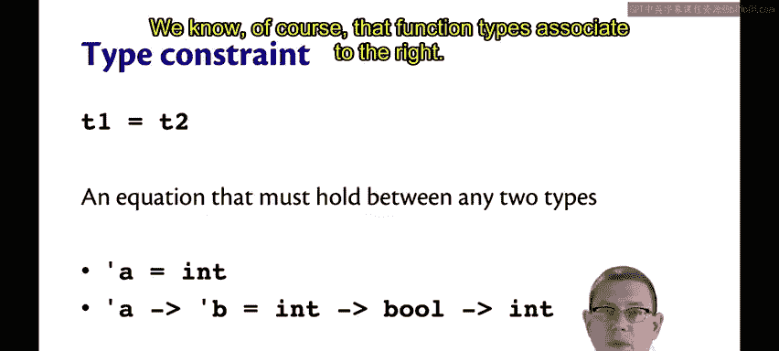
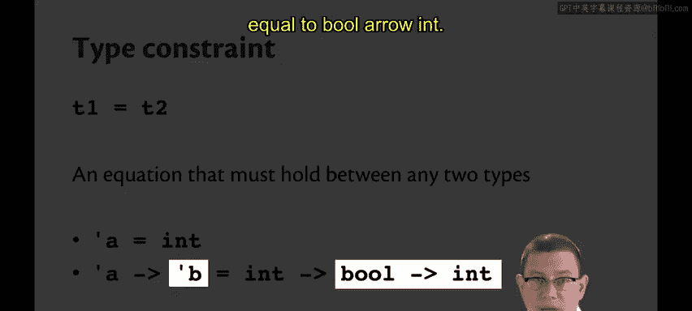
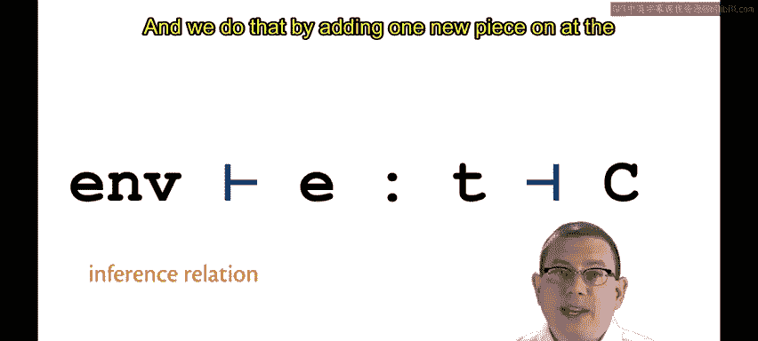
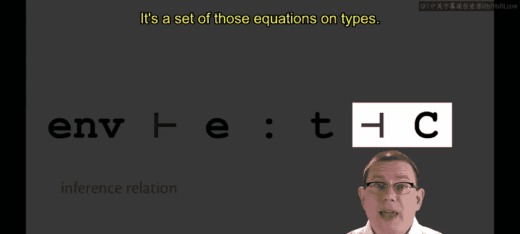
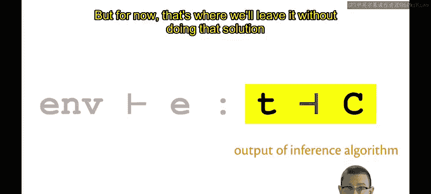

# 康奈尔大学《OCaml编程｜CS3110：OCaml Programming： Correct + Efficient + Beautiful》中英字幕 - P191：-191-Type Inference Relation Chap9 Video 38.zh_en - GPT中英字幕课程资源 - BV1Tx4y1s7sP

A type constraint is an equation， T1 equals T2 between any two types， T1 and T2。

Here are two examples of type constraints。In the first one， we have Al equal int。

The second constraint says that alpha arrow beta equals int arrowbo arrow int。

That's a little more complicated。If we look at the pieces of it。

 we might be able to infer something further about the type variables involved。😡，We know， of course。

 that。

We know， of course， that function types associate to the right， so here alpha must be equal to int。

And beta must be equal to bo arrow int。

We're going to extend the type checking relation that we had before to a type inference relation。😡。

And we do that by adding one new piece on at the end。

 which is written with this funny little backwards turnstile， C， where C is a set of constraints。

 It's a set of those equations on types。😡。

So the first piece of this looks exactly like the type checking relation that we had before。

We have a static environment that shows an expression E has type T。Of course。

 the piece in the middle between the two turnsts is what Gtop shows you。 you enter an expression。

 it comes back with the type that was inferred for that expression。😡。

The pieces on either side though outside the turnsileles。

 that's what Utah doesn't show you so there's a static environment there that has been formed U or OMl maintains that internally it doesn't print it out for you。

😡，And there's a set of constraints， and you don't see those either。

If you think about this relation as an algorithm， which we will do。😡。

It's an algorithm that takes input and gives you output。😡。

The input it takes is a static environment and an expression。

 You want to infer the type of that expression E in the static environment N。

The output of the algorithm is the type T that is inferred， along with a set of constraints。

 C on that type。😡，Of course， we'll eventually need to solve that set of constraints to really reconstruct the type fully。

 but for now that's where we'll leave it without doing that solution yet。😡。

