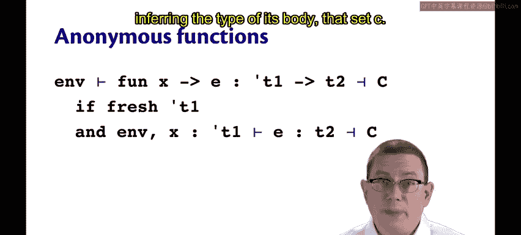
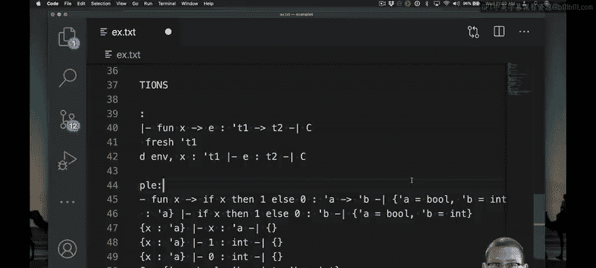

# OCaml编程：9.4：匿名函数的类型推断 🧠

在本节中，我们将学习如何为匿名函数进行类型推断。上一节我们介绍了`if`表达式的类型推断，本节中我们来看看如何处理`fun x -> E`这样的匿名函数。

## 概述

匿名函数的类型推断过程，核心在于为函数的参数引入一个**新的类型变量**，然后在扩展了参数类型绑定的环境中，推断函数体`E`的类型。最终，函数的类型是`参数类型 -> 函数体类型`，并附带从函数体推断中产生的所有约束。

## 推断过程详解

以下是匿名函数类型推断的算法步骤：

1.  **为参数引入新类型变量**：为匿名函数的参数`x`引入一个全新的类型变量`τ1`。这代表我们尚不知道`x`的具体类型。
2.  **在扩展环境中推断函数体**：在原有环境`Γ`的基础上，将`x`绑定到类型`τ1`，形成新环境`Γ, x:τ1`。然后在这个新环境中推断函数体`E`的类型`T2`，并得到一组约束`C`。
3.  **确定函数类型**：整个匿名函数的类型即为`τ1 -> T2`。
4.  **收集约束**：函数推断过程返回的约束集，就是推断函数体时产生的约束集`C`。



用伪代码描述如下：
```ocaml
infer(Γ, fun x -> E) =
    let τ1 = fresh()          // 为参数x生成新类型变量
    let (T2, C) = infer((Γ, x:τ1), E) // 在扩展环境中推断E
    in (τ1 -> T2, C)          // 返回函数类型及约束
```

## 示例分析

让我们通过一个具体例子来理解这个过程。考虑匿名函数：
```ocaml
fun x -> if x then 42 else 0
```

其推断步骤如下：

1.  **步骤一**：为参数`x`引入新类型变量`α`。
2.  **步骤二**：在环境`[x: α]`中推断函数体`if x then 42 else 0`的类型。
    *   推断条件表达式`x`的类型：从环境中查找`x`，得到类型`α`。无新约束。
    *   推断`then`分支`42`的类型：`int`。
    *   推断`else`分支`0`的类型：`int`。
    *   为整个`if`表达式引入新类型变量`β`，并生成约束：
        *   条件`x`必须是`bool`类型：`α = bool`
        *   两个分支类型必须一致：`β = int` (来自`then`分支) 且 `β = int` (来自`else`分支)
    *   因此，函数体类型`T2 = β`，约束集`C = {α = bool, β = int}`。
3.  **步骤三**：因此，整个匿名函数的类型是`α -> β`。
4.  **步骤四**：附带约束集`C = {α = bool, β = int}`。

通过求解约束集，我们可以得出`α`必须是`bool`，`β`必须是`int`。因此，该函数的最终类型是`bool -> int`。

## 总结



本节课中我们一起学习了匿名函数的类型推断。其核心思想是：**为未知的参数类型引入变量，在记录其使用方式产生的约束后，最终确定函数类型**。这个过程与之前学习的表达式推断一脉相承，通过生成并后续求解约束，OCaml的类型系统能够自动推导出`fun x -> E`这样匿名函数的精确类型。