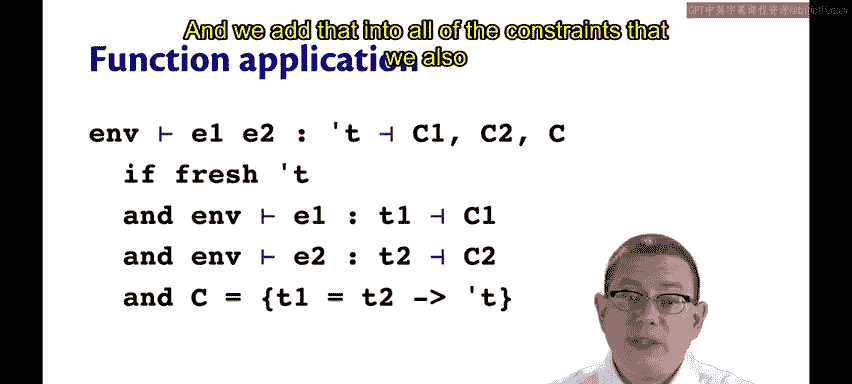
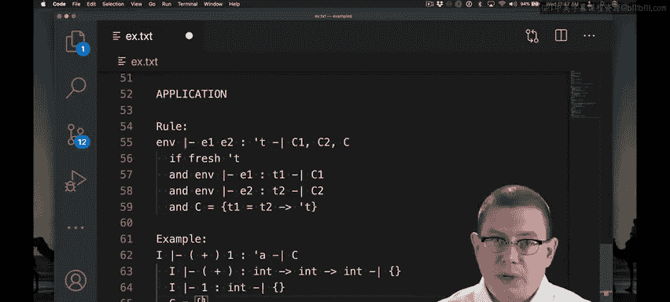
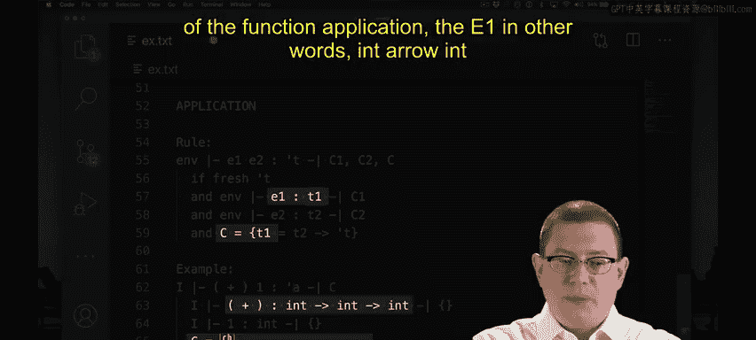
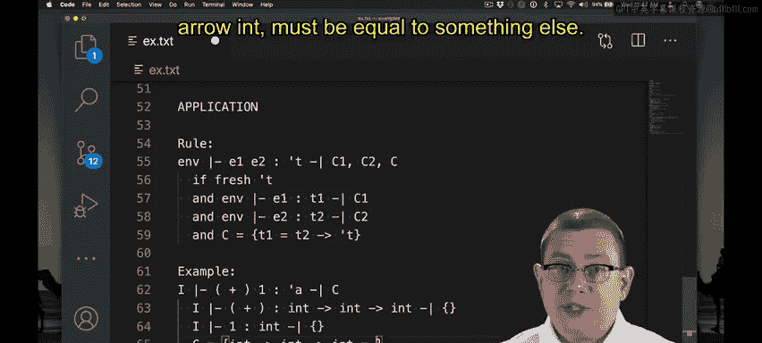
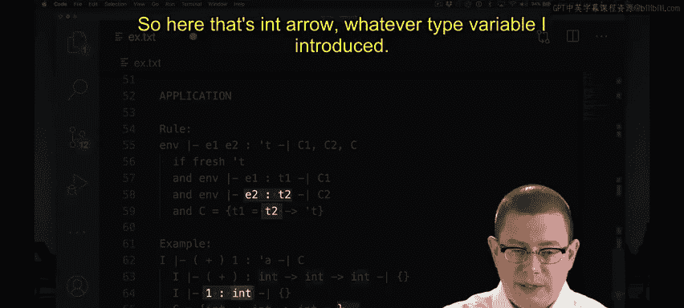
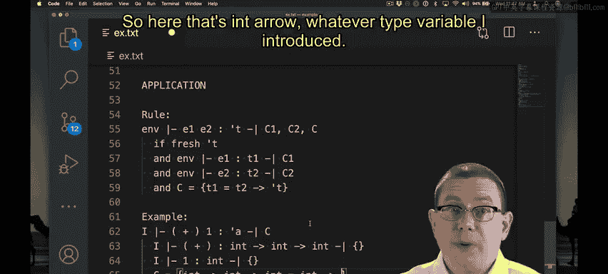
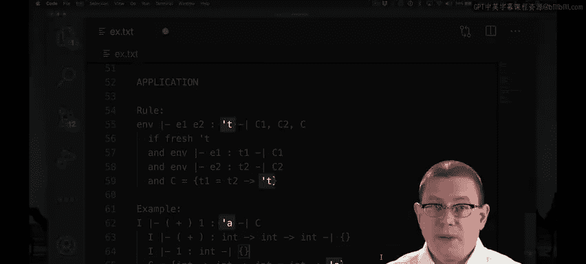
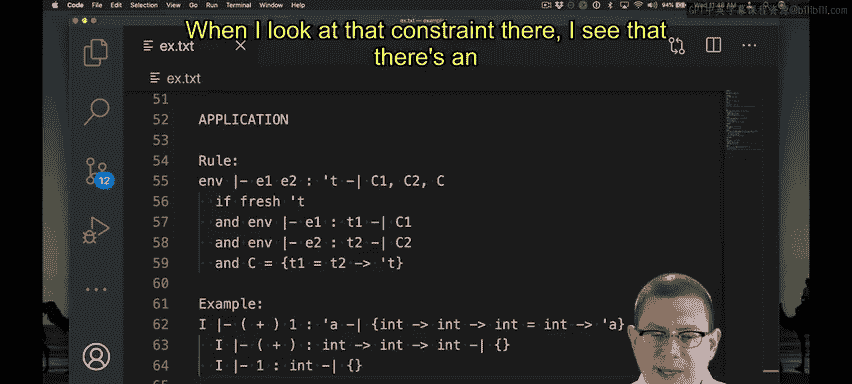
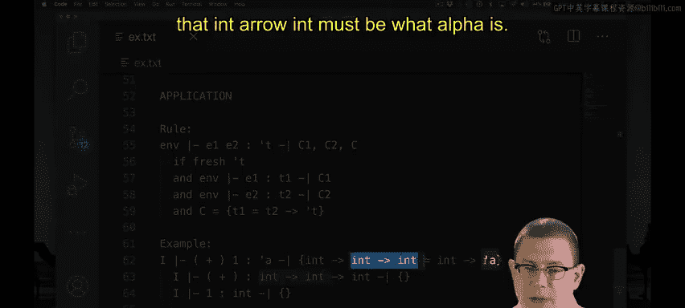
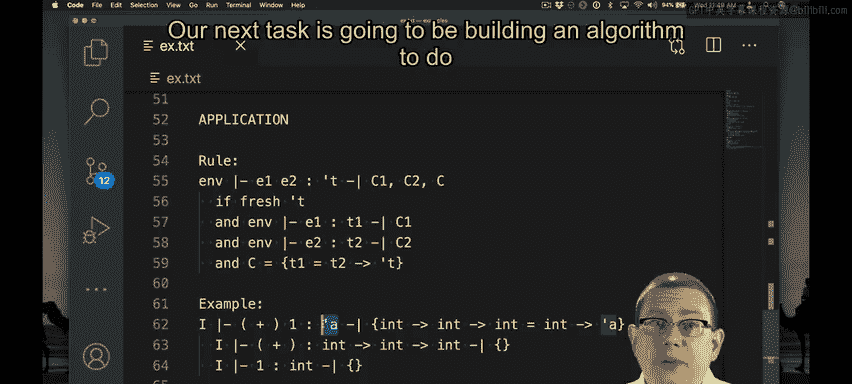

# OCaml编程：9.42：函数应用的类型推断 🧠

在本节课中，我们将要学习如何为函数应用（Function Application）表达式进行类型推断。函数应用是编程中最常见的操作之一，理解其类型推断规则对于掌握OCaml的类型系统至关重要。

上一节我们介绍了变量和常量的类型推断，本节中我们来看看如何推断 `E1 E2` 这种形式的表达式类型。

## 函数应用的类型推断规则

为了推断表达式 `E1` 应用到 `E2` 的类型，我们需要引入一个新的类型变量 `τ`，并生成一组约束 `C`、`C1` 和 `C2`。

以下是这些约束的来源：
*   `τ` 必须是一个全新的类型变量。在算法层面，我们尚未深入分析 `E1` 或 `E2`，因此尚不清楚整个应用表达式的最终类型。我们引入一个新变量，然后通过约束来确定其具体类型。
*   接下来，我们需要为两个子表达式进行类型推断。我们将为 `E1` 推断出类型 `T1` 和约束 `C1`，为 `E2` 推断出类型 `T2` 和约束 `C2`。
*   最后，我们通过添加一个关于 `T1`、`T2` 和 `τ` 的约束来整合所有信息。这个约束是：`T1` 必须是一个函数类型。

为什么 `T1` 必须是函数类型？因为我们在函数应用的左侧使用了它。接下来，这个函数类型的输入必须是 `T2`，因为我们是将函数 `E1` 应用于类型为 `T2` 的表达式 `E2`。最后，函数的输出类型未知，这正是我们引入的类型变量 `τ` 所代表的意义。

因此，我们记录下约束：`T1` 必须等于类型 `T2 -> τ`。我们将这个约束与从 `E1` 和 `E2` 推断出的所有其他约束合并。

## 一个具体例子

让我们通过一个例子来实践这个规则：推断 `plus` 部分应用于 `1` 的表达式类型（即 `plus 1`）。

为了推断这个函数应用的类型，我们将引入一个新的类型变量，并推断其子表达式的类型。

以下是推断步骤：
*   推断左侧表达式（即名称 `plus`）的类型。我们在初始静态环境中查找它，得知其类型为 `int -> int -> int`。名称推断不产生新约束。
*   推断参数（即整数常量 `1`）的类型，这很简单，就是 `int`。
*   现在我们需要添加一个新约束。我们引入了一个类型变量 `α` 来代表整个函数应用的类型。

根据规则，函数 `plus` 的类型（即 `int -> int -> int`）必须等于 `T2 -> τ`。这里 `T2` 是参数 `1` 的类型，即 `int`，而 `τ` 是我们引入的变量 `α`。因此，我们得到约束：`int -> int -> int` 必须等于 `int -> α`。

观察这个约束，我们看到箭头左侧都是 `int`，可以将其消去，从而得出 `int -> int` 必须等于 `α`。因此，我们能够推断出 `plus 1` 的类型是 `int -> int`。这是正确的，当我们将 `plus` 运算符部分应用于一个参数后，会得到一个等待接收第二个参数并返回结果的函数。

到目前为止，我们已经多次运用人脑来求解这些约束并完成类型推断。我们接下来的任务是构建一个算法，让计算机也能完成这项工作。

本节课中我们一起学习了函数应用的类型推断规则。我们了解到，推断过程需要引入新的类型变量，并为函数及其参数的类型建立等式约束，最终通过求解这些约束来确定整个表达式的类型。