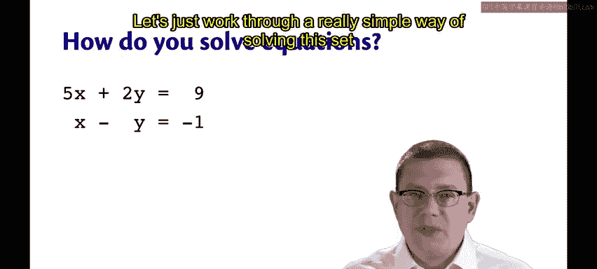
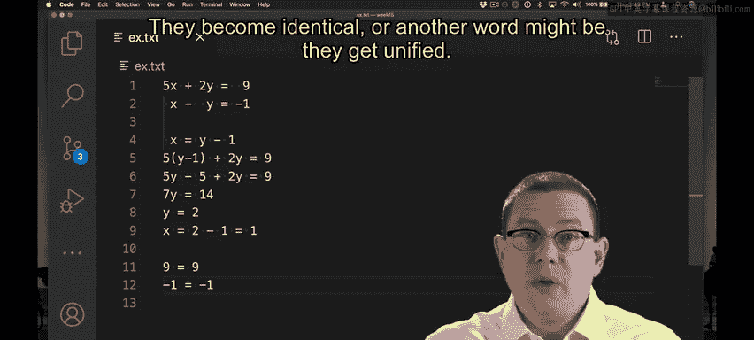
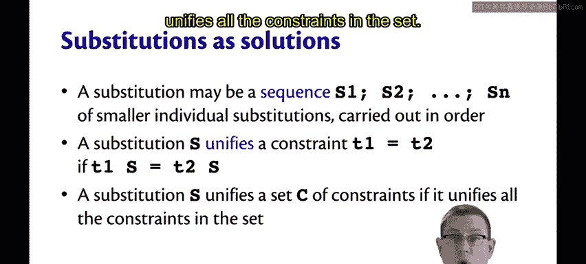
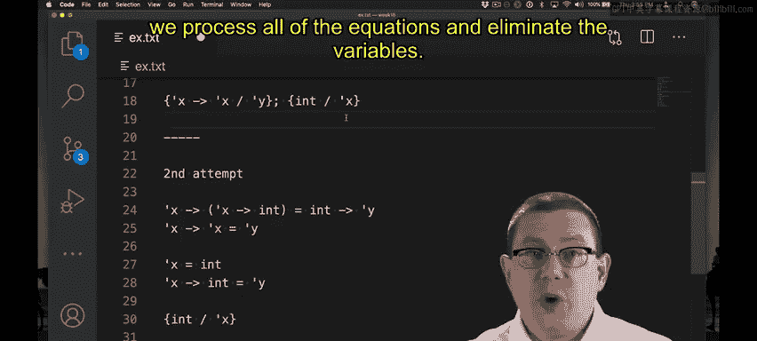
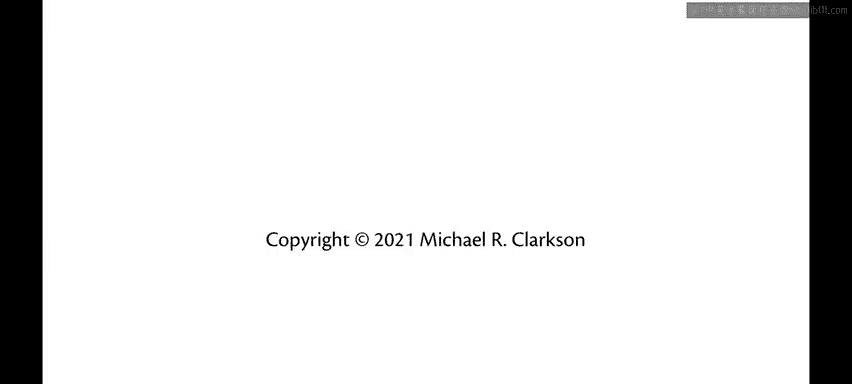

# OCaml编程：9.43：合一算法直觉 🧩

在本节课中，我们将学习如何将解决代数方程组的直觉，应用到解决类型约束系统上。我们将通过一个简单的例子，理解“合一”算法的核心思想。

---

## 概述

我们已经在脑海中多次解决过类型约束系统。如何用算法来解决它呢？让我们回到高中时代的代数方程组，从中获取一些启发。

## 从代数方程组到类型约束

以下是一个方程组。你会如何求解其中的 x 和 y？花点时间思考一下，并反思你的解题过程。

你可能立刻注意到，第二个方程为我们提供了一个简单的方法来分离 x 或 y。例如，我们可以将第二个方程重写为 **x = y - 1**。

既然我们这样分离了 x，就可以将其从系统中消除。然后继续简化方程。现在，我们可以将结果代回我们已有的 x 方程中。现在我们得到了 X 和 Y 的值。

如果我将这些值代入原始方程，每个方程的两边将变得相同。我代入了我们发现的 x 和 y 的值，x 是 1，y 是 2。现在，如果我简化这些方程，就变成了 9 等于 9，以及 -1 等于 -1。

通过应用我们为 X 和 Y 发现的这个替换，我实际上可以使方程的两边变得相同，它们变得一致，或者另一个词是它们“合一”了。

## 合一的概念

那么，我们如何解决一组方程呢？在这里，我们**消除**了一个变量。我们用它来找到另一个变量的值。这使我们能够回过头来找到第一个原始变量的值。结果，我们得到了一个可以看作“替换”的解决方案，它**统一**了这组方程。

这正是我们解决类型约束系统时要做的。

不过，这里的替换最终可能比简单的单个替换（例如用 1 替换 x 或用 int 替换 alpha）更复杂。实际上，我们将得到一个替换序列作为解决方案，其中每一个都是对变量的一个小替换。但我们将按顺序执行它们，作为该序列的一部分。

我们将说，如果一个替换应用于等式两边后，最终使两边变得相同，那么这个替换就**统一**了一个约束 **T1 = T2**。然后，如果一个替换统一了集合中的所有约束，那么它就统一了整个约束集合。

## 类型约束合一示例

让我们尝试一个统一类型约束系统的例子。

这里有两个类型约束。我可以从其中任何一个开始处理。第二个看起来更容易一些，因为它已经在等式的一边分离出了 Y。

假设我创建一个替换：用 **x -> x** 替换 **y**。然后，我可以在第一个方程中用 **x -> x** 替换 y。让我这样做。我取出第一个方程，将 y 替换为 **x -> x**。

现在我有一个包含一些部分的方程，其中一些部分是函数箭头。我知道函数箭头是右结合的。所以如果我在这里加上缺失的括号，它看起来会像那样。如果我进一步分解会怎样？

我知道这里两边都有一个带输入和输出的函数。这边的输入是 x，那边的输入是 int。为了使这两个函数类型相同，它们的输入类型必须相同。

所以从这个方程中，我实际上可以提取更多信息。我可以进一步分解它，说 **x 必须等于 int**，这是箭头两边的输入类型。并且输出类型也必须相同。所以 **x -> int** 必须与 **x -> x** 相同。我从这里和那里得到了这个信息。

现在我有了这两个方程来处理。第一个方程立即给了我另一个被分离出来的变量，我可以尝试从其他所有地方消除它。所以现在让我添加一个替换：我将用 **int** 替换 **x**。

如果我取这个替换并将其应用于剩下的方程，我得到 **int -> int = int -> int**。当然，看这个，我们立刻可以看到等式两边是相同的类型。如果我们想更算法化一点，我们可以再次说我们有一个函数类型，我们可以分解它：箭头的左侧必须等于两边箭头的左侧，所以是 int 等于 int，箭头右侧也是如此。

最后，我们得到了这个替换。首先我们用 **x -> x** 替换 **y**，然后用 **int** 替换 **x**。

## 处理顺序的影响

这只是这个方程组的一个可能解。实际上，如果我们选择以不同的顺序消除变量，可能会得到不同的解。让我们进行第二次尝试。

第一次我们选择通过处理第二个方程先消除 y。这次我们首先处理第一个方程。所以我们有这个方程。从中，我们可以提取关于输入类型和输出类型的信息。我所做的只是说箭头的左侧和右侧都必须相同。

现在，如果我想，我可以消除 x，因为我知道 x 是 int。我将在第二个方程中用 int 替换 x。现在我知道 y 实际上是 int。

所以那次我最终得到的最终替换将不同。它仍然是一个统一这组方程的替换，但它与我第一次得出的替换不同。

因此，根据我们处理所有方程和消除变量的顺序，我们可能会得到不同的解。

---

## 总结

本节课中，我们一起学习了如何将解决代数方程组的直觉迁移到类型约束系统。我们理解了“合一”的核心思想：通过应用一系列替换，使约束等式两边变得相同。关键在于**消除变量**和**顺序处理**，不同的处理顺序可能导致不同的（但都有效的）替换序列。这为后续学习具体的类型推断算法奠定了重要的概念基础。