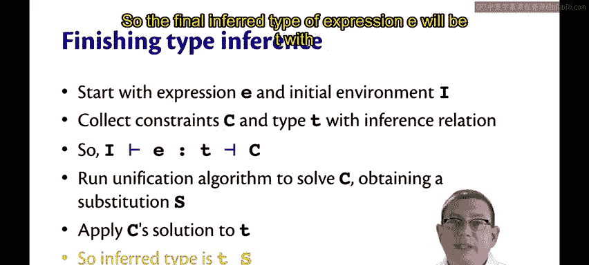
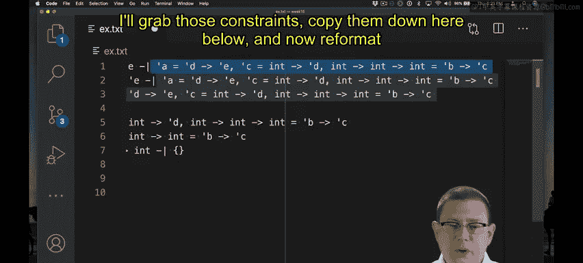

# 康奈尔大学《OCaml编程｜CS3110：OCaml Programming： Correct + Efficient + Beautiful》中英字幕 - P198：-198-A Worked Example of Type Inference Chap9 Video 45.zh_en - GPT中英字幕课程资源 - BV1Tx4y1s7sP

Now that we have both the inference relation and the unification algorithm。

 we're ready to put them together and finish up type inference。

We start with an expression E that we want to infer the type of。

 and that's in some initial static environment I。We use the inference relation to collect some constraints and a type for that expression。

😡，In other words， we run this inference relation as a kind of algorithm。

 The inputs are I and D and the outputs are an inferred type T with some constraints C。

 Now that type T doesn't necessarily tell us everything we need to know because we need to solve that set of constraints and get a substitution so that's what we do next。

 we run the unification algorithm on that set， we get the substitution S and we apply that back to T。

 so the final inferred type of expression E will be T with the substitution S applied to it。😡。

Let's work through an example of doing type inference for a little bit larger of an expression。

 So I have a function here that we'll do some type inference for。 It takes in an argument F。

 another argument X， and then it applies F to something involving X， as well as an addition。

We will start inference for this in the standard static environment that in our little language binds the plus times unless less or equal to operators。

So we start off here with an anonymous function。So that means we take the initial static environment and we add in the argument of that function F。

Along with binding it to some new type variable， I'll call it alpha here。😡。

And we want to use that to infer the type of the body of the function。

 which itself is another anonymous function。Okay， so to descend into that。

 we'll just do the same thing over again， we're starting in aesthetic static environment I。

 we now have the binding of f to alpha， and we have a new argument here。

 we invent a new fresh type variable for that beta， and we continue inferring the type of the body。

 which is f with plus x1。This point， we have our first function application。

So the sub expression that is the left hand side of that is F。

So we need to do the type inference for it。Well， that's just a name。

 so we look up the name in the environment。It's there， it has type alpha， we see that right here。

So we're able to finish this kind of recursive invocation of the inference relation， if you will。

And that doesn't generate any constraints。Next， we need to do to type inference for the argument being passed to that function。

😡，So that means again， starting off in that same environment。

 but trying to infer the type of plus applied to X。Now， of course。

 the way that function application associates is to the left。

 so really that's an application of plus x to1。So we have another function application to deal with here。

Okay， so let's descend into that。The left hand side of sub expressionpression of that is plus applied to X。

That's again， a function application。 So we descend onto the left hand side of that， which is plus。

That's just a name。 And it's bound in the initial environment。 And we know， of course。

 that it's bound to int， arrow int， arrow int。 And looking up a name doesn't generate any constraints。

Okay， so we've finished with the left hand side of this application now we need to do X。Well。

 that's again going to be easy。Because x is a name and it's bound in the static environment to beta。

 so that returns beta with no new constraints。AWe've finished the two sub expressionions here for a function application。

 now we need to finish the function application itself。So remember what we do there。

 we invent a new type variable for the type of the entire expression。 So I've used alpha and beta。

 now I'll used gamma。And that generates constraints。

 so all of the constraints from the sub expressionions， well， those were both f。

 so there's nothing to record there， and now we have a new constraint。

Which is the type of the function， the left hand sub expression。so that's inro inro int。

Needs to equal。The type of the argument， So that's beta。Arrow。The return type of the function。

 which is the type of the entire function application。So that's gamma。

So now we have int arrow int arrow int equals beta arrow gap Now that we have finished that function application。

 we can pop back up。Where we were applying it to one。

So we have an argument there that we need to deal with first。Which is just one。Now。

 of course that's easy， it's a constant that has type int and generates no constraints。

So now we're ready to finish off this function application。Okay。

 so we invent a new type variable for its return type， let's call that delta。

And we add some constraints。So first off， we need the constraints from its sub expressionpresss。

 actually， I should have nested this in one more here。So we need the constraints from there。

 that's empty。 the constraints from here， got those， I'll put them in here。

And now we need to add in one constraint， which is about Delta。All right， so what is it。

 iss the type of the function that's plus x。 So what's the type of the function， it's gamma。

 That's what we concluded here。So gamma needs to equal the type of the argument。

 so what's the type of the argument， it's int， we found that down there。😡，Errow。

 the return type of the function， the new type variable we invented。

So that's gamma equals nt arrow delta as part of our constraint set。

Now we've finished this function application so we can pop back up again。

We were doing the application of F to that entire sub expressionpression。All right。

 so we finished both of those。 This is a function application。 Therefore。

 we need to introduce a new type variable as its output type。 Let's call that epsilon。

We need to copy in all of the constraints that we got from the subexpressions。

 so we didn't get any from F， but we got this whole set of equations here that I'll copy in。

 and we need to add one more to it， which is that the type of the function， which we found here。

 alpha，Needs to be equal to the type of the argument。 So we found that here， that's Delta。Arrow。

 the return type of the entire function， which is Epsilon。

So we've got alpha equals deelta arrow epsilon as the constraint that this application generate。

Oppping back up again。We're now at an anonymous function。

So the type of an anonymous function is going to be the type of its argument。

 which is the type variable we invented， so the type variable for x was beta， we get that here。

 so that's beta arrow， the type of its body we just finished inferring the type of its body here。

 itss epsilon。😡，So that's going to be beta arrow epsil。

You also need to copy in all of the constraints that we got from below。So I'll move those up to here。

Finally， we're back up to the very top level here。 We're finishing the last recursive call。

 What is the type of this function， Well， it's the type of its argument F。

 So we introduced the type variable alpha for that。 We've got alpha arrow。

And then the type of its body， well we figured out the type of its body here that's beta arrow epsilon。

 so alpha arrow， betaarrow epsilon。😡，And then functions don't generate any new constraints。

 but we need to once more copy all of those constraints up above。And there you have' it。

 We just did the inference relation for this little program。

 which actually turned out to be rather complicated。

And we get this rather unilluminating type at this point， Al arrow beta arrow epsilon。

 of course that's because we need to solve the constraint set still to make sense of that type。

Allright， so let's solve it。 I'll grab those constraints， copypy them down here below。

 and now reformit it to make it a little easier to read。

Okay， how do we want to go about solving these Well。

 the first equation already is of a form where I could eliminate alpha。

 So let me just start off there。I'm going to take the substitution of Delta，arrow epsilon for alpha。

 add that to my solution。At that point， I want to eliminate alpha by substituting deeltaarrow epsilon anywhere else Al shows up in the constraint set。

😡，Well， good news， it doesn't show up anywhere there， so I don't have any work to do。

 and I can eliminate that constraint。All right， what to do next。 Well。

 looks like this next constraintss a next one nice one to work with。

 We've got another variable isolated right here。 gamma equals intarrow delta。 So I'll go ahead。

Pluck that one out， add a new substitution into my solution， which is int arrow Dlta for gamma。

And now I need to take into arrow delta and actually substitute it anywhere else it shows up in that constraint set。

Which is once right here。Now I'm done with that concern。All right。

 the final constraint is an equality between two function types。

 so we know we need to break that down into two smaller constraints。

So the first of them will be int equals beta because that's the left hand side of both of those arrows。

 So let me go ahead and get rid of those， and then I'm left with the right hand side being equal between both of them。

All right， looks like we just managed to isolate another variable。 So we've got beta equals int。

 I will go ahead and take that constraint， add it in as a new part of my solution。

 So I've got int for beta。And now anywhere beta shows up in the rest of the constraint set。

 I need to substitute int for it doesn't show up， so I'm done。All right。

 I'm back to a function equality。 So I'm going to break that down again into two smaller equations。

 I've got int equals int from the left hand side。And I've got int equals Delta on the right hand side。

Okay。Looking at that first equation， there's no interesting information to extract from that。

So I'll get rid of it。And now I'm left with one more equation。

 and from that I've isolated another variable， so I'll add in one more substitution here。

 which is int for deelta。And I can eliminate that equation， and now my constraint set is empty。

 so unification has finished， this is the solution that I got。Of course。

 if I had processed those constraints in a different order。

 I could get a potentially different solution。All right， now that I have that solution。

 I want to use it to finish up type inference。😡，So the type I had inferred for the program was Al。

 Arob beta， a epsilon。I want to apply this solution to that type。😡。

So I do the substitutions in order。First， for alpha， I substitute Delta arrow Epsilon。Now of course。

 I need to put parentheses in there to make sure that type pares correctly。Okay。

 so I'm done with that piece of the substitution。 Next， I need to substitute for gamma。 Well。

 good news， gamma ends up not showing up anywhere here。 So no work to do。

Now I need to substitute int for beta， okay， that shows up once there。😡，And finally。

 I need to substitute int for Delta。😡，So， that shows up here。And that gives me the answer。

 that is the inferred type for this little program。😡。

Now one thing that might look a little strange about it is you're used to when you see output from U top of you don't get an epsilon variable if there aren't any alphas around。

 you get them in order as it were。😡，So the last step here could be looking at this type and then lowering all of these down to the smallest possible type variable we use so we can replace epsilon here with alpha that's not essential。

 They're really the same type， It doesn't matter whether you call it epsilon or call it alpha。

 they both are expressing the same type。😡，Let's double check this by throwing this expression into U and seeing if it agrees with the answer that we got。

😡，Look at that。 It does。 I'll copy this type into our editor。

It's the same type up to renaming of type。So we've now successfully inferred the type of this polymorphic function。

