# 康奈尔大学《OCaml编程｜CS3110：OCaml Programming： Correct + Efficient + Beautiful》中英字幕 - P199：-199-Finishing Type Inference Chap9 Video 46.zh_en - GPT中英字幕课程资源 - BV1Tx4y1s7sP

Much like the unification algorithm gives an optimal answer in a way。

 so does this type inference algorithm HM type in。

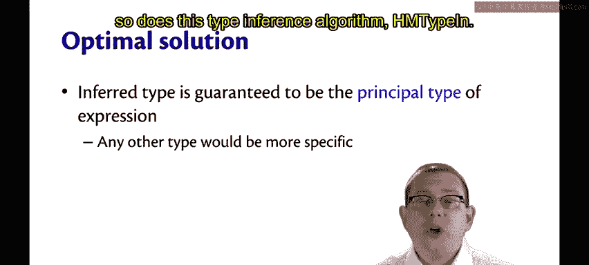

The inferred type here is guaranteed to be what's called the principal type of the expression。😡。

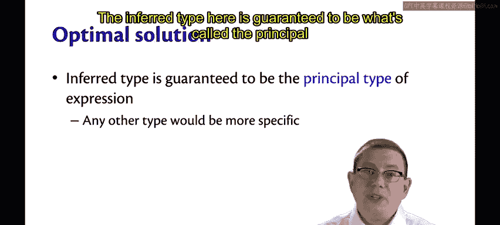

That really is just a fancy way of saying any other type would be more specific。For example。

Think about the identity function。What should the inferred type of it be？

We want it to be alphapha arrow Alpha。

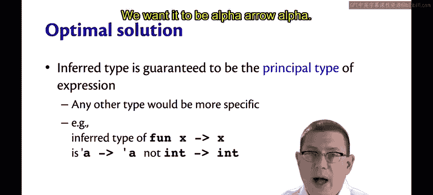

Now， of course you could give it other types， you could say that it has type int arrow int or bool arrow bo。

 or string arrow string or whatever， but all of those are more specific than the type alphapha arrow alpha。

😡。

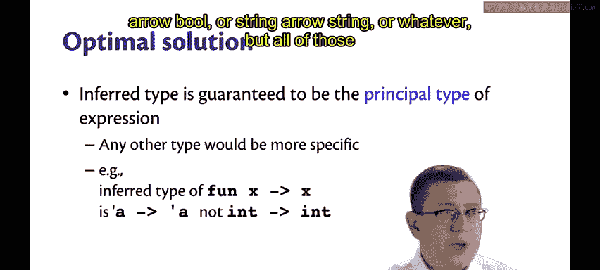

That type is the principal type of the expression。

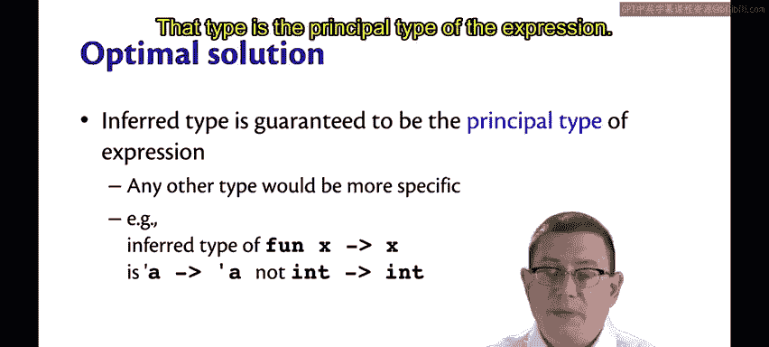

To state that formally。Suppose you infer the type of E and you get that the answer is T。😡。

But also suppose it's the case that in the initial static environment。

 you could type check E and legitimately conclude that it has some other type T prime as well。

Then we're guaranteed that T prime is actually equal to T with an additional substitution S for some substitution。

 we don't necessarily know what it is。

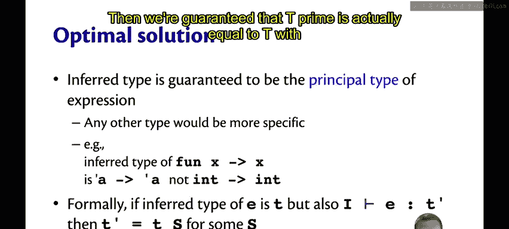

In other words， T prime would have to be a more specific type than T was because it involves doing some additional substitutions。

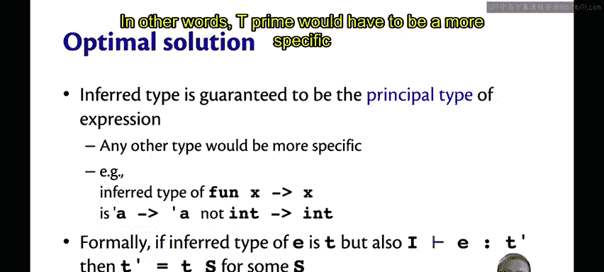

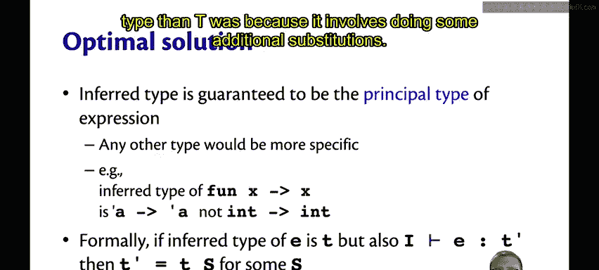

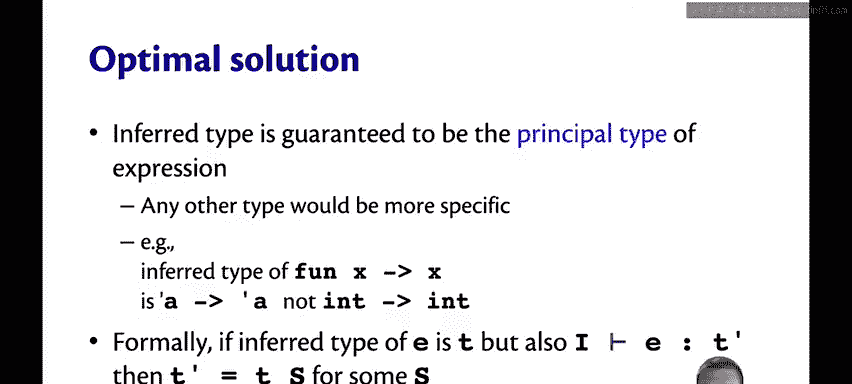

Now there is a third piece to type inference that I've glossed over here and that's errors What are we going to do about errors for programs that we can't infer the types of？

😡。

There's a couple places where errors might arise。They might arise during constraint generation。

A place we've seen that already is if we use the name rule and can't find the name in the static environment。

😡，At that point， it's pretty easy to stop type inference and tell the programmer，Hey。

 there's an unbound name here。It's harder though， when the error is because unification fails。😡。

So you're in the middle of solving a huge set of equations maybe and you discover an inconsistency。

 what is the unification algorithm supposed to do at that point？

It needs extra information that we haven't been tracking so far。😡。

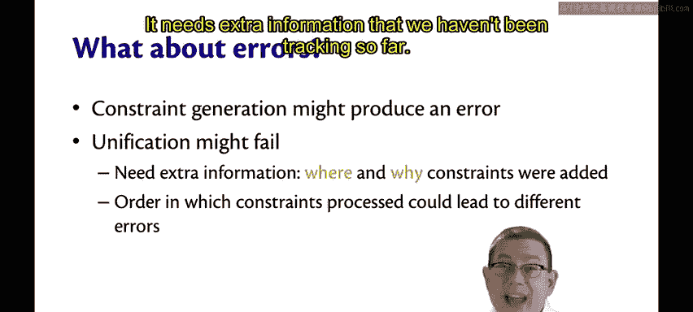

It needs to record information about where and why constraints were added so it can go back and tell the programmer。

Hey， it was on this line and column of your source code that a problem really occurred。😡。

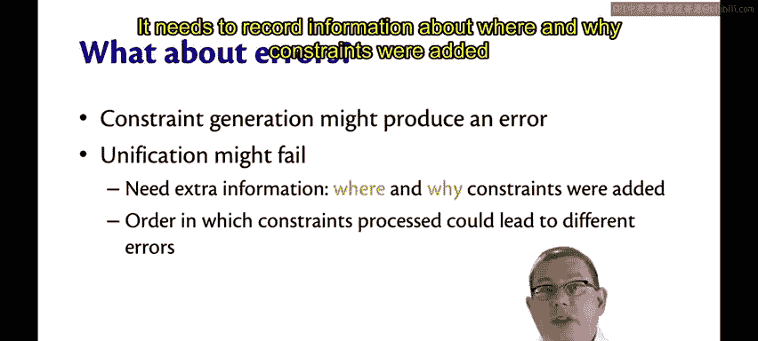

And， by the way。The order in which constraints are processed could lead to different errors。 In fact。

 we've already seen that you can get different substitutions out， so that's maybe not surprising。

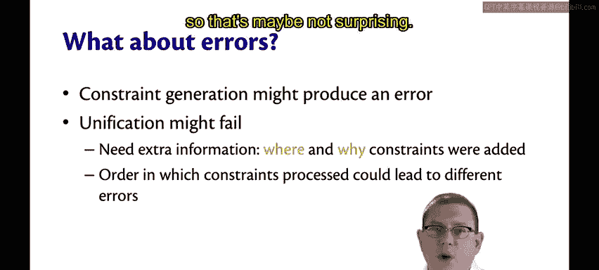

It's an ongoing area of research， how to give programmers really useful error messages when this kind of unification fails during the middle of inferring types。

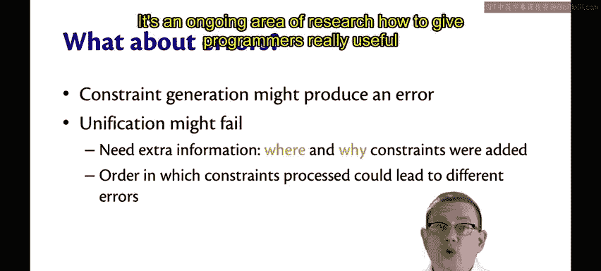

In fact， recently there was some work done in Professor Andrew Meyer's research group here on exactly this kind of problem。

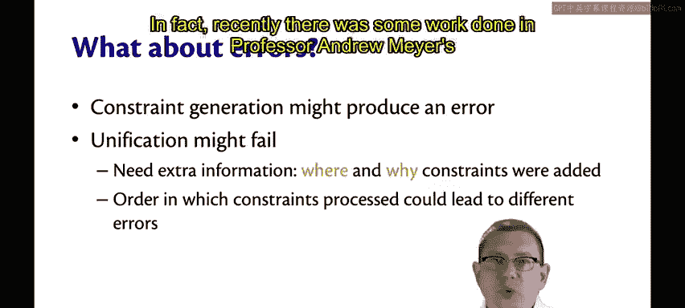

