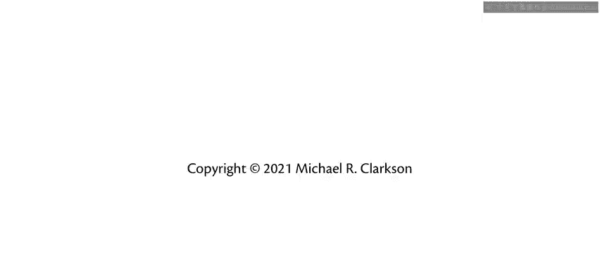

# OCaml编程：1：引言

在本节课中，我们将要学习OCaml函数式编程的入门知识，了解本系列课程的目标、背景以及如何开始学习。

大家好，我是Michael Clarkson博士。欢迎来到OCaml函数式编程课程。

我的主要工作是教授大学生如何编写**正确**、**高效**且**优美**的程序。

在过去的几年里，我在康奈尔大学的CS3110课程（数据结构与函数式编程）中，已经向大约3700名学生教授了OCaml。

您可能通过多种方式接触到这个视频。或许您目前就是CS3110课程的学生。或许您并非康奈尔的学生，但希望学习一些函数式编程的知识。或许您是通过嵌入了此视频的在线教科书找到这里的，又或者您是先发现了这个视频。如果是后者，请在下方评论区查找教科书的最新链接。

我编写这本教科书已有数年时间，它基于我和其他教职员工在过去二十多年里撰写的课程讲义。

除了教授函数式编程，我们的长期目标一直是教导学生成为优秀的程序员，为他们提供超越常规计算机科学入门课程基础知识所需的知识、技能和习惯。

然而，这些视频是全新的。它们的出现源于疫情。

在2020至2021学年，我以异步方式教授了我的课程，这意味着这些视频必须取代通常的面对面讲座。

因此，我最终制作了超过200个短视频，大部分时长在五到六分钟左右。

学生们的反应非常积极。

所以现在，我将这些视频公开，供任何希望学习OCaml、函数式编程以及想成为更好程序员的人使用。我希望您觉得它们有用，甚至有趣。这些视频是我写给所有在Zoom时代坚持下来的学生们的一封情书。我们一起做到了。现在，随着我们传播函数式编程的光芒，世界或许能变得更好一点。

本节课中我们一起学习了本系列课程的背景、目标以及获取学习资源的途径。在接下来的课程中，我们将深入探索OCaml和函数式编程的核心概念。