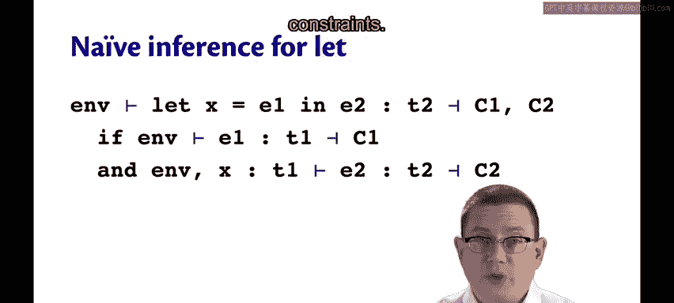
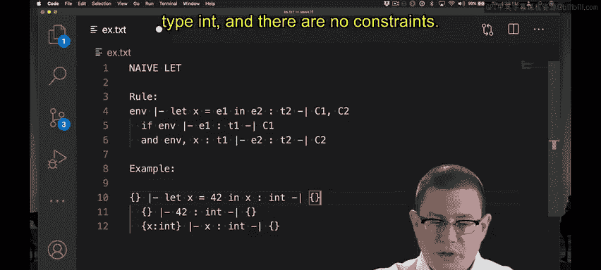
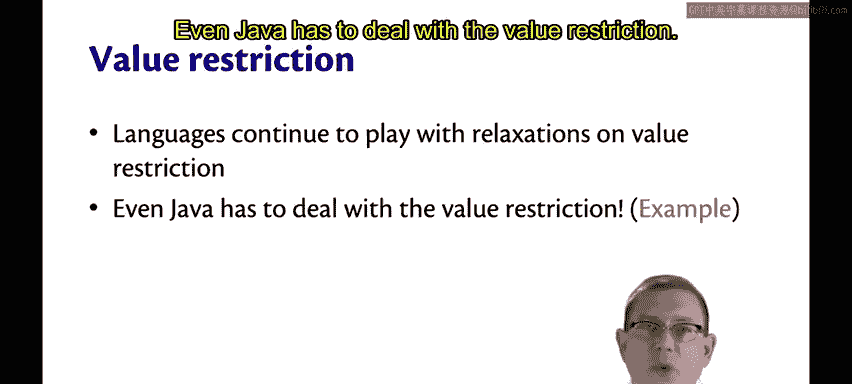
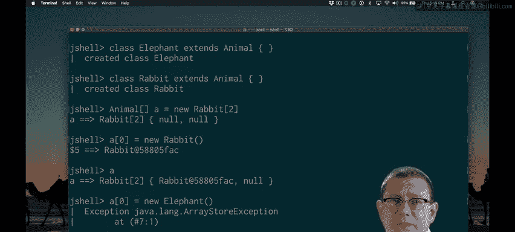
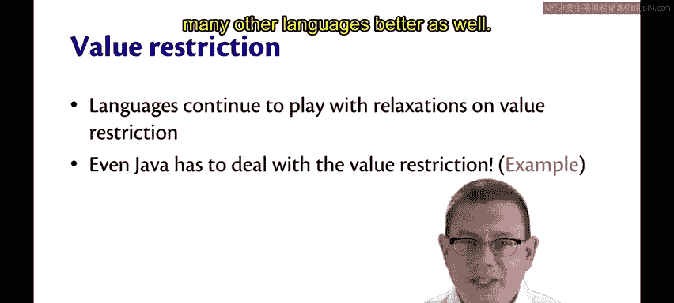

# OCaml编程：P200：Let表达式与多态性类型推断

在本节课中，我们将学习如何为OCaml语言添加Let表达式，并深入探讨其类型推断机制，特别是如何处理多态性。我们将看到，看似简单的Let表达式在类型推断中会带来一些微妙的挑战，并学习Hindley-Milner类型系统如何通过类型方案（type scheme）和值限制（value restriction）来解决这些问题。



---

## Let表达式的初始类型推断规则



上一节我们介绍了不含Let表达式的语言。本节中，我们来看看如何添加Let表达式。

一个看似合理的初始规则是：要推断一个Let表达式的类型，首先推断其绑定表达式E1的类型，得到类型T1和约束C1。然后将变量X以类型T1添加到静态环境中。接着推断主体表达式E2的类型，得到类型T2和约束C2。最后，整个Let表达式的类型就是T2，并包含这两组约束。

```ocaml
let x = E1 in E2 : T2, C1 ∪ C2
```

这个规则在许多情况下是正确的。例如，推断 `let x = 42 in x` 的类型：
1.  绑定表达式 `42` 的类型是 `int`，无约束。
2.  将 `x: int` 添加到环境。
3.  主体表达式 `x` 的类型是 `int`，无约束。
4.  因此，整个表达式的类型是 `int`，无约束。

这是一个简单的成功案例。

---

## 多态性带来的问题

问题出现在处理多态性时。假设我们使用恒等函数（identity function），并对其应用两次：一次是整数，一次是布尔值。

```ocaml
let id = fun x -> x in
(id 0, id true)
```

我们希望多态的恒等函数类型为 `'a -> 'a`，而不是特定的 `int -> int` 或 `bool -> bool`。然而，我们刚才给出的朴素Let规则不允许恒等函数以这种方式多态化。

以下是推断过程：
1.  将 `id` 以类型 `'a -> 'a` 放入环境。
2.  当 `id` 应用于整数 `0` 时，会产生约束：函数类型必须为 `int -> something`，这导致约束 `'a = int`。
3.  当 `id` 应用于布尔值 `true` 时，会产生另一个约束：函数类型必须为 `bool -> something`，这导致约束 `'a = bool`。
4.  现在我们有了一个矛盾：`'a` 需要同时等于 `int` 和 `bool`，这是不可能的。

问题出在哪里？问题在于我们放入环境中的类型。我们说 `id` 的类型是 `'a -> 'a`，这意味着存在一个单一的未知类型 `'a`。统一（unification）会尝试为这个单一类型求解。但实际上，我们想要的是不同的东西：我们希望存在许多未知类型，`id` 的每次应用都可以为该类型使用不同的值。

---

## 解决方案：类型方案（Type Scheme）

这个解决方案的灵感来源于逻辑中的全称量化（universal quantification）。在类型推断中，我们引入**类型方案**，记作 `'a. T`（在教科书中可能写作 `∀'a. T`）。这里的 `'a` 是一个在该类型 `T` 范围内有效的类型变量。语法上可以扩展到多个类型变量：`'a1 'a2 ... 'an. T`。

类型方案一直是OCaml的一部分，只是你之前没有看到它。例如，`List.length` 的类型是 `'a list -> int`。实际上，我可以给它一个显式的类型方案注解：

```ocaml
let my_length : 'a. 'a list -> int = List.length
```

OCaml接受这个类型注解。当OCaml输出类似 `'a list -> int` 的类型时，任何出现在那里的类型变量实际上都是作为类型方案的一部分被量化的。OCaml通常不打印它，因为这是冗余信息，大多数程序员不需要知道。但你可以手动输入它。

另一个例子：一个接收两个参数并返回第一个参数的函数。

```ocaml
let first_of_two : 'a 'b. 'a -> 'b -> 'a = fun x y -> x
```

---

## Hindley-Milner类型推断如何使用类型方案

当遇到像 `id` 这样的多态函数（类型为 `'a -> 'a`）时，类型推断算法会将该类型**泛化**为一个类型方案：`'a. 'a -> 'a`。可以将其理解为全称量化：对于所有类型 `'a`，该函数都具有该类型。

然后，在函数的每次使用（每次应用）时，类型推断会用一个**新的**类型变量来**实例化**该类型方案。这就像用更具体的东西来填充那个全称量化。

*   在 `id` 应用于 `0` 时，我们可能将其实例化为 `'beta -> 'beta`（假设 `'beta` 是一个新的类型变量）。
*   后来，在 `id` 应用于 `true` 时，它会用另一个不同的类型变量实例化，例如 `'gamma -> 'gamma`。

现在，函数的每次使用都独立于其他使用，因此每次使用最终都可以有自己的类型（`int -> int` 或 `bool -> bool`）。

为了利用泛化和实例化，我们只需要稍微更新两个规则。

1.  **更新Let规则**：我们给出的朴素Let规则几乎是正确的，只是需要在将绑定表达式E1的类型T1放入环境时，将其**泛化**以创建类型方案。这里的一个小复杂之处是，我们需要一些额外信息才能正确地进行泛化：需要知道生成的约束、环境和变量名。
2.  **更新名称规则**：当我们使用变量名时，需要**实例化**发现的任何类型方案。

**实例化**的细节：
*   如果对一个**类型**（严格来说，不是类型方案）应用实例化，它不会改变，只是保持不变。
*   当实例化一个**类型方案**时，你将其变回一个类型：去掉前面的 `'a1, 'a2, ... 'an.`，并为每个量化的类型变量替换一个**新的**类型变量。例如，恒等函数 `'a. 'a -> 'a` 会变成 `'beta -> 'beta`（`'beta` 是新的）。

**泛化**是两者中较难的一个。它接受约束集、静态环境、变量名以及为该变量初步找到的类型（我们现在可能想要泛化它）作为输入。

泛化的工作流程：
1.  完全完成对该绑定表达式的推断：取约束C1并进行统一，得到一个代换（substitution）。
2.  将该代换应用于环境，也应用于类型T1。这得到一个新环境（称为N1）和一个新类型（称为U1）。
3.  然后泛化U1。我们完全完成了对它的推断，然后查看其中是否有任何类型变量可以泛化并转化为类型方案。
    *   注意：并非所有类型变量都应该被泛化。**不能**泛化那些仍然出现在静态环境中的类型变量。原因是它们来自外部代码（当前正在处理的Let表达式之外嵌套的代码）。外部环境已经对这些类型变量有一些假设，可能在其他地方使用它们或产生约束，因此不允许泛化它们。
4.  泛化返回应用了代换的环境，以及将X绑定到这个泛化后的类型方案S1的绑定。

这就是多态类型推断的工作原理。从某种意义上说，这是Hindley-Milner类型推断的本质：它在Let绑定处进行泛化以生成类型方案。因此，这种类型推断方式有时被称为**Let多态**。

---

## 可变性与值限制

在结束类型推断和多态性的话题之前，我们还需要讨论另一个复杂问题，它毫不意外地与**可变性**有关。

可变性总是让事情变得更复杂。考虑以下表达式：
*   `ref None` （类型不是 `'a option ref`，而是 `'_weak1 option ref`）
*   `ref []` （类型是 `'_weak2 list ref`）
*   `ref (fun x -> x)` （类型是 `'_weak3 -> '_weak3 ref`）

它们的共同点是都涉及**弱类型变量**（weak type variables），类型变量名中出现了 `_weak` 字样。接下来，我将解释什么是弱类型变量，但首先你需要理解它们要解决的问题。

**问题示例**：
```ocaml
let id = fun x -> x in
let r = ref id in
r := succ;
!r true
```
让我们关注第二行。引用 `r` 的类型应该是什么？你最初可能认为它应该是 `('a -> 'a) ref`。根据类型推断，我们会将其泛化为一个类型方案：`r` 的类型方案是 `'a. ('a -> 'a) ref`。泛化后，每次使用它时都会实例化。
1.  当我们将 `r` 更新为后继函数 `succ`（一个整数加1的函数）时，我们会将 `r` 的类型方案实例化为 `(int -> int) ref`。
2.  在最后一行，当我们解引用 `r` 并将其应用于 `true` 时，在类型推断中会再次实例化该类型方案，并发现它需要是 `(bool -> bool) ref`。

然而，这里发生了糟糕的事情：如果后继函数存储在 `r` 中，我们解引用 `r` 得到该函数，它是一个期望整数输入的函数，但我们刚刚将其应用于布尔值 `true`。这将导致类型不安全，程序会崩溃。OCaml 绝不应该允许我们这样做。事实上，OCaml 不允许这段代码运行。

OCaml 用来防止这种将 `succ` 应用于布尔值所导致的爆炸性错误的解决方案，被称为**值限制**。

值限制出现在许多语言中。它规定：一个**可变的**多态值永远不能持有超过一种类型。你只能在其中放入一种类型（`int`、`bool`、`int -> int` 函数等）。

OCaml 目前使用**弱类型变量**来实现值限制。弱类型变量代表一个单一的未知类型（这正是在我们为多态性引入泛化之前，类型变量所做的）。最终，弱类型变量会被实例化为实际类型，从此就不再是类型变量了，因为它被一次性永久实例化了。

回顾我们的代码，更详细地看看类型发生了什么：
1.  当我们将 `r` 绑定为 `id` 的引用时，它获得了一个涉及弱类型变量的类型：`'_weak2 -> '_weak2 ref`。这是一个对某个函数的引用，该函数接受相同类型的输入并产生相同类型的输出。但这个函数不是多态的；这里只是一个尚未求解的未知类型。OCaml 还不知道我将在其中放入 `int -> int` 函数还是 `bool -> bool` 函数。
2.  后来，我确实放入了这样一个函数。我可以将后继函数 `succ`（`int -> int`）存储在该引用中。
3.  现在看 `r` 的类型发生了什么变化：它不再涉及弱类型变量。那个弱类型变量已被永久实例化为 `int`。从现在开始，我们永远不允许在其中放入不同类型的函数（例如 `bool -> bool` 函数）。

看起来当进行这种突变时，`r` 的类型似乎在改变。在某种意义上确实如此：在弱类型变量被实例化之前，存在一个未知类型；当我们进行突变将 `succ` 存储到 `r` 中时，该弱类型变量被实例化，最终确定下来，并且从此以后我们就使用这个确定的类型。这就是值限制。

你可能在你自己的代码中见过它出现。现在我们已经学习了类型推断，你可以理解它为什么存在了。OCaml 目前使用弱类型变量实现值限制，但其他语言尝试过不同的强制执行方式，并且语言设计者仍在探索放宽它的可能性，因为有时可以不完全要求它。

---

## 值限制不仅限于OCaml

顺便说一下，值限制不仅仅是OCaml的事情，甚至不仅仅是函数式编程的事情。即使是Java也必须处理值限制。



考虑在Java中创建一个表示动物的类，以及另外两种动物类型：大象和兔子。然后创建一个兔子数组。该数组的类型被声明为 `Animal[]`，但我允许在其中存储一个 `Rabbit[]`，因为 `Rabbit` 是 `Animal` 的子类。这是Java中子类型多态性的作用。

如果我尝试将一头大象放入这个数组会怎样？根据数组的类型，第一个元素应该是一个 `Animal`。我之前碰巧放了一只兔子进去。那么我现在可以放一头大象进去吗？**不行**。这段代码可以通过编译（没有类型错误），但它会通过类型检查器，在运行时抛出 `ArrayStoreException`。

`ArrayStoreException` 在你尝试将错误类型的对象存储到数组中时抛出。在这个例子中，该数组是一个兔子数组（这是它创建时的类型），因此它只能保存 `Rabbit` 类的对象（或 `Rabbit` 的子类）。你不能将非兔子的东西放入该数组，即使你持有对该数组的引用是 `Animal[]` 类型。Java 禁止这样做，因为如果你编写一个遍历该数组的循环，并假设数组的每个元素都是兔子，如果允许放入大象，这个假设就会被违反。

所以Java通过数组存储异常来防止这种情况。这实际上只是值限制的另一种表现形式。我们有一个可变的多态值（这里的可变性来自数组，多态性来自子类型多态性，即一个类扩展另一个类）。但这又是值限制，因为你不允许改变那个可变多态值的类型：一旦它成为兔子数组，它就永远只能是兔子数组，你不能放入大象。

---



## 总结

本节课中，我们一起学习了：
1.  **Let表达式的类型推断**：从朴素的规则开始，并识别其在处理多态函数时的问题。
2.  **类型方案与泛化/实例化**：作为解决方案，引入了类型方案（`'a. T`）的概念。Hindley-Milner类型系统在Let绑定处对类型进行**泛化**（生成类型方案），在变量使用处进行**实例化**（用新的类型变量替换量化的变量），从而实现了Let多态。
3.  **可变性的挑战与值限制**：当多态性与可变性（如引用 `ref`）结合时，需要**值限制**来保证类型安全。它规定可变的多态值只能持有一种具体类型。OCaml使用**弱类型变量**来实现这一限制。
4.  **概念的普遍性**：值限制的思想不仅适用于OCaml的函数式编程和参数多态性，也适用于像Java这样的命令式语言及其子类型多态性（体现在数组协变和 `ArrayStoreException` 上）。



通过学习类型推断、多态性和可变性，希望你不仅能更好地理解OCaml，也能更好地理解Java以及许多其他语言。