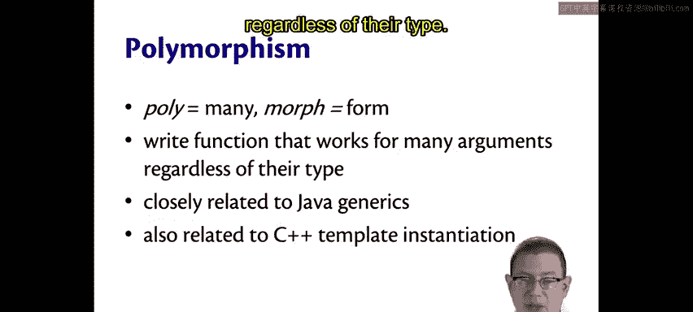
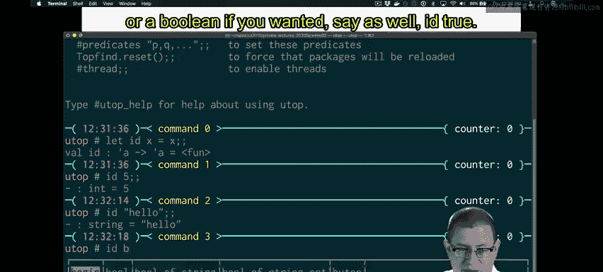
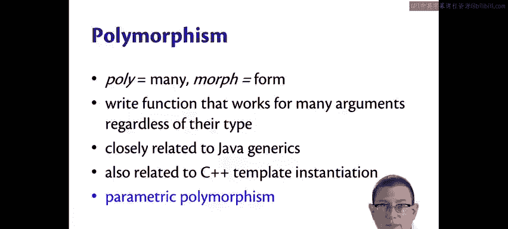

# 康奈尔大学《OCaml编程｜CS3110：OCaml Programming： Correct + Efficient + Beautiful》中英字幕 - P20：-020-Polymorphic Functions Chap2 Video 15.zh_en - GPT中英字幕课程资源 - BV1Tx4y1s7sP

Here's an important little function， the identity function。Let id X equal X。

 It's called identity because it's the function that just returns whatever you pass it。

So if I pass5 to8。I get 5， if I pass hello to Edd。 I get hello。Notice what the type of idd is。

It's a type that doesn't look the same as any of the other types we've looked at so far。

 It has this funny syntax in it。 single quote a。 This is actually the syntax for what's called a type variable in Oamel。

So we have variables that the normal kinds of variables we've been using all along。

 you might think of those as value variables。Type variables stand for an unknown type in the same way as a regular variable or a value variable stands for an unknown value。

You've seen this kind of feature before in Java， The angle bracket T in list T in Java is a way of parameterizing on a type that name T stands for an unknown type in the list class。

In Oaml syntax， we write type variables as any other kind of identifier。

 but with a single quote in front of it。So sometimes people will say single quote。

 I will often for brevity， say tick， so like tick A。You might have a longer variable name， of course。

 than just a。 You might have tick fu， T key， T value。

 especially if you were working with a dictionary， for example。But most often。

 the simplest type variable we ever write is just going to be tick A。

And for that form of type variable， Oaml programmers usually use Greek pronunciation。

 So instead of tick A we'll say alpha， instead of tick B， we'll say beta。

 instead of tick C we'll say gamma， and then rarely do we really go on to more than three type variables inside of a given expression。

This is a kind of polymorphism。Polly， of course， here means many and morph means form。

 It's a way of writing a function that works for many arguments， regardless of their type。

 We saw that with the idd function。 It worked whether you passed an integer to it or a string or a boolean。

 if you wanted， sayy as well， idd true。 This is a kind of polymorphism that is closely related to what you've seen in Java with generics。

 It's also somewhat related to C plus plus template instantiation。

 It's known as parametric polymorphism。 It's a way of having a piece of code that can behave in many ways。

 depending on the kind of parameters that are in use。

