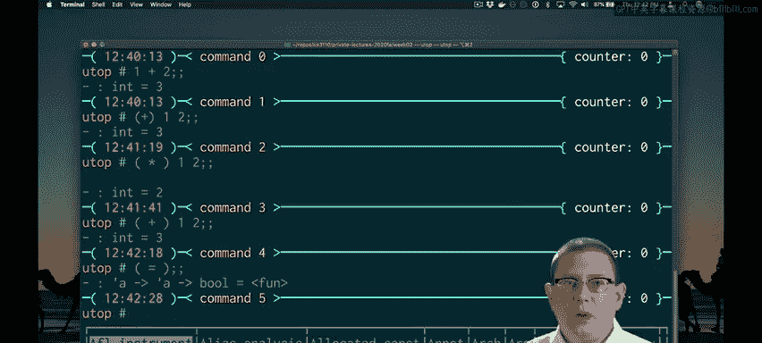
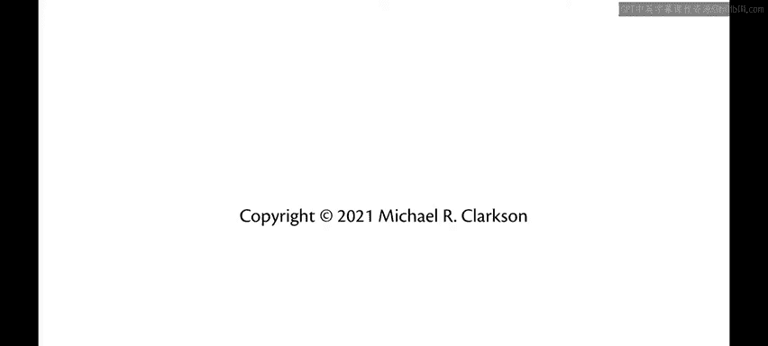

# OCaml编程：2.16：运算符即函数 🧮

在本节课中，我们将深入探讨OCaml中的运算符，了解它们如何作为函数工作，以及如何定义和使用自定义的中缀运算符。

上一节我们介绍了函数和多态性，本节中我们来看看二元运算符的更多细节。

## 运算符作为函数

我们已经知道，可以使用加号运算符将两个数字相加，它被写作中缀形式，位于两个参数之间。

```ocaml
1 + 2
```

如果将二元运算符包裹在括号中，它实际上会变成一个函数。由于它是一个函数，我们将其写作前缀应用形式，即函数出现在其参数之前。

```ocaml
(+) 1 2
```

这种方法适用于任何二元运算符，但需要注意乘法运算符。

```ocaml
( * ) 3 4
```

括号加星号`(*`在OCaml中会开启一个注释，因此解析器会认为其右侧的所有字符都是注释的一部分，并等待注释关闭。因此，将运算符作为函数处理时，最好在括号和运算符符号之间留一个空格。

## 多态比较运算符

相等运算符`=`也是一个函数。它的类型是`'a -> 'a -> bool`，这是一个多态比较，允许我比较任意两个类型相同的第一个参数。



```ocaml
1 = 2
```

我可以比较`1`和`2`，因为它们都是整数。但我不能比较`1`和`false`，因为它们类型不同。无论我将其写作前缀形式还是中缀形式，这一点都成立。

```ocaml
1 = false (* 这将无法通过类型检查 *)
```

不等式运算符也是多态的。小于运算符`<`的类型是`'a -> 'a -> bool`，你可以用它比较任意两个值。

但对此需要稍加注意。使用这些多态比较运算符来比较原始值是完全没问题的，但当处理更复杂的数据结构时，它们可能不是最合适的比较方式。对于更大的数据结构，你可能需要编写自己更有意义的比较运算符。

## 定义自定义中缀运算符

我可以根据需要定义自己的中缀二元运算符。例如，假设我们正在使用一个`max`函数。实际上，`max`已经内置在OCaml的标准库中。你给它任意两个相同类型`'a`的值，它会根据比较运算符返回较大的那个。

```ocaml
max 1 2 (* 结果是 2 *)
```

如果你想为`max`定义一个中缀运算符，你可以做到。我们需要选择一些标点符号来定义它。我决定使用`^`作为最大值的运算符，因为它看起来像是一个向上的箭头。

```ocaml
let ( ^ ) x y = max x y
```

但这还不能完全编译，我有一个语法错误。为了定义一个中缀二元运算符，我实际上必须将其包裹在括号中。

```ocaml
let ( ^ ) x y = max x y
```

现在，我有了一个新的中缀运算符。实际上，OCaml做了我应该做的事情，也在它周围加上了空格。让我回去这样做，以便更容易阅读。

```ocaml
let ( ^ ) x y = max x y
```

现在我可以使用这个`^`运算符来计算最大值。

```ocaml
1 ^ 2 (* 结果是 2 *)
```

请注意，当我将其写作中缀形式时，周围没有括号；当我将其写作前缀形式时，就像我在这里的定义一样，周围有括号。

关于如何构成中缀标点运算符的规则有点复杂，它们在OCaml手册中有说明。允许使用某些类型的标点符号，而有些则不允许。

## 总结



本节课中我们一起学习了OCaml中运算符作为函数的工作原理。我们了解到，任何中缀运算符都可以通过包裹在括号中转换为前缀函数形式，并需要注意乘法等特殊运算符的语法。我们还探讨了多态比较运算符`=`和`<`的使用及其局限性。最后，我们学习了如何通过`let (op) x y = ...`的语法来定义自己的自定义中缀运算符，这为编写更具表达力的代码提供了灵活性。